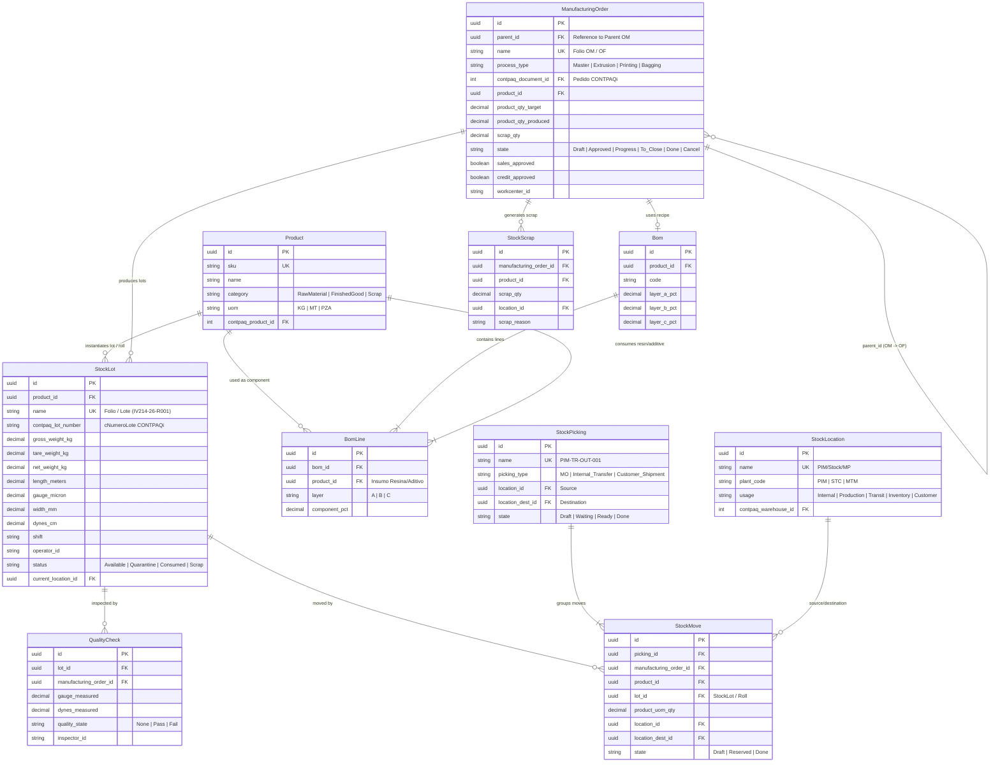

# Feature Specification: SPEC-000: Foundational Baseline (Clean Architecture, Odoo-Native Domain Model & Odoo 19 SPA)

**Feature Branch**: `000-foundational`  
**Created**: 2026-09-15  
**Status**: Validated & Implemented Baseline  
**Input**: Compactación de especificaciones de fundación (Clean Architecture, Modelo de Datos Odoo-Native y Suite UI/UX Odoo 19 SPA) para establecer el punto de partida del nuevo Roadmap basado en `INFORME_VALIDACION_DIAGRAMA_OPERATIVO.md`.

---

## Executive Summary & Architectural Vision

This specification defines the **Foundational Technical Baseline** for **PolyConecta**, uniting into a single, cohesive foundation:
1. **Clean Architecture C# Solution (`backend/`):** 5-layer decoupled architecture (`PolyConecta.Domain`, `PolyConecta.Infrastructure`, `PolyConecta.Api`, `PolyConecta.Presentation`, `PolyConecta.Contpaq`).
2. **Odoo-Native Domain Data Model (`PolyConecta.Domain`):** 10 canonical base entities (`Product`, `StockLot`, `ManufacturingOrder`, `Bom`, `BomLine`, `StockLocation`, `StockPicking`, `StockMove`, `QualityCheck`, `StockScrap`) fully aligned with Odoo 19 Enterprise ORM and CONTPAQi `adm*` tables.
3. **Odoo 19 SPA Framework (`PolyConecta.Presentation`):** Complete frontend SPA suite featuring dynamic Kanban, List, and Form views, status pipeline headers, Smart Buttons, App Launcher grid, and Mobile Handheld Terminal interface.

---

## User Scenarios & Testing

### User Story 1 - Multi-Layer Clean Architecture & Solution Foundation (Priority: P1)

As a Developer and System Administrator, I need the solution to enforce strict layer independence with unidirectional dependencies, exposing RESTful endpoints via ASP.NET Core API and asynchronous CONTPAQi Win32 integration through a transactional Outbox pattern.

### User Story 2 - Unified Odoo-Native Data Model (Priority: P1)

As a Shop-Floor Operator and Production Planner, I need products, extruded rolls, manufacturing orders, locations, movements, and quality checks to be governed by unified Odoo-Native domain models extending physical extrusion properties and mapping to CONTPAQi `admProductos`, `admCapasProducto`, `admAlmacenes`, and `admDocumentos`.

### User Story 3 - Odoo 19 SPA User Experience & Navigation (Priority: P1)

As a User across Customer Service, Planning, Quality, and Logistics, I need the interface to emulate Odoo 19 Enterprise with responsive Kanban status pipelines, interactive Smart Buttons, Form views, and Mobile Handheld scanner interfaces for zero-latency plant operations.

---

## Functional Requirements

- **FR-001**: Solution MUST structure C# projects under clean 5-layer boundaries with EF Core 8 and PostgreSQL integration.
- **FR-002**: Domain layer MUST expose the 10 Odoo-Native base entities (`Product`, `StockLot`, `ManufacturingOrder`, `Bom`, `BomLine`, `StockLocation`, `StockPicking`, `StockMove`, `QualityCheck`, `StockScrap`).
- **FR-003**: Presentation layer MUST render Odoo 19 Enterprise SPA UI components with App Launcher, Kanban pipelines, Form views, Smart Buttons, and Handheld scanner layout.

---

## Key Entities & Data Model

---

## Success Criteria

- **SC-001**: 100% clean compilation (`dotnet build`) across all 5 C# project layers with 0 errors.
- **SC-002**: 100% of domain entities align with Odoo-Native ORM naming standards.
- **SC-003**: Frontend SPA serves Odoo 19 navigation, App Launcher, Kanban pipelines, and Handheld interface on port 9000.
