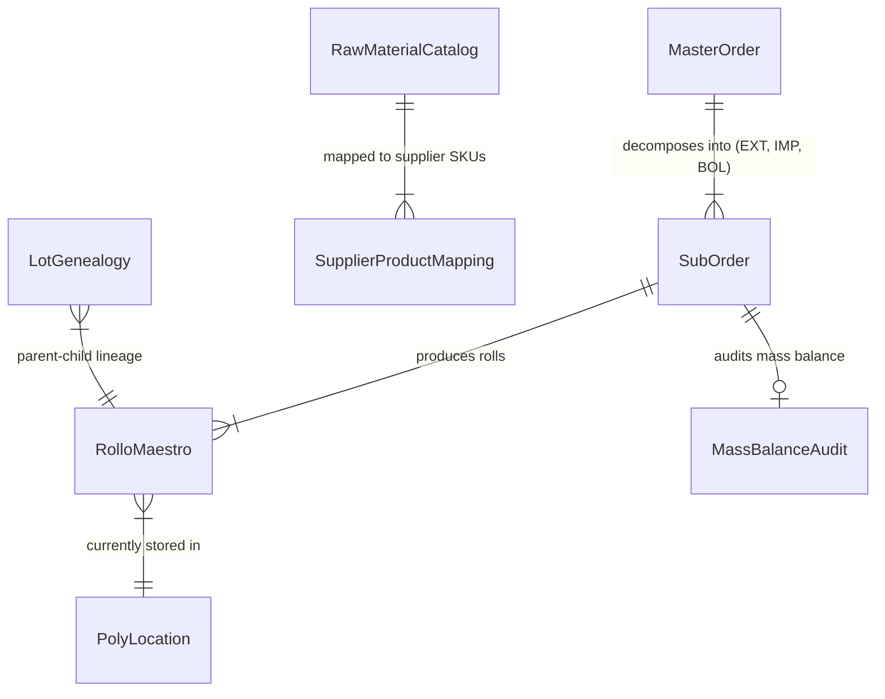

# Data Model & Layer Mapping Artifact: 000 Solution Root Clean Architecture

**Feature Branch**: `000-solution-clean-architecture`  
**Date**: 2026-09-14  
**Spec**: [spec.md](./spec.md) | **Research**: [research.md](./research.md)

---

## 1. Domain Entities & Value Objects Summary

The core domain model (`PolyConecta.Domain`) defines pure entities with zero framework dependencies:



### Entity Specifications

#### 1. `MasterOrder` (Orden Maestra / OM)
* **Namespace**: `PolyConecta.Domain.Entities`
* **Attributes**:
  * `Id` (Guid, PK)
  * `FolioOm` (string, `OM-YYYY-XXXX`)
  * `CidDocumentoPedido` (int, link to CONTPAQi `admDocumentos` Pedido)
  * `CustomerCode` (string)
  * `PtSku` (string, Finished Product SKU)
  * `TargetQuantityKg` (decimal)
  * `Status` (string: `Draft`, `Approved`, `In_Progress`, `Completed`, `Cancelled`)
  * `SubOrders` (ICollection<SubOrder>)

#### 2. `SubOrder` (Sub-Orden de Fabricación / OF)
* **Namespace**: `PolyConecta.Domain.Entities`
* **Attributes**:
  * `Id` (Guid, PK)
  * `MasterOrderId` (Guid, FK)
  * `FolioOf` (string, `OF-EXT-YYYY-XXXX-N`)
  * `ProcessType` (string: `EXT`, `IMP`, `BOL`)
  * `MachineId` (string: `EXT-01`, `IMP-01`, `BOL-01`)
  * `Status` (string: `Borrador`, `Programado`, `En_Proceso`, `Control_Calidad`, `Finalizado`, `Scrap`)
  * `PlannedQtyKg` (decimal)
  * `ProducedQtyKg` (decimal)
  * `ScrapQtyKg` (decimal)

#### 3. `RolloMaestro` (Physical Master Roll Entity)
* **Namespace**: `PolyConecta.Domain.Entities`
* **Attributes**:
  * `Id` (Guid, PK)
  * `SubOrderId` (Guid, FK)
  * `Folio` (string, Value Object regex `^EX-[0-9]{2}-[0-9]{6}-[0-9]{6}$`)
  * `LotNumber` (string, 1:1 CONTPAQi `admCapasProducto.cNumeroLote`)
  * `ProductSku` (string)
  * `GrossWeightKg` (decimal)
  * `TareWeightKg` (decimal)
  * `NetWeightKg` (calculated: $\text{Gross} - \text{Tare}$)
  * `LengthMeters` (decimal)
  * `GaugeMicron` (decimal)
  * `WidthMm` (decimal)
  * `DynesCm` (decimal, default 38.0)
  * `MachineId` (string)
  * `Shift` (string)
  * `OperatorId` (string)
  * `Status` (string: `Available`, `In_Use`, `Consumed`, `Quarantine`, `Scrap`)
  * `LocationCode` (string, default `PIM/Produccion`)

#### 4. `PolyLocation` (Physical & Virtual Warehouse Location)
* **Namespace**: `PolyConecta.Domain.Entities`
* **Attributes**:
  * `Id` (Guid, PK)
  * `CidAlmacenContpaq` (int, link to CONTPAQi `admAlmacenes.CIDALMACEN`)
  * `LocationCode` (string: `PIM/Stock/MP`, `PIM/Produccion`, `PIM/Stock/PT`, `PIM/Cuarentena`)
  * `LocationName` (string)
  * `PlantCode` (string: `PIM`, `STC`, `MTM`)
  * `WarehouseType` (string: `RawMaterial`, `Production`, `FinishedGoods`, `Quarantine`, `Transit`)
  * `IsActive` (bool)

#### 5. `RawMaterialCatalog` (Master Raw Material Item)
* **Namespace**: `PolyConecta.Domain.Entities`
* **Attributes**:
  * `Id` (Guid, PK)
  * `InternalSku` (string: `MP-RES-HD-001`)
  * `Name` (string)
  * `Category` (string: `VirginResin`, `Additive`, `Pigment`, `Recycled`)
  * `MfiMeltFlowIndex` (decimal)
  * `DensityGcm3` (decimal)
  * `TargetHopper` (string: `Tolva A`, `Tolva B`, `Tolva C`, `Cualquiera`)
  * `CidProductoContpaq` (int)
  * `IsActive` (bool)
  * `SupplierMappings` (ICollection<SupplierProductMapping>)

---

## 2. Solution Directory Tree & Clean Architecture Mapping

```text
Polyconecta/                              # Root Solution Directory (omitting src/)
├── Polyconecta.slnx                      # Unified Solution File (.NET 8)
├── PolyConecta.sln                       # Visual Studio Solution File
├── Directory.Build.props                 # Global Solution Build Props
├── run.sh                                # Automated Build, Test & Launch Script
│
├── PolyConecta.Presentation/             # 1. PRESENTATION UI LAYER (Odoo 19 Web SPA)
│   ├── README.md
│   ├── PolyConecta.Presentation.csproj
│   └── wwwroot/                          # Odoo 19 App Launcher, Kanban / List / Form Views
│
├── PolyConecta.Api/                      # 2. API GATEWAY LAYER (REST Controllers)
│   ├── README.md
│   ├── PolyConecta.Api.csproj
│   ├── Program.cs
│   └── Controllers/                      # Orders, Rolls, Locations, RawMaterials
│
├── PolyConecta.Domain/                   # 3. CORE DOMAIN LAYER (Pure Entities)
│   ├── README.md
│   ├── PolyConecta.Domain.csproj
│   ├── Entities/                         # MasterOrder, SubOrder, RolloMaestro, PolyLocation, etc.
│   ├── ValueObjects/                     # Folio (Regex EX-01-YYMMDD-HHMMSS)
│   └── Services/                         # MassBalanceService
│
├── PolyConecta.Infrastructure/           # 4. INFRASTRUCTURE LAYER (EF Core Persistence)
│   ├── README.md
│   ├── PolyConecta.Infrastructure.csproj
│   ├── Persistence/                      # PolyDbContext & Quality Hard-Stop Gate
│   └── Outbox/                           # OutboxPublisher
│
├── PolyConecta.Contpaq/                  # 5. CONTPAQi INTEGRATION BRIDGE (Win32 x86 Worker)
│   ├── README.md
│   ├── PolyConecta.Contpaq.csproj
│   ├── Program.cs                        # Outbox Async Loop & Direct SQL NOLOCK Reads
│   └── Infrastructure/                   # MGW_SDK.dll Interop P/Invoke
│
├── tests/                                # SUITE DE PRUEBAS
│   ├── PolyConecta.Domain.Tests/         # Domain Unit Tests
│   └── PolyConecta.IntegrationTests/     # End-to-End API Integration Tests
│
├── scripts/                              # AUTOMATED SCRIPTS
│   ├── run.sh                            # Solution Runner Script
│   ├── build.sh                          # Win32 Bridge Package Builder
│   └── deploy.sh                         # VPS Auto Deployment Script
│
└── docs/                                 # DOCUMENTATION & SPECIFICATIONS
    ├── sdd/ROADMAP_ESPECIFICACIONES.md
    └── contpaq/                          # CONTPAQi Manuals (BD & SDK)
```
