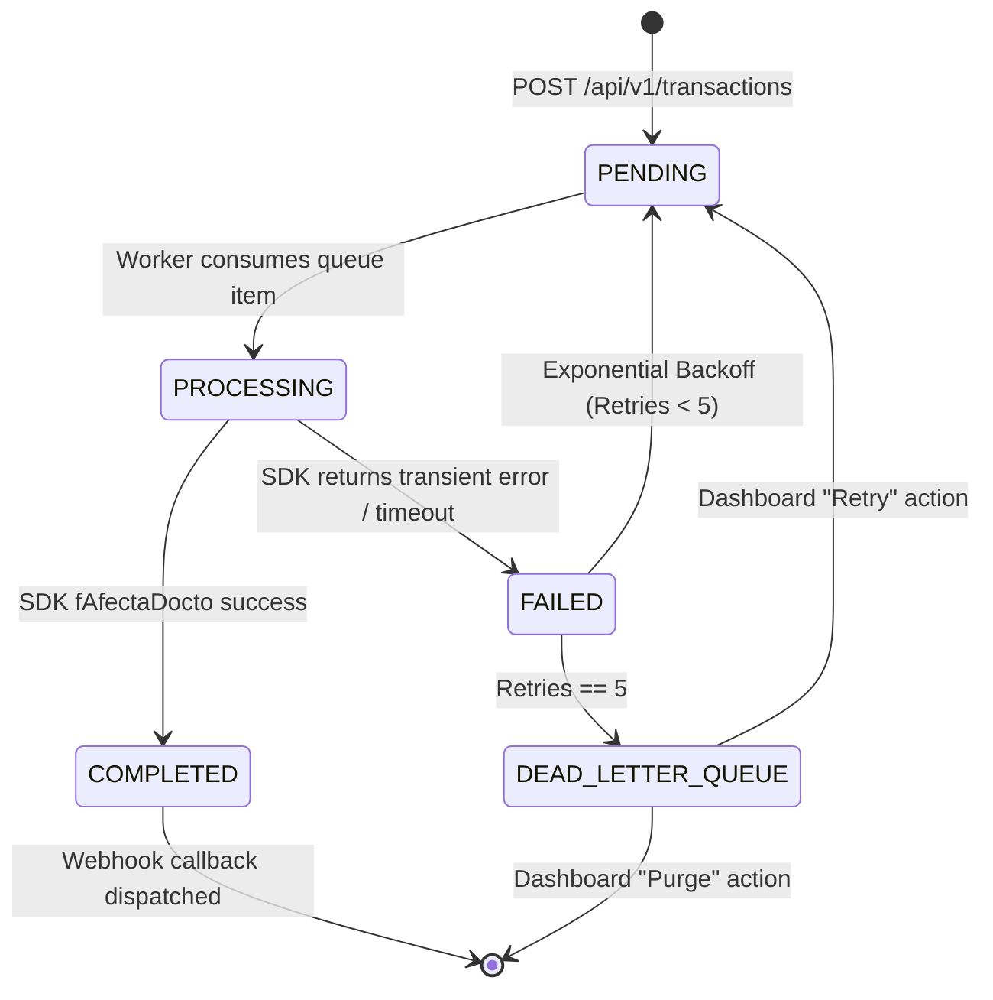

# Data Model & Schema Specification: Standalone CONTPAQi Integration Bridge

**Feature Branch**: `001-integration-bridge-contpaqi`  
**Date**: 2026-09-11  
**Spec**: [.specify/features/001-integration-bridge-contpaqi/spec.md](file:///Users/emilio/Development/Sandbox/Polyconecta/.specify/features/001-integration-bridge-contpaqi/spec.md)

---

## Overview

The Integration Bridge maintains an isolated transactional SQLite database (`bridge_outbox.db`) for durable Outbox queue persistence, audit logging, Webhook delivery tracking, and visual metrics aggregation. It also reads directly from CONTPAQi's SQL Server `adm*` tables.

---

## 1. Local SQLite Outbox Storage (`bridge_outbox.db`)

### Entity 1: `bridge_transactions`

Stores incoming generic ERP command requests, execution status, retries, and resulting CONTPAQi document metadata.

| Column | Type | Constraints | Description |
|--------|------|-------------|-------------|
| `transaction_id` | TEXT (UUID) | PRIMARY KEY, NOT NULL | Unique identifier for the transaction |
| `correlation_id` | TEXT (UUID) | NOT NULL, INDEX | Distributed correlation ID for end-to-end tracing |
| `client_app_id` | TEXT | NOT NULL | Identifier of the external system sending the request |
| `idempotency_key` | TEXT | UNIQUE, NULLABLE | Optional key to prevent duplicate command processing |
| `command_type` | TEXT | NOT NULL | `DOCUMENT_CREATE`, `MOVEMENT_ADD`, `LOT_ASSOCIATION`, `DOCUMENT_AFFECT` |
| `payload_json` | TEXT | NOT NULL | Generic JSON command payload matching API schema |
| `callback_url` | TEXT | NULLABLE | HTTP URL to receive async Webhook outcome notification |
| `status` | TEXT | NOT NULL, INDEX | `PENDING`, `PROCESSING`, `COMPLETED`, `FAILED`, `DEAD_LETTER_QUEUE` |
| `retry_count` | INTEGER | NOT NULL DEFAULT 0 | Current retry attempt count |
| `max_retries` | INTEGER | NOT NULL DEFAULT 5 | Maximum allowed retries before moving to DLQ |
| `next_attempt_at` | TEXT (ISO8601) | NOT NULL, INDEX | Scheduled timestamp for next retry execution |
| `contpaqi_doc_id` | INTEGER | NULLABLE | Internal CONTPAQi document primary key (`cIdDocumento`) |
| `contpaqi_folio` | TEXT | NULLABLE | Assigned CONTPAQi document folio (`cFolio`) |
| `last_error_code` | INTEGER | NULLABLE | Last returned SDK error code (0 = success) |
| `last_error_message` | TEXT | NULLABLE | Human-readable diagnostic error message |
| `created_at` | TEXT (ISO8601) | NOT NULL | Record creation timestamp |
| `updated_at` | TEXT (ISO8601) | NOT NULL | Record last update timestamp |

**Indexes**:
- `idx_transactions_status_next_attempt` ON `bridge_transactions(status, next_attempt_at)`
- `idx_transactions_correlation_id` ON `bridge_transactions(correlation_id)`
- `idx_transactions_idempotency_key` ON `bridge_transactions(idempotency_key)`

---

### Entity 2: `transaction_logs`

Audit log recording every P/Invoke SDK function call execution step, latency, and error code.

| Column | Type | Constraints | Description |
|--------|------|-------------|-------------|
| `log_id` | TEXT (UUID) | PRIMARY KEY, NOT NULL | Unique log entry ID |
| `transaction_id` | TEXT (UUID) | NOT NULL, FOREIGN KEY | References `bridge_transactions(transaction_id)` |
| `correlation_id` | TEXT (UUID) | NOT NULL | Correlation ID for log filtering |
| `attempt_number` | INTEGER | NOT NULL | Execution attempt counter (1 to 5) |
| `sdk_function_name` | TEXT | NOT NULL | e.g. `fAltaDocumento`, `fAltaMovimiento`, `fAfectaDocto_Param` |
| `sdk_error_code` | INTEGER | NOT NULL | Return code from SDK function (0 = kSIN_ERRORES) |
| `error_message` | TEXT | NULLABLE | Detailed error string retrieved via `fError()` |
| `duration_ms` | INTEGER | NOT NULL | Execution duration of the SDK function call in milliseconds |
| `timestamp` | TEXT (ISO8601) | NOT NULL | Log entry timestamp |

---

### Entity 3: `webhook_deliveries`

Tracks status and retry attempts of Webhook callbacks dispatched to external client applications.

| Column | Type | Constraints | Description |
|--------|------|-------------|-------------|
| `delivery_id` | TEXT (UUID) | PRIMARY KEY, NOT NULL | Unique delivery ID |
| `transaction_id` | TEXT (UUID) | NOT NULL, FOREIGN KEY | References `bridge_transactions(transaction_id)` |
| `callback_url` | TEXT | NOT NULL | Target HTTP Webhook URL |
| `http_status` | INTEGER | NULLABLE | HTTP response status code received from client (e.g. 200, 500) |
| `response_body` | TEXT | NULLABLE | Truncated HTTP response body received |
| `attempt_count` | INTEGER | NOT NULL DEFAULT 1 | Webhook delivery attempt counter |
| `delivered_at` | TEXT (ISO8601) | NULLABLE | Timestamp of successful delivery |
| `next_retry_at` | TEXT (ISO8601) | NULLABLE | Timestamp for next Webhook retry attempt |

---

### Entity 4: `metric_snapshots`

Aggregated performance metrics captured every second for streaming to the embedded Web Dashboard visual charts.

| Column | Type | Constraints | Description |
|--------|------|-------------|-------------|
| `snapshot_id` | INTEGER | PRIMARY KEY AUTOINCREMENT | Sequential snapshot ID |
| `timestamp` | TEXT (ISO8601) | NOT NULL, INDEX | Snapshot capture timestamp |
| `throughput_ops_sec` | REAL | NOT NULL | Instantaneous transactions processed per second |
| `queue_depth` | INTEGER | NOT NULL | Current count of `PENDING` + `PROCESSING` items in Outbox |
| `average_sdk_latency_ms` | REAL | NOT NULL | Moving average of SDK function latency in ms |
| `error_rate_percent` | REAL | NOT NULL | Percentage of failed SDK calls in current sampling window |
| `active_sdk_session` | INTEGER (BOOL) | NOT NULL | 1 if CONTPAQi company session is currently open, 0 otherwise |
| `circuit_state` | TEXT | NOT NULL | `CLOSED`, `OPEN`, `HALF_OPEN` |

---

## 2. SQL Server Read Models (`adm*` Tables Mapping)

The Bridge executes read-only SQL queries with `READ UNCOMMITTED` hints against CONTPAQi SQL Server database tables.

### Catalog Models

1. **`ProductCatalogItem`** (`admProductos`):
   - `cIdProducto` (Int, Primary Key), `cCodigoProducto` (String SKU), `cNombreProducto` (String), `cTipoProducto` (Int), `cControlExistencia` (Int: Lot/Serial tracking mode), `cStatus` (Int: Active/Inactive).
2. **`ClientCatalogItem`** (`admClientes`):
   - `cIdCteProv` (Int, Primary Key), `cCodigoCliente` (String), `cRazonSocial` (String), `cRFC` (String), `cTipoCliente` (Int).
3. **`WarehouseCatalogItem`** (`admAlmacenes`):
   - `cIdAlmacen` (Int, Primary Key), `cCodigoAlmacen` (String), `cNombreAlmacen` (String).
4. **`ConceptCatalogItem`** (`admConceptos`):
   - `cIdConcepto` (Int, Primary Key), `cCodigoConcepto` (String), `cNombreConcepto` (String), `cDocumentoModelo` (Int: Document type classification).

### Stock Layer Model (`admCapasProducto` + `admExistenciaCapa`)

- **`StockLayerItem`**:
  - `cIdProducto` (Int), `cIdAlmacen` (Int), `cNumeroLote` (String), `cFechaCaducidad` (DateTime), `cPedimento` (String), `cExistencia` (Decimal).

---

## 3. Entity State Transition Flow

