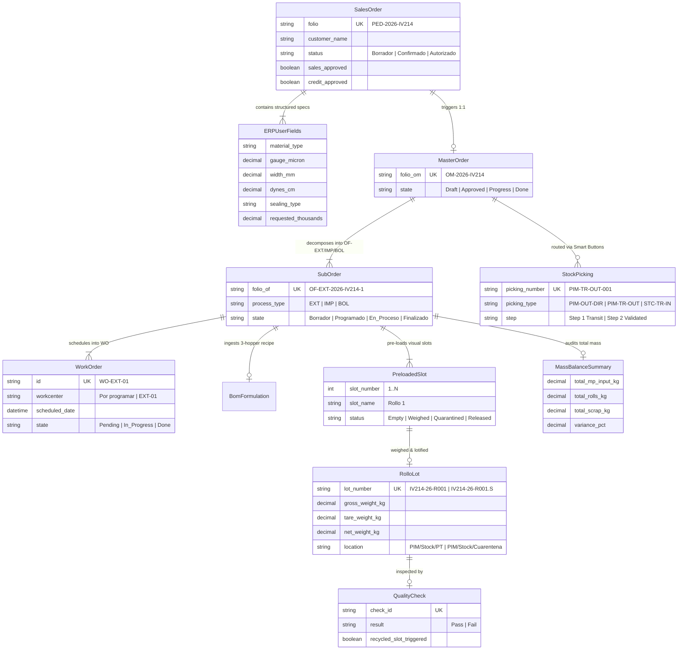

# Feature Specification: SPEC-001: Interactive End-to-End Operational Flow Proof of Concept (PoC SPA)

**Feature Branch**: `001-poc-end-to-end-operational-flow`  
**Created**: 2026-09-15  
**Status**: Validated  
**Input**: User request: "Creación de una prueba de concepto (PoC) operable e interactiva en la SPA (Odoo 19 UI) basada en el flujo operativo completo de 7 fases de INFORME_VALIDACION_DIAGRAMA_OPERATIVO.md, demostrando el diseño visual final y las 17 reglas operativas consensuadas."

---

## Executive Summary & Architectural Vision

This specification defines the **Interactive End-to-End Operational Flow Proof of Concept (PoC)** hosted inside PolyConecta's Blazor WebAssembly / SPA Presentation layer (`PolyConecta.Presentation`).

The PoC provides an end-to-end operable demonstration of the 7 validated operational phases and 17 business rules ratifying the interaction between Polyempaques shop floor personnel, PolyConecta's MES engine, and CONTPAQi Comercial Premium:
1. **Phase 1 (ERP Order & Spec Capture):** Sales Order form in Odoo 19 UI with structured ERP User Fields for Extrusion & Converting (0 Excel OT attachments).
2. **Phase 2 (Sync & 2-Signature Approvals):** Odoo 19 header status pipeline (`Draft` → `Confirmed` → `Authorized`) with interactive `Confirmar` (AC), `Validar (Ventas)` and `Validar (Crédito)` buttons.
3. **Phase 3 (MRP Hierarchy & 3-Layer BoM):** Master Order (`OM`) Kanban view and child sub-orders (`OF-EXT`, `OF-IMP`, `OF-BOL`) with work order (`WO`) assignment in `'Por programar'` state and dynamic 3-hopper co-extrusion BoM uploader.
4. **Phase 4 (Floor Execution, Slot Weighing & Quality):** Mobile Handheld floor weighing terminal with pre-loaded roll slots (`Rollo 1`... `Rollo N`), `QualityCheck` modal, consecutive lot numbering (`IV214-26-R001`), and Quarantine `.S` recycling rule (`IV214-26-R001.S` moves to quarantine, recycling `R001` slot for clean replacement).
5. **Phase 5 (Mass Balance & ERP Closure):** Technical closure console calculating Total Extruded Mass ($\sum \text{Rollos} + \text{Scrap}$), categorizing scrap by resin/reason codes, and triggering consolidated CONTPAQi stock consumption.
6. **Phase 6 (Logistics & 2-Step Inter-Plant Transfers):** Smart Buttons UI ("Entregas / Envíos" vs "Operaciones de Traslado"), Direct Dispatch (`PIM-OUT-DIR`) Remisión, and 2-step inter-plant transfer (`PIM-TR-OUT` $\rightarrow$ `TRANSIT/PIM-STC` $\rightarrow$ `STC-TR-IN`) triggering CONTPAQi warehouse transfer upon receiving validation.
7. **Phase 7 (Santa Cruz Bagging Conversion):** Bagging sub-order (`OF-BOL`) execution applying the 4 Universal Manufacturing Rules, Dual Metric Capture (Thousands of bags + Net Kg weight), Real Conversion Factor ($\text{Kg/Millar real} = \frac{\text{Kg}}{\text{Millares}}$) vs technical spec, and order completion (`Hecho`).

---

## User Scenarios & Testing

### User Story 1 - Interactive Sales Order & 2-Signature Approval Flow (Priority: P1)

As an Attention to Customers (AC) representative, Sales Manager, and Credit Officer, I want to create a Sales Order with structured Extrusion and Converting technical fields, confirm it, and apply digital sign-offs (`Validar Ventas`, `Validar Crédito`) in the Odoo 19 header pipeline, so that the order transitions from `Borrador` to `Autorizado` without requiring external Excel OT attachments.

**Why this priority**: Eliminates manual Excel OT files and validates the initial Order-to-Cash governance gate.

**Independent Test**: Navigate to `/pedido/demo`, fill ERP technical user fields (material, gauge, dynes, sealing type, thousands requested), click `Confirmar`, observe status change to `Confirmado`, click `Validar Ventas` and `Validar Crédito`, and observe state transition to `Autorizado`.

---

### User Story 2 - MRP Decomposition, Work Order Scheduling & Dynamic BoM (Priority: P1)

As a Production Planner, I want an authorized Sales Order to automatically generate a Master Order (`OM`) and child sub-orders (`OF-EXT`, `OF-IMP`, `OF-BOL`) with work orders initialized in `'Por programar'`, upload a 3-layer co-extrusion BoM recipe Excel, reserve raw materials, and assign a physical extruder machine and date to transition the `WO` to `En progreso`.

**Why this priority**: Validates 3-tier MRP hierarchy (`OM` $\rightarrow$ `OF` $\rightarrow$ `WO`) and dynamic 3-hopper recipe ingestion.

**Independent Test**: Navigate to `/mrp/demo`, view parent `OM` and child `OF-EXT`, upload 3-layer recipe Excel (Tolvas A/B/C %), verify raw material reservations in `PIM/Stock/MP`, assign extruder `EXT-01` and date, and observe status transition to `En progreso`.

---

### User Story 3 - Floor Weighing, Pre-loaded Slots, Quality Gate & Quarantine `.S` Recycling (Priority: P1)

As a Plant Operator and Quality Inspector, I want a mobile handheld scale terminal that pre-loads roll slots (`Rollo 1`... `Rollo N`) and Quality Checks, assigns consecutive lot numbers (`IV214-26-R001`), and allows marking a rejected roll as Quarantine `IV214-26-R001.S`, automatically recycling slot `R001` for a clean replacement roll.

**Why this priority**: Core floor execution innovation ensuring clean consecutive lot sequences for customer delivery.

**Independent Test**: Navigate to `/handheld/weighing`, select pre-loaded `Rollo 1`, enter gross/tare weight, trigger Quality Check `Fail`, observe lot renamed to `IV214-26-R001.S` in `PIM/Stock/Cuarentena`, and observe slot `R001` freed for clean replacement `IV214-26-R001`.

---

### User Story 4 - Mass Balance, Consolidated ERP Closure & 2-Step Logistics (Priority: P1)

As a Plant Manager and Logistics Coordinator, I want to execute technical closure calculating total extruded mass ($\sum \text{Rollos} + \text{Scrap}$) with consolidated CONTPAQi stock deduction, and perform 2-step inter-plant transfers (`PIM` $\rightarrow$ `TRANSIT/PIM-STC` $\rightarrow$ `STC`) using Odoo 19 Smart Buttons.

**Why this priority**: Validates mass-balance accounting, ERP consolidation, and 2-step inventory movement.

**Independent Test**: Navigate to `/closure/demo`, review mass balance summary, click `Cierre Técnico & Consolidar ERP`, then navigate to `/logistics/demo`, click Smart Button `Operaciones de Traslado`, execute Step 1 (PIM exit) and Step 2 (Santa Cruz validation receipt), verifying CONTPAQi transfer trigger.

---

### User Story 5 - Santa Cruz Bagging Conversion & Dual Metric Audit (Priority: P2)

As a Santa Cruz Plant Planner, I want to execute `OF-BOL` capturing Thousands of Bags produced + Net Weight Kg, automatically calculating the Real Conversion Factor ($\text{Kg/Millar real} = \frac{\text{Kg}}{\text{Millares}}$) against the technical spec tolerance, and completing the master order to `Hecho`.

**Why this priority**: Completes the end-to-end manufacturing flow for converting processes.

**Independent Test**: Navigate to `/conversion/demo`, enter 50.0 Thousands produced and 425.0 Kg net weight, verify calculated factor `8.50 Kg/Millar`, capture suaje scrap, and click `Cierre OF-BOL`, observing Master Order transition to `Hecho`.

---

## Functional Requirements

### 1. Interactive SPA Demo Suite Structure
- **FR-001**: PolyConecta MUST expose a unified interactive PoC navigation suite under `/demo/poc` within `PolyConecta.Presentation`, featuring an Odoo 19 Enterprise App Shell, top navigation bar, side menu, and active step indicator for the 7 operational phases.

### 2. Phase 1 & 2: Sales Order Form & Workflow Pipeline
- **FR-002**: The PoC MUST render an Odoo 19 Sales Order Form displaying structured ERP User Fields for Extrusion (Material Type, Gauge in micras, Width, Dynes, Pigment, Perforations) and Converting (Bag Dimensions, Inks, Sealing Type, Requested Thousands).
- **FR-003**: The header status pipeline MUST display states `Borrador` → `Confirmado` → `Autorizado` → `En progreso` → `Hecho`.
- **FR-004**: Interactive header buttons MUST enable Attention to Customers to click `Confirmar` (transitioning state to `Confirmado`), and Ventas / Crédito to click `Validar` (transitioning state to `Autorizado`).

### 3. Phase 3: MRP Hierarchy & Dynamic BoM
- **FR-005**: The PoC MUST render a 3-tier MRP hierarchy: Master Order (`OM-2026-IV214`) containing child sub-orders (`OF-EXT`, `OF-IMP`, `OF-BOL`) and work orders (`WO`).
- **FR-006**: The `OF-EXT` view MUST include an interactive 3-Layer Co-Extrusion BoM uploader (Hopper A %, Hopper B %, Hopper C %), computing raw material resin requirements and updating location balances in `PIM/Stock/MP`.
- **FR-007**: Work orders (`WO`) MUST initialize in state `'Por programar'` / `'Por asignar'`, transitioning to `En progreso` when assigned an extruder line (`EXT-01`) and scheduled date.

### 4. Phase 4: Handheld Scale Weighing & Quarantine `.S` Recycling
- **FR-008**: The PoC MUST feature a Mobile Handheld Scale Terminal view (`/demo/poc/handheld`) displaying pre-loaded visual slots (`Rollo 1`, `Rollo 2`, ..., `Rollo N`).
- **FR-009**: Scale weight capture MUST compute net weight ($\text{Net} = \text{Gross} - \text{Tare}$) and trigger a `QualityCheck` modal (Gauge, Width, Dynes, Visual Inspection).
- **FR-010**: Upon `QualityCheck` approval, the lot MUST be assigned consecutive lot string `IV214-26-R00X` in `PIM/Stock/PT`.
- **FR-011**: Upon `QualityCheck` rejection, the lot MUST be renamed with suffix `.S` (`IV214-26-R00X.S`), routed to `PIM/Stock/Cuarentena`, and MUST automatically free/recycle slot `R00X` so a subsequent roll can take the clean sequence `IV214-26-R00X`.

### 5. Phase 5: Mass Balance & Consolidated ERP Closure
- **FR-012**: The PoC MUST provide a Mass Balance Console computing:
  $$\text{Masa Total Extruida (kg)} = \sum \text{Rollos (Buenos + Cuarentena)} + \sum \text{Scrap de Proceso}$$
- **FR-013**: Technical closure MUST display a consolidated raw material stock deduction payload representing single-batch ERP posting upon `OF-EXT` closure.

### 6. Phase 6: Odoo Smart Buttons & 2-Step Inter-Plant Transfers
- **FR-014**: The PoC MUST feature interactive Smart Buttons: `Entregas / Envíos` (Direct Customer Dispatch `PIM-OUT-DIR`) and `Operaciones de Traslado` (Inter-plant transfer).
- **FR-015**: 2-step inter-plant transfers MUST demonstrate Step 1 (PIM exit to `TRANSIT/PIM-STC` without ERP financial impact) and Step 2 (Santa Cruz validated receipt `STC-TR-IN` triggering CONTPAQi warehouse transfer).

### 7. Phase 7: Santa Cruz Bagging Conversion & Dual Metric Audit
- **FR-016**: The `OF-BOL` view MUST enforce the 4 Universal Manufacturing Rules and require Dual Metric Capture: Thousands of bags produced + Total Net Weight Kg.
- **FR-017**: The PoC MUST calculate Real Conversion Factor ($\text{Kg/Millar real} = \frac{\text{Kg}}{\text{Millares}}$), evaluate against technical spec tolerance, record suaje scrap, and transition the Master Order state to `Hecho`.

---

## Key Entities & Interactive State Model

---

## Success Criteria

- **SC-001**: 100% of the 7 operational phases and 17 validated business rules are interactively operable in the Blazor SPA under `/demo/poc`.
- **SC-002**: Users can complete the full end-to-end flow from Sales Order capture with ERP User Fields to Santa Cruz Bagging Conversion in under 4 minutes.
- **SC-003**: 100% compliance with Odoo 19 Enterprise design standards (Header Status Pipeline, Smart Buttons, App Launcher, Form/List/Kanban views, Mobile Scale Terminal).
- **SC-004**: Zero external Excel OT files are required to initiate or execute the production run.
- **SC-005**: Rejection of a roll in the Quality Check modal correctly demonstrates lot renaming to `.S` (`IV214-26-R001.S`), transfer to Quarantine, and slot recycling for clean replacement `IV214-26-R001`.
