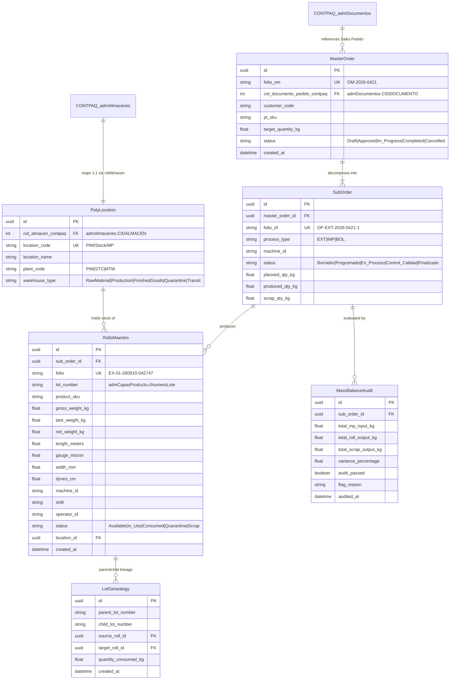

# Canonical Data Model Specification: SPEC-002 Core Domain & Data Model

**Feature Branch**: `002-core-domain-data-model`  
**Date**: 2026-09-14  
**Spec**: [spec.md](./spec.md) | **Research**: [research.md](./research.md)

---

## 1. Domain ER Diagram



---

## 2. Table Schemas & Constraints

### 2.1 `poly_locations`

Stores internal 2-step location paths mapped 1:1 to CONTPAQi `admAlmacenes` IDs.

| Field Name | Type | Constraints | Description |
| :--- | :--- | :--- | :--- |
| `id` | `UUID` | `PRIMARY KEY` | Unique location identifier |
| `cid_almacen_contpaq` | `INT` | `NOT NULL, UNIQUE` | CONTPAQi `admAlmacenes.CIDALMACEN` |
| `location_code` | `VARCHAR(50)` | `NOT NULL, UNIQUE` | 2-step path (e.g. `PIM/Stock/MP`) |
| `location_name` | `VARCHAR(100)`| `NOT NULL` | Descriptive name |
| `plant_code` | `VARCHAR(10)` | `NOT NULL` | Plant identifier (`PIM`, `STC`, `MTM`) |
| `warehouse_type` | `VARCHAR(30)` | `NOT NULL` | `RawMaterial`, `Production`, `FinishedGoods`, `Quarantine`, `Transit` |
| `is_active` | `BOOLEAN` | `DEFAULT TRUE` | Location active status |

---

### 2.2 `poly_master_orders`

Stores parent Master Orders (OM) linked to CONTPAQi Sales Orders (`admDocumentos`).

| Field Name | Type | Constraints | Description |
| :--- | :--- | :--- | :--- |
| `id` | `UUID` | `PRIMARY KEY` | Master Order ID |
| `folio_om` | `VARCHAR(30)` | `NOT NULL, UNIQUE` | Master Order Folio (e.g. `OM-2026-0421`) |
| `cid_documento_pedido`| `INT` | `NOT NULL` | CONTPAQi Sales Order `CIDDOCUMENTO` |
| `customer_code` | `VARCHAR(30)` | `NOT NULL` | Customer code (`admClientes.CCODIGOCLIENTES`) |
| `pt_sku` | `VARCHAR(30)` | `NOT NULL` | Finished Product SKU |
| `target_quantity_kg` | `NUMERIC(12,3)`| `NOT NULL, > 0` | Total scheduled output weight |
| `status` | `VARCHAR(20)` | `NOT NULL` | `Draft`, `Approved`, `In_Progress`, `Completed`, `Cancelled` |
| `created_at` | `TIMESTAMPTZ` | `NOT NULL` | Creation timestamp |

---

### 2.3 `poly_sub_orders`

Stores process execution sub-orders (`OF-EXT`, `OF-IMP`, `OF-BOL`).

| Field Name | Type | Constraints | Description |
| :--- | :--- | :--- | :--- |
| `id` | `UUID` | `PRIMARY KEY` | Sub-Order ID |
| `master_order_id` | `UUID` | `FOREIGN KEY` | Parent Master Order ID |
| `folio_of` | `VARCHAR(35)` | `NOT NULL, UNIQUE` | Sub-Order Folio (e.g. `OF-EXT-2026-0421-1`) |
| `process_type` | `VARCHAR(10)` | `NOT NULL` | `EXT` (Extrusión), `IMP` (Impresión), `BOL` (Bolseo) |
| `machine_id` | `VARCHAR(20)` | `NOT NULL` | Work Center / Extrusion Line ID |
| `status` | `VARCHAR(20)` | `NOT NULL` | `Borrador`, `Programado`, `En_Proceso`, `Control_Calidad`, `Finalizado`, `Scrap` |
| `planned_qty_kg` | `NUMERIC(12,3)`| `NOT NULL, > 0` | Planned batch weight |
| `produced_qty_kg` | `NUMERIC(12,3)`| `DEFAULT 0.0` | Accumulated roll output weight |
| `scrap_qty_kg` | `NUMERIC(12,3)`| `DEFAULT 0.0` | Accumulated scrap weight |
| `created_at` | `TIMESTAMPTZ` | `NOT NULL` | Creation timestamp |

---

### 2.4 `poly_master_rolls`

Stores physical master roll inventory and technical parameters.

| Field Name | Type | Constraints | Description |
| :--- | :--- | :--- | :--- |
| `id` | `UUID` | `PRIMARY KEY` | Rollo Maestro ID |
| `sub_order_id` | `UUID` | `FOREIGN KEY` | Originating Sub-Order ID |
| `folio` | `VARCHAR(30)` | `NOT NULL, UNIQUE` | Immutable Folio (`EX-01-260910-042747`) |
| `lot_number` | `VARCHAR(30)` | `NOT NULL` | CONTPAQi Lot (`admCapasProducto.cNumeroLote`) |
| `product_sku` | `VARCHAR(30)` | `NOT NULL` | Master SKU |
| `gross_weight_kg` | `NUMERIC(10,3)`| `NOT NULL, > 0` | Measured gross weight |
| `tare_weight_kg` | `NUMERIC(10,3)`| `NOT NULL, >= 0` | Measured core/pallet tare |
| `net_weight_kg` | `NUMERIC(10,3)`| `GENERATED` | Gross minus Tare |
| `length_meters` | `NUMERIC(10,2)`| `NOT NULL, > 0` | Total meterage |
| `gauge_micron` | `NUMERIC(8,2)` | `NOT NULL, > 0` | Calibre in micras |
| `width_mm` | `NUMERIC(8,2)` | `NOT NULL, > 0` | Width in mm |
| `dynes_cm` | `NUMERIC(5,1)` | `DEFAULT 38.0` | Corona treatment energy |
| `machine_id` | `VARCHAR(20)` | `NOT NULL` | Line ID |
| `shift` | `VARCHAR(10)` | `NOT NULL` | Work shift |
| `operator_id` | `VARCHAR(50)` | `NOT NULL` | Operator user ID |
| `status` | `VARCHAR(20)` | `NOT NULL` | `Available`, `In_Use`, `Consumed`, `Quarantine`, `Scrap` |
| `location_id` | `UUID` | `FOREIGN KEY` | Current location ID (`poly_locations.id`) |
| `created_at` | `TIMESTAMPTZ` | `NOT NULL` | Timestamp |

---

### 2.5 `poly_lot_genealogy`

Tracks DAG transformational relationships between lots.

| Field Name | Type | Constraints | Description |
| :--- | :--- | :--- | :--- |
| `id` | `UUID` | `PRIMARY KEY` | Lineage record ID |
| `parent_lot_number` | `VARCHAR(30)` | `NOT NULL` | Parent lot number (e.g. Resin Lot) |
| `child_lot_number` | `VARCHAR(30)` | `NOT NULL` | Child lot number (e.g. Master Roll Lot) |
| `source_roll_id` | `UUID` | `NULLABLE FK` | Source roll ID |
| `target_roll_id` | `UUID` | `NULLABLE FK` | Target roll ID |
| `quantity_consumed_kg`| `NUMERIC(10,3)`| `NOT NULL, > 0` | Weight consumed in transition |
| `created_at` | `TIMESTAMPTZ` | `NOT NULL` | Timestamp |

---

### 2.6 `poly_mass_balance_audits`

Tracks shop-floor mass balance calculations and tolerance audits.

| Field Name | Type | Constraints | Description |
| :--- | :--- | :--- | :--- |
| `id` | `UUID` | `PRIMARY KEY` | Audit record ID |
| `sub_order_id` | `UUID` | `FOREIGN KEY` | Sub-order audited |
| `total_mp_input_kg` | `NUMERIC(12,3)`| `NOT NULL` | Total raw material input |
| `total_roll_output_kg`| `NUMERIC(12,3)`| `NOT NULL` | Total roll output |
| `total_scrap_output_kg`| `NUMERIC(12,3)`| `NOT NULL` | Total scrap output |
| `variance_percentage` | `NUMERIC(6,3)` | `NOT NULL` | Calculated variance % |
| `audit_passed` | `BOOLEAN` | `NOT NULL` | `True` if variance <= 2.0% |
| `flag_reason` | `TEXT` | `NULLABLE` | Explanation if failed |
| `audited_at` | `TIMESTAMPTZ` | `NOT NULL` | Audit timestamp |

---

## 3. State Transition Rules

### Sub-Order Pipeline (`poly_sub_orders.status`)

```
[Borrador] --(Schedule & Assign)--> [Programado] --(Start Scan)--> [En_Proceso]
[En_Proceso] --(Finish Batch & Weigh)--> [Control_Calidad]
[Control_Calidad] --(Quality Approval & Pass Audit)--> [Finalizado]
[Control_Calidad] --(Quality Reject)--> [Scrap]
```

### Rollo Maestro Lifecycle (`poly_master_rolls.status`)

```
[Available] --(Scan to Print/Bagging)--> [In_Use] --(Fully Consumed)--> [Consumed]
[Available] --(Quality Audit Hold)--> [Quarantine]
[Quarantine] --(Quality Release)--> [Available]
[Quarantine] --(Quality Reject)--> [Scrap]
```
