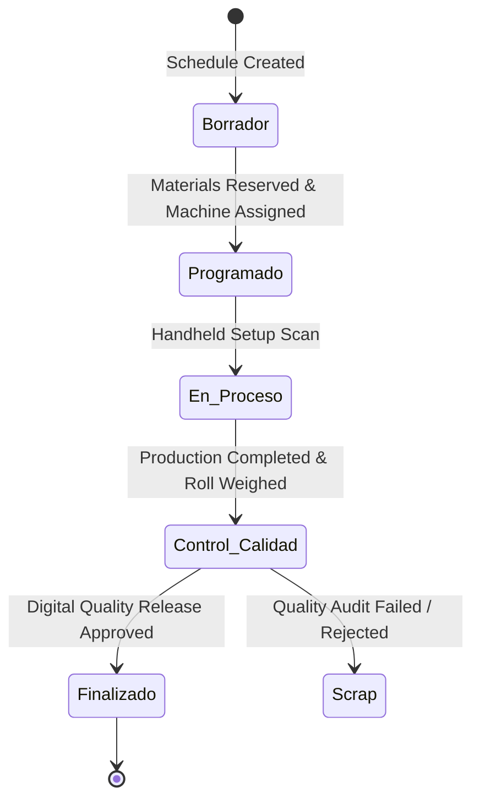

# Research & Design Decisions: SPEC-002 Core Domain & Data Model

**Feature Branch**: `002-core-domain-data-model`  
**Date**: 2026-09-14  
**Spec**: [spec.md](./spec.md)

---

## 1. Warehouse & Location Mapping (PolyConecta vs CONTPAQi `admAlmacenes`)

### Decision
Map each physical plant virtual sub-location 1:1 to dedicated entries in CONTPAQi's `admAlmacenes` catalog table, while encapsulating them inside PolyConecta using an Odoo 19 Enterprise-style 2-step location routing model.

### Key Mappings

| Physical Plant | PolyConecta 2-Step Location Path | CONTPAQi `admAlmacenes` Code (`CCODIGOALMACEN`) | Description |
| :--- | :--- | :--- | :--- |
| **Apodaca (PIM)** | `PIM/Stock/MP` | `ALM_PIM_MP` | Raw Material Resin & Additives Stock |
| **Apodaca (PIM)** | `PIM/Produccion` | `ALM_PIM_PROD` | Shop-Floor WIP Inventory |
| **Apodaca (PIM)** | `PIM/Stock/PT` | `ALM_PIM_PT` | Finished Goods Warehouse |
| **Apodaca (PIM)** | `PIM/Cuarentena` | `ALM_PIM_CUARENTENA` | Quality Quarantine & Hold Location |
| **Santa Cruz (STC)** | `STC/Stock/MP` | `ALM_STC_MP` | STC Plant Raw Materials |
| **Santa Cruz (STC)** | `STC/Stock/PT` | `ALM_STC_PT` | STC Plant Finished Goods |
| **Montemorelos (MTM)** | `MTM/Stock/MP` | `ALM_MTM_MP` | MTM Plant Raw Materials |
| **Montemorelos (MTM)** | `MTM/Stock/PT` | `ALM_MTM_PT` | MTM Plant Finished Goods |
| **Inter-Plant Transit** | `TRANS/PIM-STC` | `ALM_TRANSIT` | In-transit stock between PIM and STC |

### Rationale
- CONTPAQi `admAlmacenes` maintains flat warehouse records without built-in hierarchical locations. Creating distinct warehouse codes in CONTPAQi for each production stage (`MP`, `PROD`, `PT`, `CUARENTENA`) allows accounting and inventory reports in CONTPAQi to match exact plant locations.
- PolyConecta wraps these warehouse IDs into Odoo 19-style 2-step location routing paths (`PIM/Stock/MP` → `PIM/Produccion` → `PIM/Stock/PT`), giving shop-floor operators smooth Kanban routing while preserving ERP fidelity.

---

## 2. Rollo Maestro Entity Model & Technical Identity

### Decision
Model `RolloMaestro` as a first-class domain entity in PolyConecta identified by an immutable Folio string `EX-{Linea:2d}-{YYMMDD}-{HHMMSS}` (e.g. `EX-01-260910-042747`). Map its Folio string to CONTPAQi `admCapasProducto.cNumeroLote` as an individual Lot number.

### Technical Attributes

```sql
CREATE TABLE poly_master_rolls (
    id UUID PRIMARY KEY DEFAULT gen_random_uuid(),
    folio VARCHAR(30) UNIQUE NOT NULL, -- EX-01-260910-042747
    lot_number VARCHAR(30) NOT NULL, -- Mapped to admCapasProducto.cNumeroLote
    sub_order_id UUID NOT NULL REFERENCES poly_sub_orders(id),
    product_sku VARCHAR(30) NOT NULL, -- Master MP / Semi-finished SKU
    gross_weight_kg NUMERIC(10,3) NOT NULL,
    tare_weight_kg NUMERIC(10,3) NOT NULL,
    net_weight_kg NUMERIC(10,3) GENERATED ALWAYS AS (gross_weight_kg - tare_weight_kg) STORED,
    length_meters NUMERIC(10,2) NOT NULL,
    gauge_micron NUMERIC(8,2) NOT NULL, -- Calibre in micras / milésimas
    width_mm NUMERIC(8,2) NOT NULL,
    dynes_cm NUMERIC(5,1) DEFAULT 38.0, -- Surface treatment energy
    machine_id VARCHAR(20) NOT NULL,
    shift VARCHAR(10) NOT NULL, -- "Turno 1", "Turno 2", "Turno 3"
    operator_id VARCHAR(50) NOT NULL,
    status VARCHAR(20) NOT NULL DEFAULT 'Available', -- Available | In_Use | Consumed | Quarantine | Scrap
    location_code VARCHAR(50) NOT NULL DEFAULT 'PIM/Produccion',
    created_at TIMESTAMPTZ NOT NULL DEFAULT clock_timestamp()
);
```

### Rationale
- Plastic film manufacturing requires tracking roll-level physical parameters (Gauge, Meterage, Net Weight, Dynes) that standard ERP lot tables do not support natively.
- Storing full technical specifications in `poly_master_rolls` while passing `folio` as `cNumeroLote` to CONTPAQi satisfies both shop-floor technical requirements and CONTPAQi accounting requirements.

---

## 3. Order Hierarchy & State Pipeline (OM vs OF-EXT, OF-IMP, OF-BOL)

### Decision
Implement a 3-tier order hierarchy:
1. **CONTPAQi Pedido**: Linked via `cIdDocumento` from `admDocumentos`.
2. **Master Order (`MasterOrder` / OM)**: Encloses the customer request and coordinates overall production volume across processes.
3. **Process Sub-Orders (`SubOrder` / `OF-EXT`, `OF-IMP`, `OF-BOL`)**: Execution tickets representing Work Centers (Extrusión, Impresión, Bolseo).

### Status Pipeline (Odoo 19 Kanban Pattern)



### Rationale
- Decoupling Master Orders (OM) from Process Sub-Orders (OF) allows extrusion lines to run independently from printing or bagging queues, preventing shop-floor bottlenecks and enabling precise work center capacity scheduling.

---

## 4. Lot Genealogy & Mass-Balance Accounting

### Decision
PolyConecta maintains a directed acyclic graph (DAG) in `poly_lot_genealogy` tracking transformation links between raw material resin lots, master rolls, printed rolls, and finished bag boxes.

### Mass-Balance Audit Formula

$$\text{Variance (\%)} = \left| \frac{\text{Input MP (kg)} - (\text{Net Output Rolls (kg)} + \text{Scrap Output (kg)})}{\text{Input MP (kg)}} \right| \times 100$$

- Default System Tolerance: **2.0%**
- If Variance > 2.0%, the sub-order status is flagged as `Mass_Balance_Hold` and requires Supervisor digital sign-off before closing.

### Rationale
- Keeping lot transformation lineage within PolyConecta avoids bloating CONTPAQi with multi-level `cIdCapaOrigen` recursion, while guaranteeing 100% backwards and forwards lot traceability for Quality Audits and ISO compliance.
