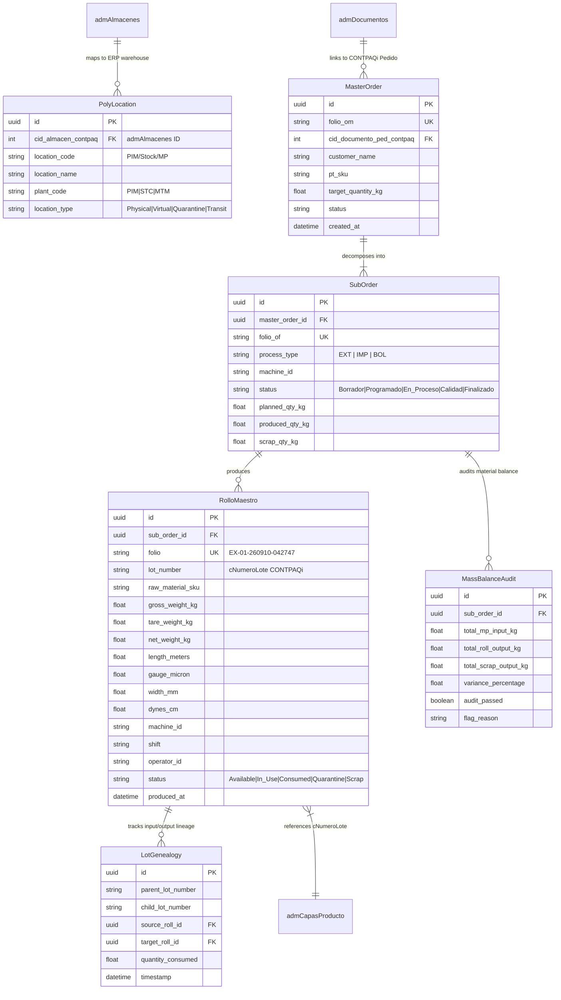

# Feature Specification: SPEC-002: Core Domain & Data Model

**Feature Branch**: `002-core-domain-data-model`  
**Created**: 2026-09-14  
**Status**: Validated  
**Input**: User description: "Definición del Modelo de Datos Canónico de PolyConecta y su alineación estructural con la base de datos CONTPAQi Comercial Premium (`admAlmacenes`, `admCapasProducto`, `admDocumentos`, `admMovimientos`). Incluye la alineación de almacenes físicos y virtuales, el modelo del Rollo Maestro, la jerarquía de órdenes de fabricación (OM vs OF-EXT, OF-IMP, OF-BOL), y el esquema de lotes y capas de inventario."

---

## Executive Summary & Architectural Vision

This specification defines the **Canonical Domain & Data Model** for **PolyConecta**, a specialized Operational Routing & Inventory Engine for plastic film extrusion, printing, and converting plants (Apodaca `PIM`, Santa Cruz `STC`, Montemorelos `MTM`).

In strict compliance with **Constitution v1.4.0**, **CONTPAQi Comercial Premium v10+** remains the single master repository of record for billing, accounting, financial reporting, and official inventory balances. PolyConecta operates as the shop-floor intelligence and execution layer. While PolyConecta is a custom web application and does NOT deploy Odoo as an underlying framework, its user interfaces (Kanban, List, Form views, Smart Buttons) and operational workflows explicitly emulate **Odoo 19 Enterprise** as its design benchmark.

---

## User Scenarios & Testing *(mandatory)*

### User Story 1 - Multi-Plant & Virtual Location Inventory Management (Priority: P1)

As a Plant Logistics Coordinator and Shop-Floor Operator, I need to track physical raw materials (MP), work-in-progress (WIP), and finished goods (PT) across physical plants and virtual plant locations in PolyConecta, while ensuring that inventory shifts between production states correspond to CONTPAQi `admAlmacenes` entries.

**Why this priority**: Precise inventory positioning across physical and virtual boundaries is critical for shop-floor routing, stock visibility, and CONTPAQi reconciliation.

**Independent Test**: Can be verified by creating raw material stock in `ALM_PIM_MP`, executing a handheld barcode transfer to `ALM_PIM_PROD`, and observing corresponding movement queues and stock balances in both PolyConecta and CONTPAQi `admAlmacenes`.

**Acceptance Scenarios**:

1. **Given** raw material resin bags stored in `ALM_PIM_MP`, **When** a operator scans and transfers resin to extrusion, **Then** PolyConecta updates internal 2-step location routing (`PIM/Stock/MP` → `PIM/Produccion`) and registers an asynchronous stock transfer or consumption movement towards CONTPAQi `admAlmacenes` (`ALM_PIM_MP` → `ALM_PIM_PROD`).
2. **Given** a finished roll marked with a Quality Hold, **When** Quality Inspection updates its status, **Then** the material is routed to `ALM_PIM_CUARENTENA` (virtual and ERP warehouse) until a formal digital Quality Release is granted.

---

### User Story 2 - Rollo Maestro Lifecycle & Physical Identity Tracking (Priority: P1)

As an Extrusion Operator and Quality Auditor, I need each extruded master roll ("Rollo Maestro") to possess an immutable physical identity (Folio, Gross Weight, Tare, Net Weight, Length, Gauge, Dynes, Machine ID, Shift, Operator) linked to an individual lot in CONTPAQi (`admCapasProducto.cNumeroLote`), so that full roll-level physical traceability is preserved.

**Why this priority**: Master rolls are the fundamental physical output of extrusion and the primary unit of consumption for downstream processes (printing, slitting, bagging).

**Independent Test**: Can be tested by performing a handheld extrusion weight capture, generating an immutable GS1-128 barcode label with Folio `EX-01-260910-042747`, and verifying that all physical properties (calibre, metraje, peso neto, dinas) are querying correctly in PolyConecta while its Lot is mapped to `admCapasProducto.cNumeroLote`.

**Acceptance Scenarios**:

1. **Given** an extrusion machine completing a roll run, **When** the operator captures gross weight and tare on the handheld scanner, **Then** PolyConecta generates a Rollo Maestro with net weight calculation ($\text{Net} = \text{Gross} - \text{Tare}$), assigns an immutable Folio `EX-{Linea}-{YYMMDD}-{HHMMSS}`, generates a GS1-128 QR code label, and links the roll to an individual CONTPAQi Lot string (`cNumeroLote`).
2. **Given** a Rollo Maestro in stock, **When** a downstream printing operator scans the roll QR code, **Then** PolyConecta displays complete physical attributes (gauge in milésimas/micras, net weight, corona treatment dynes, production shift) in an Odoo 19-style Form view with Smart Buttons showing its manufacturing order origin.

---

### User Story 3 - Hierarchical Manufacturing Orders (OM vs OF-EXT, OF-IMP, OF-BOL) (Priority: P1)

As a Production Planner, I need to decompose a customer Sales Order (`admDocumentos` concept Pedido) into a Master Order (OM) and process-level Sub-Orders (`OF-EXT`, `OF-IMP`, `OF-BOL`), so that each department operates on focused job queues with independent status pipelines and intermediate quality gates.

**Why this priority**: Manufacturing plastic films requires multi-stage processing where each phase (extrusion, flexographic printing, bag converting) has distinct setup parameters, waste factors, and job schedules.

**Independent Test**: Can be tested by creating a Master Order (OM-1001) from an incoming sales order, generating sequential process sub-orders (`OF-EXT-1001`, `OF-IMP-1001`, `OF-BOL-1001`), advancing `OF-EXT-1001` through its Kanban lifecycle (Borrador → Programado → En Proceso → Control Calidad → Finalizado), and verifying that intermediate WIP outputs are held until quality approval.

**Acceptance Scenarios**:

1. **Given** an active Master Order (OM), **When** the planner approves the production schedule, **Then** PolyConecta creates process sub-orders (`OF-EXT`, `OF-IMP`, `OF-BOL`) linked directly to the parent OM, initialized in `Borrador` state.
2. **Given** an active Extrusion Sub-Order (`OF-EXT`), **When** rolls are produced and inspected, **Then** the sub-order tracks cumulative output weight, scrap weight, and mass-balance variance against scheduled requirements before transitioning to `Control Calidad`.

---

### User Story 4 - Lot Lineage, Independent Inventory Layers & Mass-Balance Audit (Priority: P2)

As a Plant Manager and Financial Auditor, I need PolyConecta to maintain complete multi-tier lot transformation lineage (Resin Lot → Rollo Maestro Lot → Printed Roll Lot → Bag Box Lot) and mass-balance accounting internally, while synchronizing aggregate lot stock movements to CONTPAQi without relying on CONTPAQi `cIdCapa` deep tree storage.

**Why this priority**: Plant operations demand detailed multi-step lot lineage for recall and quality traceability, while CONTPAQi requires reliable aggregate inventory balances and cost records.

**Independent Test**: Can be verified by executing a complete production flow from resin consumption to finished bag boxes, auditing the mass balance calculation ($\text{Consumo MP} = \sum \text{Rollos} + \text{Scrap}$), verifying lot genealogy in PolyConecta, and confirming aggregate stock updates in CONTPAQi.

**Acceptance Scenarios**:

1. **Given** a raw material lot consumed during extrusion, **When** master rolls are created, **Then** PolyConecta records the multi-tier lineage link between raw material lots and generated master roll lots (`poly_lot_genealogy`).
2. **Given** a completed sub-order run, **When** total raw material input is compared against total roll output plus scrap, **Then** PolyConecta computes mass-balance variance and flags an audit alert if the variance exceeds configured tolerance limits.

---

### Edge Cases

- **Offline Handheld Scanning**: What happens when a handheld scanner loses wireless connection during roll weight registration?  
  *Behavior*: The handheld buffers the scan transaction locally in IndexedDB/SQLite offline storage, prints/renders the local roll barcode with temporary offline sequence, and synchronizes asynchronously upon reconnection.
- **Partial Roll Consumption & Remaining Stub (Colilla)**: What happens when a master roll is partially consumed in printing/slitting, leaving a partial roll?  
  *Behavior*: PolyConecta generates a child "Colilla" roll entity inheriting the parent's gauge, machine origin, and shift attributes, with updated net weight and metraje, adjusting inventory balances accordingly.
- **Quality Rejection at Intermediate Stage**: How does the system handle a master roll rejected during printing inspection?  
  *Behavior*: The roll status transitions to `Rechazado`, its location shifts to `ALM_PIM_CUARENTENA` / Scrap, the quality gate hard-stop blocks further processing, and a scrap notification is sent to the planner.
- **CONTPAQi Master Catalog Discrepancies**: How does PolyConecta handle customer-specific SKU variations in CONTPAQi versus unified master raw material SKUs?  
  *Behavior*: PolyConecta maps supplier raw material codes to a standardized master MP catalog, while preserving customer PT SKUs (`admProductos`) linked to internal physical technical specifications.

---

## Requirements *(mandatory)*

### Functional Requirements

#### 1. Warehouse & Location Modeling
- **FR-001**: PolyConecta MUST model warehouse locations in alignment with CONTPAQi `admAlmacenes` records by creating dedicated warehouse entries for each physical plant and virtual sub-location (e.g., `ALM_PIM_MP`, `ALM_PIM_PROD`, `ALM_PIM_PT`, `ALM_PIM_CUARENTENA`, `ALM_STC_MP`, `ALM_STC_PT`, `ALM_MTM_MP`, `ALM_MTM_PT`).
- **FR-002**: PolyConecta MUST support Odoo 19-style 2-step location hierarchy paths internally (e.g., `PIM/Stock/MP`, `PIM/Produccion`, `PIM/Stock/PT`, `TRANS/PIM-SC`, `PIM/Cuarentena`) for granular shop-floor routing while maintaining strict 1:1 mapping to CONTPAQi `admAlmacenes` IDs (`CIDALMACEN`).
- **FR-003**: The system MUST enforce location routing rules that prevent unreleased or quarantined stock in `ALM_PIM_CUARENTENA` from being selected for dispatch (`PIM-OUT-DIR`) or inter-plant transfer (`PIM-TR-OUT`).

#### 2. Rollo Maestro Entity & Technical Attributes
- **FR-004**: PolyConecta MUST define a canonical `RolloMaestro` entity representing extruded master rolls, identified by an immutable Folio string formatted as `EX-{Linea:2d}-{YYMMDD}-{HHMMSS}` (e.g., `EX-01-260910-042747`).
- **FR-005**: Every `RolloMaestro` record MUST store mandatory physical technical attributes: Gross Weight (kg), Tare Weight (kg), Net Weight (kg, calculated), Meterage (m), Nominal Gauge (calibre in milésimas/micras), Width (ancho in mm/cm), Corona Treatment Surface Energy (Dynes/cm), Extrusion Line/Machine ID, Production Shift, Operator ID, and Timestamp.
- **FR-006**: PolyConecta MUST associate each `RolloMaestro` with a distinct Lot Identifier (`cNumeroLote`) for alignment with CONTPAQi `admCapasProducto.cNumeroLote`.
- **FR-007**: The system MUST generate a GS1-128 barcode / QR code containing the Folio, SKU, Lot, Net Weight, and Gauge for 100% mobile handheld scanning on the shop floor.

#### 3. Order Hierarchy & Status Pipeline
- **FR-008**: PolyConecta MUST support a hierarchical order structure consisting of:
  1. **Sales Order Linkage**: Document reference to CONTPAQi Sales Order (`admDocumentos` concept `Pedido`).
  2. **Master Order (OM)**: Overall production plan agrouping all manufacturing steps for a customer commitment.
  3. **Process Sub-Orders (OF)**: Execution sub-orders per production phase: Extrusion (`OF-EXT`), Flexographic Printing (`OF-IMP`), and Bag Converting (`OF-BOL`).
- **FR-009**: Each Process Sub-Order MUST maintain an independent status pipeline adhering to Odoo 19 Kanban patterns: `Borrador` → `Programado` → `En Proceso` → `Control Calidad` → `Finalizado` (or `Cancelado`).
- **FR-010**: Downstream sub-orders (`OF-IMP`, `OF-BOL`) MUST NOT begin execution until input rolls from upstream stages (`OF-EXT`) pass the mandatory Quality Gate digital approval.

#### 4. Inventory Lot Lineage, Scrap & Mass-Balance
- **FR-011**: PolyConecta MUST record full multi-tier lot lineage (`poly_lot_genealogy`) tracking transformations from Raw Material Resin Lots → Master Roll Lots → Printed Roll Lots → Finished Product Bag Box Lots.
- **FR-012**: PolyConecta MUST manage lot balances, FIFO selection, and transformation history independently in its local core database, while transmitting aggregate stock movement records (entries, exits, transfers) to CONTPAQi via the asynchronous Outbox Bridge.
- **FR-013**: The system MUST compute shop-floor mass balance for every extrusion sub-order using the formula:
  $$\text{Mass Balance Variance (\%)} = \frac{\text{Total Input Raw Material (kg)} - (\text{Net Roll Output (kg)} + \text{Scrap Output (kg)})}{\text{Total Input Raw Material (kg)}} \times 100$$
- **FR-014**: PolyConecta MUST trigger a mandatory audit alert if mass balance variance exceeds the system-configured tolerance percentage (default: 2.0%).

---

## Key Entities *(mandatory)*

---

## Success Criteria *(mandatory)*

### Measurable Outcomes

- **SC-001**: 100% of master rolls produced on the shop floor have an immutable Folio and GS1-128 QR code generated in under 1.5 seconds from handheld weight capture.
- **SC-002**: 100% of shop-floor inventory movements across virtual locations (`PIM/Stock/MP`, `PIM/Produccion`, `PIM/Stock/PT`, `PIM/Cuarentena`) accurately sync to corresponding CONTPAQi `admAlmacenes` records via the Outbox Bridge without orphan records.
- **SC-003**: 100% of manufacturing runs undergo automated mass-balance calculation with real-time audit flagging whenever variance exceeds the 2.0% threshold.
- **SC-004**: Zero material dispatches (`PIM-OUT-DIR`) or inter-plant transfers (`PIM-TR-OUT`) occur without a verified digital Quality Release (100% hard-stop enforcement).
- **SC-005**: 100% compliance with Odoo 19 Enterprise design standards across Kanban, List, and Form views for Master Orders and Sub-Orders, including interactive Smart Buttons for roll lineage navigation.

---

## Assumptions

- **ERP Database Structure**: CONTPAQi Comercial Premium v10+ `admAlmacenes` has pre-configured warehouse codes corresponding to plant virtual sub-locations (e.g., `ALM_PIM_MP`, `ALM_PIM_PROD`, `ALM_PIM_PT`, `ALM_PIM_CUARENTENA`).
- **Hardware Integration**: Phase 1 shop-floor data entry relies on 100% mobile handheld scanner devices operated by plant personnel (direct IoT scale telemetry deferred to Phase 2).
- **Network Resilience**: Plant connectivity may experience intermittent Wi-Fi drops; mobile client applications buffer scan events offline and sync asynchronously.
- **Catalog Standardization**: Raw material (MP) SKUs are unified under a master catalog in PolyConecta, while finished product (PT) SKUs retain customer-specific mappings linked to CONTPAQi `admProductos`.
