# Feature Specification: SPEC-002: Domain Model Redefinition (Auditable, Stateful, Multi-Entity Business Model)

**Feature Branch**: `002-domain-model-redefinition`

**Created**: 2026-09-15

**Status**: Draft

**Input**: User description: "Redefinir la capa de dominio (`PolyConecta.Domain`) en base a las 17 reglas de negocio de `INFORME_VALIDACION_DIAGRAMA_OPERATIVO.md`, aplicando una filosofía de modelado de datos con auditoría, archivado, relaciones bien tipadas, seguridad en dos capas, multiempresa y flujos de estado explícitos — reemplazando el modelo actual, que quedó desalineado tras priorizar primero una prueba de concepto visual."

---

## Executive Summary & Architectural Vision

El dominio actual (`PolyConecta.Domain`) nació antes de que la operación validara las 17 reglas de `INFORME_VALIDACION_DIAGRAMA_OPERATIVO.md`, y quedó congelado en un borrador temprano mientras el esfuerzo se concentraba en una prueba de concepto visual. Como consecuencia, hoy conviven **dos jerarquías de órdenes duplicadas** (`MasterOrder`/`SubOrder` vs. `ManufacturingOrder` auto-referenciado), **dos entidades de rollo duplicadas** (`RolloMaestro` vs. `StockLot`), máquinas de estado con nombres distintos entre entidades que representan el mismo documento, y ninguna entidad real para `WorkOrder`, `WorkCenter`, ficha técnica multinivel o motivos de scrap — todo eso solo existe hoy como datos de ejemplo en la capa de presentación (`Presentation.Models.OperationalModels`).

Esta especificación **redefine `PolyConecta.Domain` desde cero como fuente única de verdad**, aplicando un conjunto de principios de modelado agnósticos de stack (mixins de auditoría/archivado, relaciones tipadas con patrón de herencia explícito, flujos de estado cerrados con transiciones auditadas, seguridad en dos capas separadas, multiempresa por entidad legal, y numeración de referencias centralizada) sobre el vocabulario de negocio ya validado (`OM`, `OF`, `WO`, lotes `R00X`/`​.S`, tipos de operación, balance de masa). El resultado reemplaza el modelo actual entidad por entidad, sin dejar duplicados.

Esta spec se ancla en la Constitución del Proyecto v1.4.0 — en particular los Principios III (fronteras de catálogo MP/PT), IV (balance de masa, auditoría obligatoria, hard-stop de calidad), V (multiplanta/multiempresa) y VIII (alineación con la realidad operativa de CONTPAQi) — y no introduce ningún alcance que la Constitución declare diferido a Fase 2 (mezcla completa intercompany, órdenes de peletizado, integración directa de báscula IoT, flujo de 3 firmas de requisición).

---

## Nota de validación posterior — revisión 4 (transcripción de reunión + mockups reales, 2026-09-18/19)

Se revisaron la transcripción de la reunión Polyempaques/AI Consultores del 18-sep-2026 (`docs/references/notes/Notas de reunion - Descripcion de flujos.pdf`) y 19 mockups reales (`docs/mockups/`). Esto **supersede la jerarquía tripartita `OM`/`OF`/`WO` de la User Story 1 y FR-003 más abajo** — se conserva esa sección como registro histórico de la primera hipótesis, no como el diseño vigente. Cambios confirmados (decisión del usuario, todas con la opción recomendada):

1. **`ManufacturingOrder` y `ProcessOrder` se fusionan en un solo tipo autoreferenciado** (`ManufacturingOrder` con `OriginOrderId` nullable FK a sí misma). Los mockups muestran que la OM (ej. `BOL/2026/0001`) y cada OF secundaria (`IMP/2026/0001`, `EXT/2026/0001`) usan **exactamente el mismo formulario y pestañas** (Componentes/Subproductos/Producción/Planeación); solo cambian los smart buttons: la orden sin `OriginOrderId` (la "maestra") enlaza a `Pedido`, las demás enlazan a su "Orden de Fabricación Origen". La cadena real observada: `Pedido → OF-BOL (maestra, sin origen) → OF-IMP (origen=BOL) → OF-EXT (origen=IMP)` — el proceso que se entrega al cliente es la raíz, no necesariamente "Bolseo" fijo.
2. **`WorkOrder` deja de ser una entidad independiente.** La "Planeación" es una tabla de líneas (`PlanningLine`: centro de trabajo, cantidad, unidad, fecha inicio, fecha fin, operador) embebida directamente en `ManufacturingOrder` — los mockups muestran una misma OF dividida en 2 filas (2 centros de trabajo/días distintos, ej. `COEXT-001`/`COEXT-002`), no un documento `WO` aparte.
3. **`Bom`/`BomLine` se simplifica**: ya no hay capas/tolvas A-B-C con porcentaje. Es una lista plana editable de líneas (`Clave`, `Producto`, `Cantidad`, `Unidad`), cada una eliminable — coincide con la evidencia de sustitución de materia prima descrita en la transcripción (el Planner borra/agrega líneas libremente antes del cierre).
4. **Nueva entidad `SubProductLine`** (pestaña "Subproductos"): cada `ManufacturingOrder` declara qué producto(s) de scrap resultan de su proceso — no es un texto libre ni un `ScrapReasonCode` genérico, es un producto CONTPAQi propio por tipo de proceso, con `Cantidad`, `Unidad`, `Producido` (bool) y `AlmacenDestino` explícito.
5. **`QualityCheck` pasa a ser un documento propio (`QualityControl`)**, no un registro inline por slot: folio propio (`QC/2026/000X`), referencia a la `ManufacturingOrder`, `Auditor`, `Proceso`, estado (`Planeado/Aprobado/Parcial/Rechazado`), y una tabla `Controles` (Producto/Lote/Cantidad Planeada/Cantidad Real/Aprueba-Falla) — con acciones globales `Aprueba`/`Falla` a nivel de todo el documento además de por línea.
6. **Nomenclatura de lote corregida**: `R{secuencial de 3 dígitos}-{Folio del Pedido}` (ej. `R001-IV310-26`) — NO el ID interno de CONTPAQi ni un prefijo por proceso; era inconsistente en los propios mockups (4 variantes distintas) y el usuario confirmó este formato como el correcto.
7. **`StockPicking` se redefine en 3 conceptos**: `Traslado` (interplanta, paso 1 — salida de origen) y `Recepcion` (interplanta, paso 2 — confirmación de destino por lote, puede ser parcial: columnas `Demanda` vs `Cantidad Entregada`) siguen siendo las 2 mitades de la misma operación de 2 pasos ya validada; `Entrega` (cliente externo) es un documento independiente de un solo paso que dispara la Remisión en CONTPAQi. Ambos tipos comparten acciones `Comprobar disponibilidad` / `Validar` / `Cancelar`, y el traslado/recepción interplanta añade `Imprimir`. Estados: `Borrador → En espera de operación → En espera → Listo → Hecho` (traslado/recepción, 5 estados) vs. `Borrador → En espera → Listo → Hecho` (entrega, 4 estados).
8. **Nueva entidad `Incidencia`** (paro de máquina): `Fecha`, `CentroTrabajo`, `TipoIncidencia` (de un catálogo), `Comentarios`, `HoraInicio`, `HoraFin` — captura global, no ligada a una `ManufacturingOrder` específica.
9. **`SalesOrder` necesita más campos**: `OrdenCompraCliente` (PO del cliente), `Agente` (vendedor/AC), `ErpDocumentId` ya existía pero ahora es explícitamente de solo lectura ("Contpaq ID"). Cada checkbox de proceso (Extrusión/Impresión/Bolseo) en `SalesOrderLine` lleva su propio `Plant` (Origen) y su propio `ProductId` — no un checkbox genérico.
10. **Riesgo técnico identificado, no resuelto** (Sergio Martínez, transcripción ~00:53:23): la Remisión que dispara `Entrega` debe quedar enlazada al Pedido de origen en CONTPAQi vía SDK — si el SDK no soporta mandar ese folio al crear la remisión, el Pedido en CONTPAQi queda "pendiente de surtir" indefinidamente. Pendiente de verificación técnica contra el SDK real (Principio VII), no es un problema de modelo de datos.

---

### ⚠️ Sección superada — se conserva como registro histórico, no como diseño vigente

### User Story 1 - Jerarquía tripartita real de manufactura (Priority: P1)

Como Planner de Extrusión, necesito que la Orden de Manufactura Maestra (`OM`), la Orden de Fabricación por proceso (`OF`) y la Orden de Trabajo (`WO`) sean tres entidades independientes con su propio estado, para poder programar una `WO` en una máquina y fecha sin que eso obligue a reinterpretar el estado de la `OF` que la contiene, ni mezclar dos jerarquías distintas en el mismo documento.

**Why this priority**: Es el gap estructural más grande detectado — hoy `ManufacturingOrder` colapsa `OF` y `WO` en una sola tabla, y coexiste con el modelo legado `MasterOrder`/`SubOrder` escrito en paralelo por el controlador actual. Sin esto, ninguna otra regla de la Fase 3 puede implementarse de forma consistente.

**Independent Test**: Crear una `OM`, confirmar sus `OF` hijas, verificar que cada `OF` genera su propia `WO` en estado `Por programar`, asignar máquina y fecha a una `WO`, y comprobar que el estado de la `OF` padre no cambia automáticamente salvo por una transición explícita propia.

**Acceptance Scenarios**:

1. **Given** una `OM` en `Draft` con tres `OF` hijas (`EXT`, `IMP`, `BOL`), **When** se confirma la `OF-EXT` con su BOM cargado, **Then** se crea su `WO` en estado `PendingSchedule` y la `OM` permanece en `Draft`.
2. **Given** una `WO` en `PendingSchedule`, **When** se le asigna centro de trabajo y fecha, **Then** transiciona a `Scheduled`/`InProgress` y queda un registro auditado de la transición (quién, cuándo, de qué estado a cuál).
3. **Given** una `OF` sin BOM cargado, **When** se intenta confirmarla, **Then** la operación se rechaza (precondición de la transición, no una edición libre del campo de estado).

---

### User Story 2 - Ficha técnica multinivel desacoplada (Priority: P1)

Como Atención a Clientes, necesito capturar la ficha técnica de Rollo y la de PT en registros propios y reutilizables ligados al producto — **dentro de PolyConecta, no en CONTPAQi** — para no forzar campos de PT en un rollo intermedio (o viceversa) ni repetir manualmente los mismos datos en cada pedido.

**Why this priority**: Se confirmó con la operación que los campos de usuario/datos complementarios de CONTPAQi Premium (a nivel Pedido o a nivel Producto) son insuficientes para esta ficha técnica — no es una limitación temporal, es una restricción real del ERP. Por eso esta ficha **vive en el dominio de PolyConecta**, vinculada al producto de CONTPAQi solo por su código (`erp_product_id`/SKU), nunca replicada como campos custom dentro de CONTPAQi.

**Independent Test**: Crear un producto `IntermediateRoll` con su `RollSpecification` (tipo de material, calibre, kg por rollo, tratado, pigmento, aditivo, perforación, impresión); crear un producto `FinishedGood` con su `PtSpecification` (no. de parte del cliente, medida, tintas, pantones, suaje, empaque, tipo de sello, kg por millar) referenciando el `RollSpecification` del que se deriva — que puede ser el mismo rollo vendido tal cual, o uno distinto si el PT pasa por un segundo proceso (bolseo/impresión); confirmar que la captura de Atención a Clientes siempre completa ambos bloques (Rollo y PT), incluso cuando físicamente describen el mismo material.

**Acceptance Scenarios**:

1. **Given** un producto categoría `FinishedGood`, **When** se consulta su ficha técnica, **Then** se obtienen los datos de `PtSpecification` y, a través de su referencia obligatoria a `RollSpecification`, los datos del rollo del que se deriva (mismo rollo o de segundo proceso), sin campos duplicados entre ambos registros.
2. **Given** un producto `RawMaterial`, **When** se consulta su ficha técnica, **Then** no existe ninguna `RollSpecification` ni `PtSpecification` asociada — esos registros solo se crean para las categorías que los necesitan.
3. **Given** un `Pedido` en CONTPAQi con una línea que referencia ese PT, **When** PolyConecta sincroniza la línea, **Then** el pedido aparece con **una sola línea comercial** (producto + cantidad), y es PolyConecta quien resuelve internamente sus dos bloques de ficha técnica (Rollo + PT) — CONTPAQi nunca ve esos campos.

---

### User Story 3 - Nomenclatura y reciclaje de lotes con cuarentena `.S` (Priority: P1)

Como Inspector de Calidad, necesito que rechazar un lote lo renombre automáticamente con el sufijo `.S`, lo mueva a la ubicación de cuarentena de su planta, y libere su número de secuencia para que el rollo de reposición tome el folio limpio — todo como una única operación de dominio, no como tres pasos manuales coordinados a mano.

**Why this priority**: Es la regla operativa más citada por la planta (#14) y la que hoy solo está simulada en la capa de presentación (`OperationalDataStore.WeighRoll`), sin ninguna garantía de dominio detrás.

**Independent Test**: Pesar el rollo del slot `R001` de una `OF-EXT` confirmada, marcar la inspección de calidad como reprobada, verificar que el lote pasa a `IV214-26-R001.S` en la ubicación de cuarentena de la planta, y que el slot `R001` queda disponible para un nuevo lote que sí puede nombrarse `IV214-26-R001`.

**Acceptance Scenarios**:

1. **Given** un `ProductionSlot` `R001` con lote pesado y `QualityCheck` en `Pending`, **When** Calidad ejecuta `Reject()`, **Then** el `StockLot` transiciona a `Quarantine`, su nombre pasa a `...-R001.S`, se reubica a `.../Stock/Cuarentena` de su planta, y el `ProductionSlot` vuelve a `Empty` conservando el número `001`.
2. **Given** el mismo slot ya liberado, **When** se pesa un rollo de reposición en él, **Then** el nuevo `StockLot` recibe el nombre limpio `...-R001` sin colisionar con el lote en cuarentena.

---

### User Story 4 - Motor de rutas logísticas data-driven (Priority: P2)

Como Logística, necesito que los tipos de traspaso/despacho (`PIM-OUT-DIR`, `PIM-TR-OUT`, `STC-TR-IN`, etc.) sean un catálogo configurable con su ubicación origen/destino por defecto y su regla de afectación en el ERP, en vez de cadenas de texto fijas repartidas en el código de aplicación.

**Why this priority**: Es la base para poder agregar nuevas rutas (p. ej. Montemorelos) sin tocar código de aplicación, y para aplicar el hard-stop de calidad de forma centralizada en un solo lugar (Principio IV de la Constitución).

**Independent Test**: Dar de alta un tipo de operación `PIM-TR-OUT` con su ubicación origen/destino y bandera de "requiere liberación de calidad"; intentar validar un traspaso que incluya un lote en cuarentena y verificar que la operación se rechaza antes de tocar el ERP.

**Acceptance Scenarios**:

1. **Given** un `StockPicking` de tipo `PIM-OUT-DIR` que incluye un lote sin `QualityCheck` aprobado, **When** Logística intenta `ValidateDispatch()`, **Then** la operación se rechaza con un motivo explícito (hard-stop, Principio IV).
2. **Given** un `StockPicking` de tipo `PIM-TR-OUT` validado en origen, **When** Santa Cruz ejecuta `ValidateReceipt()`, **Then** solo en ese momento se dispara el evento de sincronización que produce el documento de traspaso en CONTPAQi — el paso 1 nunca afecta el ERP.

---

### User Story 5 - Trazabilidad multiempresa sin duplicar el dato (Priority: P2)

Como Administrador del sistema, necesito que cada movimiento y cada documento queden atribuidos a la entidad legal correcta (Razón Social 1 para PIM/Santa Cruz vs. Razón Social 2 para Montemorelos) de forma automática, derivada de la planta/almacén involucrado, sin que cada tabla tenga que copiar y sincronizar ese dato a mano.

**Why this priority**: La Constitución (Principio V) ya reconoce que Montemorelos opera bajo una razón social distinta; sin este límite modelado desde ahora, cualquier automatización futura de intercompany (Fase 2) tendría que rehacer el modelo base.

**Independent Test**: Consultar el balance de una ubicación de Montemorelos y verificar que resuelve su entidad legal a través de su planta, sin un campo de entidad legal editable directamente en la ubicación.

**Acceptance Scenarios**:

1. **Given** una `Plant` `MTM` asociada a la `LegalEntity` "Razón Social 2", **When** se crea una `StockLocation` para esa planta, **Then** su entidad legal se resuelve por la relación con `Plant`, nunca por un campo propio editable.

### Edge Cases

- ¿Qué pasa si se rechaza un lote que ya fue rechazado antes (segundo rollo de reposición también sale defectuoso)? El slot debe soportar más de un ciclo de cuarentena antes de liberar el nombre limpio (el histórico de intentos queda en `LotGenealogy`/`StateTransitionLog`, no se sobrescribe).
- ¿Qué pasa si se intenta cerrar técnicamente una `OF-EXT` con slots todavía en `Empty` o `Weighed` sin inspección resuelta? El cierre debe rechazarse hasta que todos los slots proyectados tengan un `QualityCheck` en estado terminal (`Passed`/`Failed`).
- ¿Qué pasa si dos clientes piden exactamente la misma especificación física? Cada uno obtiene su propio `Product`/SKU (regla #2 y Principio III de la Constitución) — el dominio nunca fuerza reutilización de código de PT entre clientes.
- ¿Qué pasa si una `WO` se reprograma después de estar `InProgress`? Debe ser una transición explícita nueva (`Reschedule()`), auditada igual que cualquier otra, no una edición directa de `ScheduledDate`.

---

## Requirements

### Functional Requirements

**Mixins y campos base**
- **FR-001**: Toda entidad de negocio (no las tablas puramente técnicas de configuración estática) MUST exponer un identificador técnico inmutable, un campo `active`/archivado con valor por defecto verdadero, y auditoría de creación/modificación (quién y cuándo), aplicados como mixins reutilizables — nunca repetidos campo por campo en cada entidad.
- **FR-002**: Ningún registro de negocio referenciado por otra entidad MUST ser eliminado físicamente; su baja se representa archivándolo (`active = false`).

**Jerarquía de manufactura**
- **FR-003**: El sistema MUST modelar la jerarquía de manufactura como tres entidades independientes — `ManufacturingOrder` (OM), `ProcessOrder` (OF) y `WorkOrder` (WO) — cada una con su propio ciclo de vida, en lugar de una jerarquía auto-referenciada de dos niveles o de un modelo paralelo legado.
- **FR-004**: `ProcessOrder` MUST rechazar su transición a confirmado si su tipo de proceso es `Extrusion` y no tiene una `Bom` cargada con líneas por capa.
- **FR-005**: `WorkOrder` MUST nacer en el estado `PendingSchedule` y solo transicionar a `Scheduled`/`InProgress` mediante una operación explícita que reciba centro de trabajo y fecha.
- **FR-006**: El modelo legado (`MasterOrder`, `SubOrder`, `RolloMaestro`) MUST ser retirado del dominio; ninguna operación de aplicación MUST escribir simultáneamente en un modelo legado y en el modelo redefinido.

**Ficha técnica y catálogo de producto**
- **FR-007**: `Product` MUST ser la identidad única de catálogo (SKU, nombre, categoría, UoM, referencia ERP) para materia prima, insumos, rollos intermedios, producto terminado y scrap, sin mezclar atributos físicos específicos de categoría en la tabla base.
- **FR-008**: Los atributos físicos específicos de categoría (formulación de resina, ficha de rollo, ficha de PT) MUST vivir en entidades delegadas 1:1 (`RawMaterialCatalog`, `RollSpecification`, `PtSpecification`) dentro del dominio de PolyConecta — nunca como campos de usuario/complementarios dentro de CONTPAQi (confirmado insuficiente para este propósito) —, cada una asociada solo a las categorías de producto que la necesitan.
- **FR-009**: Todo producto terminado (`FinishedGood`) MUST referenciar el `RollSpecification` del que se deriva — ya sea el mismo rollo vendido tal cual, o uno distinto cuando el PT pasa por un segundo proceso de conversión —, sin duplicar sus campos.
- **FR-010**: El catálogo de materia prima MUST seguir siendo único y estandarizado entre plantas (Principio III); el catálogo de producto terminado MAY tener un código distinto por cliente para la misma especificación física.
- **FR-010a**: El Pedido de CONTPAQi (maestro + líneas) MUST reflejarse como un documento con sus líneas comerciales reales (`SalesOrderLine`: producto + cantidad), nunca como un formulario plano de ficha técnica — la ficha técnica se resuelve del lado de PolyConecta a partir del producto de cada línea, no se inyecta en el documento de CONTPAQi.
- **FR-010b**: La meta de producción de una corrida (`target_production_kg`) y la tolerancia aplicable MUST capturarse a nivel de `SalesOrderLine` (varían por orden), nunca como atributo fijo del catálogo de producto — aunque Atención a Clientes las capture en el mismo formulario que la ficha técnica del Rollo.
- **FR-010c**: `Product.base_uom` MUST ser siempre `KG` — todo cálculo interno de manufactura (BOM, `ManufacturingOrder`/`ProcessOrder`, balance de masa) MUST operar exclusivamente en kilogramos, sin importar en qué unidad se vendió la línea.
- **FR-010d**: La unidad de venta de una línea (Millar, pieza, rollo, bulto, o kg directo) MUST ser configurable por producto (`PackagingUnit`) y elegible por línea de pedido (`SalesOrderLine.requested_packaging_unit_id`) — nunca un campo de texto libre ni un valor fijo por tipo de producto. `requested_qty_kg` MUST derivarse siempre por cálculo (`requested_qty × conversion_to_kg`), nunca capturarse de forma independiente (evita que las dos cifras diverjan).

**Flujos de estado y auditoría**
- **FR-011**: Todo documento con ciclo de vida (`SalesOrder`, `ManufacturingOrder`, `ProcessOrder`, `WorkOrder`, `StockLot`, `QualityCheck`, `StockPicking`) MUST tener un campo de estado de tipo enumerado cerrado, y MUST exponer sus transiciones como operaciones nombradas con validación de precondiciones — nunca como edición directa del campo.
- **FR-012**: Cada transición de estado MUST quedar registrada en un log de auditoría de transiciones (entidad, id, estado origen, estado destino, usuario, fecha, nota opcional).
- **FR-013**: `SalesOrder` MUST distinguir explícitamente la aprobación de Ventas de la aprobación de Crédito como dos banderas/operaciones independientes, y solo transicionar a `Authorized` cuando ambas estén resueltas.

**Lotificación, calidad y cuarentena**
- **FR-014**: Al confirmarse una `ProcessOrder`, el sistema MUST precargar los `ProductionSlot` (uno por rollo proyectado) junto con su `QualityCheck` asociado en estado pendiente, antes de que exista ningún pesaje real.
- **FR-015**: El nombre visible de un `StockLot` MUST ser un campo calculado (`Folio-R00X`, con sufijo `.S` cuando está en cuarentena) recalculado por la propia operación de dominio que cambia su estado — nunca editado a mano ni duplicado manualmente.
- **FR-016**: Rechazar la calidad de un `StockLot` MUST, en una sola operación de dominio: renombrarlo con sufijo `.S`, reubicarlo a la ubicación de cuarentena de su planta, y liberar su número de secuencia en el `ProductionSlot` para el siguiente lote.

**Scrap, balance de masa y cierre**
- **FR-017**: Todo registro de scrap MUST estar clasificado por un motivo de un catálogo cerrado (`ScrapReasonCode`), no por texto libre.
- **FR-018**: El cierre técnico de una `ProcessOrder` MUST calcular el balance de masa (rollos buenos + cuarentena + scrap) contra el insumo consumido, con una tolerancia configurable, y MUST producir un único registro de auditoría de balance — nunca un descuento de ERP por rollo individual.
- **FR-019**: El cierre técnico MUST rechazarse si existe algún `ProductionSlot` de la orden sin `QualityCheck` en estado terminal.

**Rutas logísticas y multiempresa**
- **FR-020**: Los tipos de traspaso/despacho MUST modelarse como un catálogo (`OperationType`) con ubicación origen/destino por defecto y bandera de "requiere liberación de calidad" y "documento ERP que dispara" — no como cadenas fijas en la capa de aplicación.
- **FR-021**: Ningún `StockPicking` MUST poder validarse en despacho si contiene un `StockLot` sin liberación de calidad vigente (hard-stop, Principio IV de la Constitución).
- **FR-022**: Un traspaso interplanta de dos pasos MUST disparar la sincronización con el ERP únicamente al validarse la recepción en destino, nunca en la salida de origen.
- **FR-023**: Toda entidad operativa (planta, ubicación, orden) MUST resolver su entidad legal (`LegalEntity`) de forma derivada a través de su planta — nunca como un campo propio duplicado y sincronizado a mano.

**Seguridad en dos capas**
- **FR-024**: El sistema MUST documentar una matriz de permisos por rol × tipo de documento (crear/leer/actualizar/archivar/transicionar), separada de cualquier regla de visibilidad por registro individual.
- **FR-025**: Las reglas de visibilidad por registro (p. ej. un Planner solo ve las órdenes de su planta) MUST expresarse como filtros reutilizables por rol, nunca como condicionales dispersos en la lógica de negocio.

**Numeración de referencias**
- **FR-026**: Toda referencia de negocio visible al usuario (folio de pedido, `OM`, `OF`, `WO`, lote) MUST generarse mediante un servicio de numeración centralizado y configurable por tipo de documento — nunca por concatenación manual de cadenas ni por el identificador técnico interno.

### Fuera de alcance (diferido explícitamente por la Constitución)

- Mezcla automática completa de documentos intercompany (`ICO-DOC-TRIGGER` end-to-end) — solo se modela el límite de entidad legal necesario para rutear hoy; la automatización queda para Fase 2 (Principio VI).
- Seguimiento de órdenes de peletizado/re-granulación como jerarquía propia (Principio VI, Fase 2).
- Integración directa con báscula IoT — la captura de peso sigue siendo mediada por un Planner (Principio VI).
- Flujo de requisición de compras con 3 firmas (Principio V) — no forma parte de las 17 reglas validadas de manufactura/logística que cubre esta spec.

---

## Key Entities & Data Model

Todas las entidades de negocio listadas abajo heredan implícitamente los mixins `AuditableEntity` (id técnico, `created_at/by`, `updated_at/by`) y `ArchivableEntity` (`is_active`, default `true`); esos campos no se repiten en cada bloque para mantener el diagrama legible. Las entidades marcadas con un flujo de estado además heredan `StatefulDocument` (campo `state` enumerado cerrado + operaciones de transición) y generan filas en `StateTransitionLog`.

```mermaid
erDiagram
    LegalEntity ||--o{ Plant : "owns"
    Plant ||--o{ WorkCenter : "hosts"
    Plant ||--o{ StockLocation : "hosts"
    Plant ||--o{ Operator : "employs"

    Customer ||--o{ SalesOrder : "places"
    SalesOrder ||--|{ SalesOrderLine : "maestro/detalle CONTPAQi"
    SalesOrderLine ||--o| ManufacturingOrder : "triggers 1:1 per line"
    ManufacturingOrder ||--|{ ProcessOrder : "decomposes into OF-EXT/IMP/BOL"
    ProcessOrder ||--|{ WorkOrder : "schedules"
    ProcessOrder ||--o| Bom : "consumes recipe"
    Bom ||--|{ BomLine : "contains"
    BomLine }|--|| Product : "references component"
    WorkOrder }o--|| WorkCenter : "assigned to"
    WorkOrder }o--o| Operator : "assigned to"

    ProcessOrder ||--|{ ProductionSlot : "pre-loads"
    ProductionSlot ||--o| StockLot : "weighed into"
    ProductionSlot ||--|| QualityCheck : "pre-created with"
    StockLot ||--o| QualityCheck : "inspected by"
    ProcessOrder ||--o{ ScrapEntry : "generates"
    ScrapEntry }o--|| ScrapReasonCode : "classified by"
    ProcessOrder ||--o| MassBalanceAudit : "closes with"

    Product ||--o| RawMaterialCatalog : "delegates (MP/Additive/Pigment)"
    Product ||--o| RollSpecification : "delegates (Extrusion spec)"
    Product ||--o| PtSpecification : "delegates (PT spec)"
    PtSpecification ||--|| RollSpecification : "always linked: same roll or 2nd process"
    Product ||--|{ PackagingUnit : "configures sellable units (KG always exists)"
    SalesOrderLine }o--|| Product : "sells PT sku"
    SalesOrderLine }o--|| PackagingUnit : "sold in this unit"
    RawMaterialCatalog ||--o{ SupplierProductMapping : "maps supplier codes"

    StockLocation ||--o{ StockMove : "source/destination"
    OperationType ||--o{ StockPicking : "configures"
    StockPicking ||--|{ StockMove : "groups"
    StockMove }o--o| StockLot : "moves"
    StockLot ||--o{ LotGenealogy : "parent/child roll consumption"

    LegalEntity {
        uuid id PK
        string name
        string tax_id UK
    }
    Plant {
        uuid id PK
        string code UK "PIM | STC | MTM | HUN"
        string name
        uuid legal_entity_id FK
    }
    WorkCenter {
        uuid id PK
        string code UK
        string name
        uuid plant_id FK
        string process_type "Extrusion | Printing | Bagging"
        decimal capacity_kg_per_hour
    }
    Operator {
        uuid id PK
        string code UK
        string name
        uuid plant_id FK
        string role
    }
    Customer {
        uuid id PK
        int erp_customer_id FK
        string code UK
        string name
        string credit_status "Ok | Hold | Overdue"
    }
    ScrapReasonCode {
        uuid id PK
        string code UK
        string description
    }
    OperationType {
        uuid id PK
        string code UK "PIM-MO | PIM-OUT-DIR | PIM-TR-OUT | STC-TR-IN"
        uuid default_source_location_id FK
        uuid default_dest_location_id FK
        bool requires_quality_release
        string triggers_erp_document_type "None | Remision | Traspaso | EntradaAlmacen"
    }
    StockLocation {
        uuid id PK
        string code UK "PIM/Stock/MP"
        string name
        uuid plant_id FK
        string usage "Internal | Production | Transit | Quarantine | Customer"
        int erp_warehouse_id
    }
    Product {
        uuid id PK
        string sku UK
        string name
        string category "RawMaterial | Additive | Pigment | Recycled | IntermediateRoll | FinishedGood | ScrapMaterial"
        string base_uom "siempre KG — unidad de medida base para todo cálculo interno (MRP, balance de masa)"
        int erp_product_id
    }
    PackagingUnit {
        uuid id PK
        uuid product_id FK
        string code "KG | MIL | PZA | ROLLO | BULTO25"
        string name
        decimal conversion_to_kg "cuántos kg equivale 1 unidad de este empaque para ESTE producto"
        bool is_default_sales_unit
    }
    RawMaterialCatalog {
        uuid id PK
        uuid product_id FK "delegation 1:1"
        decimal mfi_melt_flow_index
        decimal density_g_cm3
        string target_hopper
    }
    SupplierProductMapping {
        uuid id PK
        uuid raw_material_catalog_id FK
        string supplier_code
        string supplier_sku
    }
    RollSpecification {
        uuid id PK
        uuid product_id FK "delegation 1:1"
        string material_type "Tipo de material"
        string roll_type_descriptor "Tipo / Medida del rollo"
        decimal gauge_micron "Calibre"
        decimal kg_per_roll "Kg por rollo"
        string treatment "Tratado (corona, dynes/cm)"
        string pigment "Pigmento"
        string additive "Aditivo"
        bool has_perforation "Perforación"
        bool has_preliminary_print "Impresión"
    }
    PtSpecification {
        uuid id PK
        uuid product_id FK "delegation 1:1"
        uuid related_roll_specification_id FK "siempre presente: mismo rollo o de 2o proceso"
        string customer_part_number "No. Parte (del cliente, no el SKU interno)"
        string finished_dimensions "Medida"
        string inks "Tintas"
        string pantones "Pantones"
        string suaje "Suaje"
        string packaging "Empaque"
        string seal_type "Tipo de sello"
        decimal kg_per_thousand_target "Kg por millar (factor ficha)"
    }
    Bom {
        uuid id PK
        uuid product_id FK "intermediate roll produced"
        string code
        int version
    }
    BomLine {
        uuid id PK
        uuid bom_id FK
        uuid component_product_id FK
        string layer "A | B | C"
        decimal component_percentage
    }
    SalesOrder {
        uuid id PK
        int erp_document_id FK "documento maestro CONTPAQi (Pedido)"
        uuid customer_id FK
        date promise_date
        string state "Draft | Confirmed | Authorized | InProgress | Done | Cancelled"
        bool sales_approved
        bool credit_approved
    }
    SalesOrderLine {
        uuid id PK
        uuid sales_order_id FK
        int erp_document_line_id FK "detalle/línea del documento CONTPAQi"
        uuid product_id FK "PT sku"
        decimal requested_qty "en la unidad comercial elegida (requested_packaging_unit_id)"
        uuid requested_packaging_unit_id FK "PackagingUnit del producto vendido, define la unidad de venta de ESTA línea"
        decimal requested_qty_kg "computado: requested_qty × PackagingUnit.conversion_to_kg — nunca capturado a mano"
        decimal target_production_kg "Kg por fabricar (meta de producción de esta corrida)"
        decimal tolerance_percentage_override "opcional; sobreescribe la tolerancia global (Principio IV)"
    }
    ManufacturingOrder {
        uuid id PK
        string name UK "OM-2026-0421"
        uuid sales_order_line_id FK "1:1 por línea, no por pedido completo"
        decimal target_qty_kg
        decimal produced_qty_kg "stored computed"
        decimal scrap_qty_kg "stored computed"
        string state "Draft | Approved | InProgress | Done | Cancelled"
    }
    ProcessOrder {
        uuid id PK
        string name UK "OF-EXT-2026-0421-1"
        uuid manufacturing_order_id FK
        uuid plant_id FK
        string process_type "Extrusion | Printing | Bagging"
        uuid bom_id FK
        string state "Draft | Confirmed | InProgress | TechnicalClosure | Done | Cancelled"
        decimal planned_qty_kg
    }
    WorkOrder {
        uuid id PK
        string name UK "WO-EXT-01"
        uuid process_order_id FK
        uuid work_center_id FK
        uuid operator_id FK
        date scheduled_date
        string state "PendingSchedule | Scheduled | InProgress | Done | Cancelled"
    }
    ProductionSlot {
        uuid id PK
        uuid process_order_id FK
        int slot_number
        string state "Empty | Weighed | Released"
        uuid current_stock_lot_id FK
    }
    StockLot {
        uuid id PK
        uuid product_id FK
        uuid process_order_id FK
        uuid production_slot_id FK
        int sequence_number
        string name UK "computed: Folio-R00X[.S]"
        decimal gross_weight_kg
        decimal tare_weight_kg
        string state "Available | Quarantine | Consumed | ScrappedOut"
        uuid current_location_id FK
    }
    QualityCheck {
        uuid id PK
        uuid production_slot_id FK
        uuid stock_lot_id FK
        decimal gauge_measured
        decimal dynes_measured
        bool visual_passed
        string state "Pending | Passed | Failed"
        uuid inspector_id FK
    }
    ScrapEntry {
        uuid id PK
        uuid process_order_id FK
        uuid product_id FK
        uuid scrap_reason_code_id FK
        decimal quantity_kg
        uuid location_id FK
    }
    MassBalanceAudit {
        uuid id PK
        uuid process_order_id FK
        decimal total_input_kg
        decimal total_good_rolls_kg
        decimal total_quarantine_kg
        decimal total_scrap_kg
        decimal variance_percentage
        decimal tolerance_applied
        bool passed
    }
    StockPicking {
        uuid id PK
        string name UK
        uuid operation_type_id FK
        uuid source_location_id FK
        uuid dest_location_id FK
        string state "Draft | Waiting | Ready | Done | Cancelled"
    }
    StockMove {
        uuid id PK
        uuid picking_id FK
        uuid product_id FK
        uuid stock_lot_id FK
        decimal qty
        uuid source_location_id FK
        uuid dest_location_id FK
        string state "Draft | Reserved | Done"
    }
    LotGenealogy {
        uuid id PK
        uuid parent_stock_lot_id FK
        uuid child_stock_lot_id FK
        decimal quantity_consumed_kg
    }
    StateTransitionLog {
        uuid id PK
        string entity_type
        uuid entity_id
        string from_state
        string to_state
        string changed_by
        datetime changed_at
    }
```

### Servicios de dominio (interfaces, no persistidos)

- **`IReferenceSequenceService`**: genera folios/nombres (`OM`, `OF`, `WO`, lote) según configuración por tipo de documento (prefijo, relleno, reinicio) — sustituye la concatenación manual de cadenas hoy repartida entre el controlador y el value object `Folio`.
- **`IMassBalanceService`**: promueve el cálculo estático actual a una interfaz inyectable, para poder sustituir la tolerancia configurable (Principio IV) sin tocar la entidad `ProcessOrder`.
- **`IBridgeSyncService`** (se conserva): encola transacciones ERP vía Outbox; ninguna entidad de dominio MUST invocar CONTPAQi directamente (Principio II).
- **`IIntercompanyMirrorService`** (interfaz stub, sin implementación en esta spec): punto de extensión reservado para la mezcla automática Fase 2 (Principio VI) — solo declarado para no romper el límite de `LegalEntity` cuando se active.
- **`IO2CApprovalService` / `IP2PValidationService`** (existentes): `IO2CApprovalService` se retira en favor de las operaciones propias de `SalesOrder` (`ValidateSales`, `ValidateCredit`) por FR-011; `IP2PValidationService` queda sin cambios, fuera de alcance de esta spec.

### Seguridad — Capa 1: permisos por tipo de documento

| Rol | SalesOrder | ManufacturingOrder / ProcessOrder | WorkOrder | StockLot / QualityCheck | StockPicking |
|---|---|---|---|---|---|
| Atención a Clientes | Crear, Leer, Confirmar | Leer | — | — | — |
| Ventas | Leer, Validar (ventas) | Leer | — | — | — |
| Crédito y Cobranza | Leer, Validar (crédito) | Leer | — | — | — |
| Planner de Extrusión/Conversión | Leer | Crear, Leer, Confirmar, Cerrar | Crear, Leer, Programar | Leer | Leer |
| Calidad | — | Leer | — | Crear, Leer, Aprobar/Rechazar | — |
| Logística/Tráfico | Leer | Leer | — | Leer | Crear, Leer, Validar |
| Administrador | Todo | Todo | Todo | Todo | Todo |

### Seguridad — Capa 2: reglas de fila (ejemplos)

- Un Planner solo ve/edita `ProcessOrder`/`WorkOrder` de su propia `Plant`.
- Crédito y Cobranza solo puede escribir su propio campo de aprobación (`credit_approved`); nunca el de Ventas, ni viceversa.
- El Operador de planta no tiene acceso directo al sistema (Principio VI: captura mediada por el Planner vía terminal handheld).

---

## Decisiones de Modelado

- **Patrón de herencia elegido**: delegación (composición 1:1 vía FK), no extensión de campos, para `RawMaterialCatalog`, `RollSpecification` y `PtSpecification` sobre `Product` — cada especialización tiene su propio ciclo de vida y solo aplica a un subconjunto de categorías; extender `Product` con todos los campos habría dejado columnas nulas sin sentido para las demás categorías.
- **Multiempresa**: aplicado por derivación (`LegalEntity` ← `Plant` ← entidad operativa), no por un campo `legal_entity_id` copiado en cada tabla — evita el filtro manual repetido y refleja que hoy PIM y Santa Cruz comparten razón social mientras Montemorelos no.
- **Documentos con flujo de estado explícito**: `SalesOrder`, `ManufacturingOrder`, `ProcessOrder`, `WorkOrder`, `StockLot`, `QualityCheck` y `StockPicking` — los siete documentos que la operación describió con transiciones cualitativas (`Borrador→Confirmado→...`) en la validación. Los catálogos (`Product`, `WorkCenter`, `OperationType`, etc.) no llevan estado, solo archivado.
- **Jerarquía tripartita** modelada como tres entidades distintas (no una self-referencing) porque `OF` y `WO` tienen precondiciones y auditoría de transición incompatibles entre sí (regla #9); colapsarlas oscurece exactamente la regla que la operación pidió explicitar.

---

## Success Criteria

### Measurable Outcomes

- **SC-001**: Los 17 puntos de la Matriz de Discrepancias Validada tienen, cada uno, al menos una entidad, campo o regla de transición identificable en este modelo que lo implementa (trazabilidad 1:1 documentada en la revisión de diseño).
- **SC-002**: Cero entidades duplicadas para el mismo concepto de negocio tras la migración (`MasterOrder`/`SubOrder`/`RolloMaestro` retirados; un único camino de escritura por documento).
- **SC-003**: Cero transiciones de estado implementadas como asignación libre del campo `state`; el 100% pasan por una operación nombrada con precondición validada.
- **SC-004**: Ningún movimiento de despacho o traspaso puede completarse en las pruebas de aceptación si algún lote incluido no tiene liberación de calidad vigente.
- **SC-005**: El motor de rutas logísticas queda 100% data-driven: agregar una ruta nueva no requiere cambios en código de aplicación, solo un registro nuevo de `OperationType`.

## Nota de validación posterior (confirmada con operación/CONTPAQi) — revisión 2

Una primera confirmación (revisión 1) validó que la ficha técnica no puede vivir como campos de usuario de CONTPAQi. Una segunda ronda con el usuario precisó el alcance y **sí motivó cambios de modelo**, ya aplicados en este documento:

1. **Ni siquiera a nivel Producto de CONTPAQi caben estos campos** — no es solo el documento Pedido el limitado; la ficha técnica completa vive en PolyConecta, vinculada al producto de CONTPAQi solo por su código (`erp_product_id`), nunca replicada dentro de CONTPAQi en ninguna entidad.
2. **`BagSpecification` se renombró a `PtSpecification`** — el PT no siempre es una bolsa (puede ser el mismo rollo vendido directamente sin conversión), así que el nombre genérico evita implicar un proceso que no siempre ocurre.
3. **La referencia `PtSpecification → RollSpecification` pasó de opcional a obligatoria** — Atención a Clientes siempre captura ambos bloques (Rollo y PT) en su formato, incluso cuando el PT es literalmente el mismo rollo vendido tal cual; el modelo ahora refleja esa realidad en vez de modelar el vínculo como opcional.
4. **Se agregó la entidad `SalesOrderLine`** — el Pedido de CONTPAQi es maestro + detalle (confirmado contra el CFDI que se deriva de él); `SalesOrder` ya no carga un único `product_id`/`requested_qty` de forma plana, ahora tiene líneas (`SalesOrderLine`), cada una 1:1 con su propia `ManufacturingOrder` — así una orden comercial con más de un PT no fuerza una sola `OM` a cubrir productos distintos.
5. **`target_production_kg` y la tolerancia quedaron en `SalesOrderLine`, no en `RollSpecification`** — aunque Atención a Clientes las captura en el mismo formulario que la ficha técnica del rollo, son metas de esa corrida/orden específica, no un atributo fijo del catálogo; dejarlas en el catálogo haría que la meta de producción de la última orden "contaminara" el valor por defecto de todas las órdenes futuras del mismo producto.

Los campos exactos de `RollSpecification` y `PtSpecification` en el diagrama de esta spec ya están alineados 1:1 con el formato real de captura de Atención a Clientes que el usuario proporcionó.

## Nota de validación posterior — revisión 3 (CFDI real de referencia)

Se revisó un CFDI real (`docs/references/documents/CFDI_APODACA_MXN_CON_IVA_4.0_S_26234.pdf`, Polyempaques y Derivados → Owens America, folio S-26234) para confirmar la forma exacta del detalle de un documento CONTPAQi. Hallazgos y su efecto en el modelo:

1. **La línea de detalle real es `Cantidad | Unidad | Descripción | Valor unit. | Importe`**, con `Descripción` como un único string plano (ej. `"BOLSA TERMOENCOGIBLE 60X48 50458038"`, con el número de parte del cliente concatenado a mano al final) — confirma FR-008/FR-010a: ningún campo estructurado de ficha técnica existe ahí.
2. **La unidad de venta de esta línea real es `KG`, no `MIL`** — confirma que la unidad de venta **debe ser variable por producto/línea**, no fija por tipo de producto. Esto motivó agregar `PackagingUnit` (FR-010c/FR-010d): `Product.base_uom` es siempre `KG` para todo cálculo interno de manufactura; la unidad comercial de cada línea (`KG`, `MIL`, `PZA`, `ROLLO`, ...) es configurable por producto y elegible por línea, con conversión explícita a kg — nunca una cadena de texto libre ni un valor asumido.
3. **Precio, IVA y totales existen en CONTPAQi y NO se modelan en PolyConecta** (`SalesOrderLine` no tiene campos de precio) — consistente con el Principio I de la Constitución (CONTPAQi es el único repositorio de facturación); PolyConecta solo necesita producto + cantidad + unidad para su propia ejecución de manufactura.

## Assumptions

- El catálogo de clientes (`Customer`) se sincroniza de solo-lectura desde CONTPAQi vía el bridge existente; el dominio no escribe datos financieros del cliente.
- La mezcla automática intercompany completa y el seguimiento de órdenes de peletizado quedan fuera de alcance por decisión explícita de la Constitución (Principio VI, Fase 2); esta spec solo deja el límite de `LegalEntity`/`Plant` listo para soportarlos después.
- La captura de peso sigue mediada por un Planner en terminal handheld, no por integración directa de báscula (Principio VI).
- Las pruebas actuales que referencian el modelo legado (`RolloMaestroTests`, partes de `InterfaceContractsTests`) MUST reescribirse durante la fase de implementación; ese costo de migración no se resuelve en esta spec, solo se declara como impacto conocido.
- El flujo de requisición de compras (3 firmas) no se toca en esta redefinición; sigue gobernado por el Principio V sin cambios de modelo aquí.
