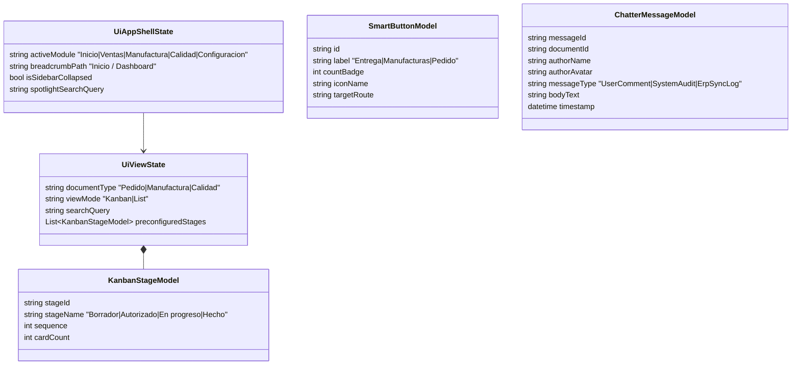

# Canonical UI/UX Data Model Specification: SPEC-003 Odoo 19 UI/UX Framework

**Feature Branch**: `003-odoo19-ui-ux-framework`  
**Date**: 2026-09-14  
**Spec**: [spec.md](./spec.md) | **Research**: [research.md](./research.md)

---

## 1. UI Component State Models

---

## 2. Component State Specifications & Enums

### 2.1 `UiAppShellState`

| Property | Type | Constraints | Description |
| :--- | :--- | :--- | :--- |
| `activeModule` | `string` | `REQUIRED, ENUM` | `Inicio`, `Ventas`, `Manufactura`, `Calidad`, `Configuracion` |
| `breadcrumbPath` | `string` | `REQUIRED` | Formatted breadcrumb path (e.g. `Inicio / Ventas / Pedido 3192389`) |
| `isSidebarCollapsed` | `bool` | `DEFAULT false` | Sidebar collapse toggle state |
| `spotlightSearchQuery`| `string` | `NULLABLE` | Global search query |

---

### 2.2 `KanbanStageModel`

| Property | Type | Constraints | Description |
| :--- | :--- | :--- | :--- |
| `stageId` | `string` | `REQUIRED` | Stage key (e.g. `stage_borrador`) |
| `stageName` | `string` | `REQUIRED` | Human readable title (e.g. `Borrador`, `En progreso`, `Hecho`) |
| `sequence` | `int` | `REQUIRED, >= 1` | Column display order |
| `cardCount` | `int` | `DEFAULT 0` | Count of records currently in stage |

---

### 2.3 `SmartButtonModel`

| Property | Type | Constraints | Description |
| :--- | :--- | :--- | :--- |
| `id` | `string` | `REQUIRED` | Unique button key |
| `label` | `string` | `REQUIRED` | Button text (e.g. `Manufacturas`) |
| `countBadge` | `int` | `DEFAULT 0, >= 0` | Live counter badge value |
| `targetRoute` | `string` | `REQUIRED` | Target URL route on click |

---

### 2.4 `ChatterMessageModel`

| Property | Type | Constraints | Description |
| :--- | :--- | :--- | :--- |
| `messageId` | `string` | `REQUIRED, UUID` | Unique message ID |
| `documentId` | `string` | `REQUIRED` | Associated document ID (e.g. `3192389`) |
| `authorName` | `string` | `REQUIRED` | Author name or system name |
| `messageType` | `string` | `REQUIRED, ENUM` | `UserComment`, `SystemAudit`, `ErpSyncLog` |
| `bodyText` | `string` | `REQUIRED` | Message text content |
| `timestamp` | `DateTime` | `REQUIRED` | Creation timestamp |
