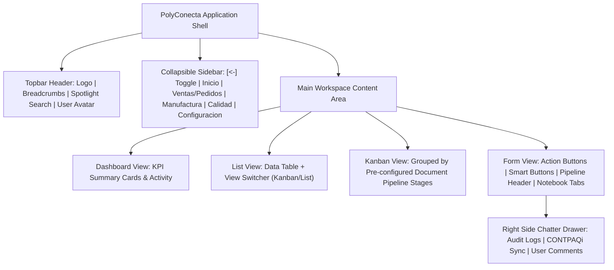
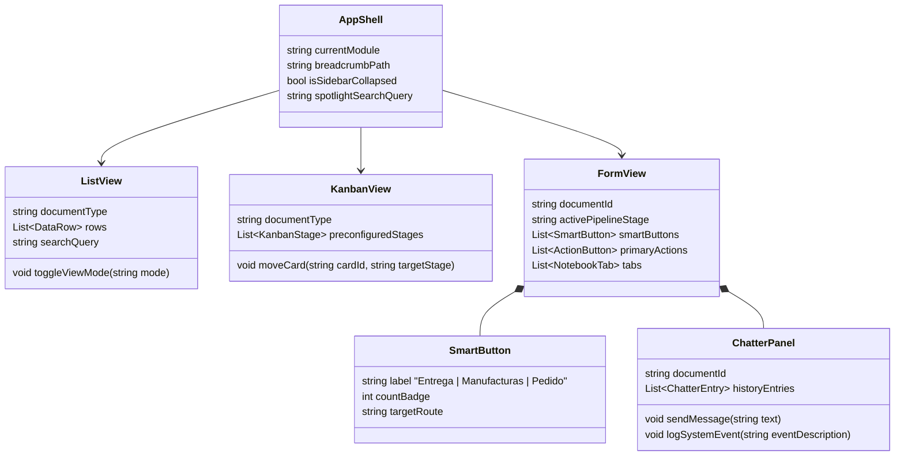

# Feature Specification: SPEC-003: Odoo 19 Enterprise UI/UX Design & Component Framework

**Feature Branch**: `003-odoo19-ui-ux-framework`  
**Created**: 2026-09-14  
**Status**: Validated  
**Input**: User description: "Definición y estandarización del marco de diseño UI/UX de PolyConecta apegado 100% a la filosofía de Odoo 19 Enterprise, basándose en la arquitectura visual de docs/mockups/mockup-001.png. Incluye la estructura de Shell (Sidebar colapsable, Topbar con Spotlight Search y Breadcrumbs), el alternador de vistas List/Kanban con etapas preconfiguradas por documento, Formularios de Registro con Smart Buttons, Barra de Estado de Pipeline (Arrow Status Header), Cuadernos de Pestañas (Notebook Tabs) y Panel Lateral de Chatter (Historial de conversación, auditoría de sync y notas en vivo)."

---

## Executive Summary & Design Benchmark

This specification establishes the **Canonical UI/UX Design & Component Framework** for **PolyConecta**, directly implementing the layout, components, visual hierarchy, and interaction patterns analyzed from [mockup-001.png](file:///Users/emilio/Development/Sandbox/Polyconecta/docs/mockups/mockup-001.png).

While PolyConecta operates as a custom C# / .NET 8 web engine for shop-floor routing and CONTPAQi Comercial Premium synchronization, its user interface MUST deliver the exact clean, frictionless user experience of **Odoo 19 Enterprise**.

---

## Visual Architecture & Mockup Alignment (mockup-001.png)

---

## User Scenarios & Testing *(mandatory)*

### User Story 1 - App Shell, Navigation & Spotlight Search (Priority: P1)

As a PolyConecta user (Planner, Supervisor, Quality Auditor, Sales Manager), I need a responsive application shell with a collapsible sidebar menu, dynamic breadcrumbs, and global Spotlight search, so that I can seamlessly navigate between production dashboards, CONTPAQi sales orders, manufacturing orders, and quality controls.

**Why this priority**: The application shell provides the foundational layout frame and navigation structure for all user interactions in PolyConecta.

**Independent Test**: Can be tested by collapsing/expanding the left sidebar via the `[<-]` toggle button, typing a document number in the Spotlight search input, and verifying instant navigation and breadcrumb updates (`Inicio / Dashboard` → `Ventas / Pedidos` → `Formulario Pedido`).

**Acceptance Scenarios**:

1. **Given** any screen in PolyConecta, **When** the user clicks the sidebar toggle button `[<-]`, **Then** the sidebar collapses into icon-only mode, expanding the main workspace area seamlessly.
2. **Given** the global Spotlight search bar in the topbar, **When** the user types a CONTPAQi Pedido folio (e.g. `3192389`) or Order Folio (e.g. `IV214-26`), **Then** a quick-match dropdown displays matching records for immediate 1-click navigation.

---

### User Story 2 - Dual View Switcher (List & Pre-configured Kanban Stages) (Priority: P1)

As a Production Manager and Shop-Floor Supervisor, I need to switch instantly between a structured List View (data table) and a Kanban View grouped by pre-configured pipeline stages, so that I can visualize work orders across their lifecycle stages or analyze high-density tabular data.

**Why this priority**: Odoo 19's signature Kanban and List view switching enables intuitive status tracking and bulk management across shop-floor operations.

**Independent Test**: Can be tested by navigating to `Listado de Pedidos contpaq` or `Listado de Manufacturas`, clicking the `[kanban] [list]` view toggle buttons in the top header, and verifying that Kanban view automatically organizes cards into pre-configured document status columns (`Borrador` → `Autorizado` → `En progreso` → `Hecho`).

**Acceptance Scenarios**:

1. **Given** the list screen of Manufacturing Orders (`Listado de Manufacturas`), **When** the user selects Kanban view `[kanban]`, **Then** the system renders cards grouped under pre-configured status columns (`Borrador`, `Autorizado`, `En progreso`, `Hecho`), displaying key metrics (Customer, Delivery Date, Output Quantity) on each card.
2. **Given** the List view `[list]`, **When** the user applies a search filter in the header search bar, **Then** both List table rows and Kanban cards filter dynamically without losing search criteria.

---

### User Story 3 - Odoo 19 Form View with Smart Buttons & Status Pipeline Header (Priority: P1)

As a Planner or Quality Officer viewing a Sales Order (`Formulario Pedido`) or Manufacturing Order (`Formulario Manufactura`), I need a standardized form layout featuring primary Action Buttons, real-time Smart Buttons with linked record counters, a visual arrow Status Pipeline, and Notebook Tabs (`[Detalle]`, `[Observaciones]`), so that I can manage order execution with 100% visual clarity.

**Why this priority**: Form views represent the primary operational interface for reviewing document headers, line items, linked sub-orders, and status transitions.

**Independent Test**: Can be tested by opening Sales Order `3192389`, verifying the top-right Smart Buttons (`Entrega: 1`, `Manufacturas: 1`), clicking the `Manufacturas` Smart Button to navigate directly to linked sub-orders, and confirming status progression along the Arrow Pipeline bar.

**Acceptance Scenarios**:

1. **Given** an open `Formulario Pedido` record, **When** the order is linked to manufacturing sub-orders and delivery notes, **Then** Smart Buttons rendered in the top-right header display live count badges (`Entrega [1]`, `Manufacturas [3]`) and clicking a Smart Button opens the filtered list of linked records.
2. **Given** a `Formulario Manufactura` record, **When** the user clicks the primary action button `[Validar]`, **Then** the arrow Status Pipeline updates its active highlighted stage (`Borrador` → `Autorizado` → `En progreso` → `Hecho`).

---

### User Story 4 - Native Side Chatter & Audit Log Panel (Priority: P2)

As a System Auditor, Sales Coordinator, or Shop-Floor Operator, I need a native right-side Chatter drawer embedded in all main Form Views, displaying real-time user notes, status change logs, and CONTPAQi SDK sync events with an interactive message input field.

**Why this priority**: Chatter provides transparent traceability, user collaboration, and automated ERP integration audit trails directly alongside document forms.

**Independent Test**: Can be tested by opening any Form View, observing existing chatter history (e.g. "Alejandro Ponce: Se carga el pedido de venta polyconecta"), typing a new comment in the Chatter input box, clicking `[Send]`, and verifying that the comment is appended to the audit log.

**Acceptance Scenarios**:

1. **Given** an active Form View (`Formulario Pedido` or `Formulario Manufactura`), **When** an automated event occurs (e.g., CONTPAQi SDK sync or Quality Approval), **Then** PolyConecta posts an automated system log entry into the Chatter drawer with timestamp and event details.
2. **Given** the Chatter drawer, **When** an authorized user types a message and clicks `[Send]`, **Then** the comment is persisted and broadcasted to linked document followers in real time.

---

### Edge Cases

- **Small Screen / Handheld Mobile Layout**: How does the Odoo 19 Form View adapt when opened on a narrow mobile handheld scanner device?  
  *Behavior*: The side Chatter panel automatically stacks below the main form sheet, and Smart Buttons wrap horizontally into a compact scrollable header.
- **Empty Kanban Columns**: How does Kanban view display pipeline stages that currently have zero records?  
  *Behavior*: All pre-configured stages (`Borrador`, `Autorizado`, `En progreso`, `Hecho`) remain visible as drop targets with `0` record count badges.
- **Unsaved Form Changes**: What happens if a user attempts to navigate away via a Smart Button or Sidebar link while editing a form?  
  *Behavior*: A modal alert prompts the user to save changes, discard changes, or cancel navigation.

---

## Requirements *(mandatory)*

### Functional Requirements

#### 1. Application Shell & Topbar Structure
- **FR-001**: PolyConecta MUST implement a global Application Shell matching [mockup-001.png](file:///Users/emilio/Development/Sandbox/Polyconecta/docs/mockups/mockup-001.png), featuring a fixed Topbar, a collapsible Left Sidebar with toggle button `[<-]`, and a main workspace container.
- **FR-002**: The Topbar MUST render:
  1. Company / App Logo on the far left.
  2. Dynamic Breadcrumb Trail navigation (e.g. `Inicio / Dashboard`, `Ventas / Pedidos`, `Formulario Pedido`).
  3. Global Spotlight Search input box (`spotlight search`) supporting real-time folio and SKU lookup.
  4. User Profile Avatar & Menu button on the far right.
- **FR-003**: The Left Sidebar MUST provide navigation links for core operational modules: `Inicio` (Dashboard), `Ventas / Pedidos` (CONTPAQi Sales Orders), `Manufactura` (Master & Sub-Orders), `Calidad` (Inspection & Quality Release), and `Configuracion` (System Settings).

#### 2. Dual View Switcher (Kanban & List Views)
- **FR-004**: All main document list screens MUST include a header View Switcher control offering `[kanban]` and `[list]` view modes.
- **FR-005**: In Kanban View `[kanban]`, records MUST be visually grouped under pre-configured document status pipeline columns following Odoo 19 design patterns:
  - **Pedidos CONTPAQi**: `Pedido Sincronizado` → `Confirmado` → `En manufactura` → `Hecho`.
  - **Órdenes de Fabricación**: `Borrador` → `Autorizado` → `En progreso` → `Hecho`.
- **FR-006**: In List View `[list]`, records MUST be displayed in structured data tables with column sorting, search filtering, and row selection.

#### 3. Form Views, Smart Buttons & Arrow Status Pipeline
- **FR-007**: Form Views (`Formulario Pedido`, `Formulario Manufactura`) MUST display:
  1. **Primary Action Bar** on top-left of the form (e.g. `[Confirmar]` in Sales Orders; `[Subir Pdf] [Validar]` in Manufacturing Orders).
  2. **Smart Buttons Container** on top-right of the form header, rendering action count badges (`Entrega: 1`, `Manufacturas: 1` / `Pedido de venta: 1`, `Órdenes de Fabricación: 3`) that navigate to linked records.
  3. **Arrow Status Pipeline Header** on top-right of the form sheet, highlighting the current lifecycle stage.
  4. **Primary Header Block**: Large bold document ID (e.g. `3192389`, `IV214-26`) with metadata fields (`Cliente`, `Fecha`, `Ubicacion`, `Fecha est. Entrega`).
  5. **Notebook Tab Container**: Tabbed sub-sections (`[Detalle] [Observaciones]`, `[Detalle] [Adicionales]`) containing line-item detail tables (`Codigo`, `Ruta`, `No. Parte`, `Descripcion`, `Cantidad`, `Precio`, `Subtotal`).

#### 4. Side Chatter & Audit Trail Panel
- **FR-008**: All Form Views MUST incorporate a native right-side Chatter panel (`CHATTER`) dedicated to communication, audit history, and system logs.
- **FR-009**: The Chatter panel MUST record and display:
  - Automated CONTPAQi SDK sync logs (e.g. "Se carga el pedido de venta polyconecta").
  - User status changes (e.g. "Estado cambiado a En progreso por Alejandro Ponce").
  - User text notes and comments submitted via the Chatter input box and `[Send]` button.

---

## Key Entities & UI Components *(mandatory)*

---

## Success Criteria *(mandatory)*

### Measurable Outcomes

- **SC-001**: 100% visual and structural compliance with [mockup-001.png](file:///Users/emilio/Development/Sandbox/Polyconecta/docs/mockups/mockup-001.png) across App Shell, Topbar, Sidebar, Spotlight Search, View Switchers, Form Views, Smart Buttons, Pipeline Headers, and Chatter Drawers.
- **SC-002**: View switching between List and Kanban views completes in under 200ms with zero loss of active search or filter state.
- **SC-003**: 100% of Kanban views display pre-configured pipeline stages (`Borrador` → `Autorizado` → `En progreso` → `Hecho`) in strict adherence to Odoo 19 design standards.
- **SC-004**: Smart Buttons update live counts within 500ms of any linked record creation or status change.
- **SC-005**: Chatter panel logs 100% of CONTPAQi SDK synchronization events and user comments in real time with exact timestamps and author attribution.

---

## Assumptions

- **Design Benchmark Integrity**: Odoo 19 Enterprise layout and component patterns serve as the strict reference for all web interfaces in PolyConecta.
- **Frontend Component Architecture**: UI components (Smart Buttons, Pipeline Headers, Kanban Columns, Chatter Panels) are implemented as reusable modular web components (e.g., Razor Components / Blazor or Tailwind/TypeScript modules).
- **Responsive Stacking**: On mobile handheld scanner devices (<768px width), the right Chatter drawer automatically wraps below the main form sheet to maintain 100% usability.
