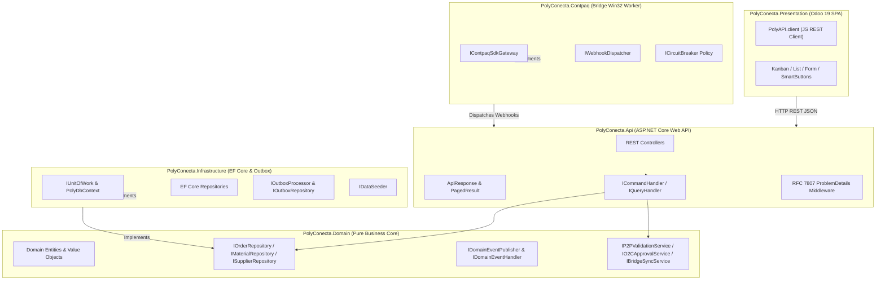

# Implementation Plan: 003-solution-layer-interfaces

**Feature Branch**: `003-solution-layer-interfaces`  
**Date**: 2026-09-14  
**Spec**: [spec.md](./spec.md)

---

## Technical Architecture & Layer Boundary Contracts

---

## 1. Domain Layer Contracts (`PolyConecta.Domain`)
- `Common/IRepository.cs`: `IRepository<TEntity, TId>` interface.
- `Repositories/IOrderRepository.cs`: Interface for `MasterOrder` persistence and queries.
- `Repositories/IMaterialRepository.cs`: Interface for `RawMaterialCatalog` and `SupplierProductMapping`.
- `Repositories/ISupplierRepository.cs`: Interface for supplier query operations.
- `Repositories/IOutboxRepository.cs`: Interface for Outbox message storage.
- `Events/IDomainEvent.cs`: Marker interface for domain events.
- `Events/IDomainEventPublisher.cs`: Domain event dispatcher interface.
- `Events/IDomainEventHandler.cs`: Interface for event handlers `IDomainEventHandler<TEvent>`.
- `Services/IP2PValidationService.cs`: Interface for P2P purchase receipt validations.
- `Services/IO2CApprovalService.cs`: Interface for O2C 3-digital signatures workflow validation.
- `Services/IBridgeSyncService.cs`: Interface for queuing CONTPAQi transactions.

---

## 2. Infrastructure Layer Contracts & Adapters (`PolyConecta.Infrastructure`)
- `Common/IUnitOfWork.cs`: Unit of work interface for atomic transaction commits.
- `Repositories/OrderRepository.cs`: EF Core implementation of `IOrderRepository`.
- `Repositories/MaterialRepository.cs`: EF Core implementation of `IMaterialRepository`.
- `Repositories/SupplierRepository.cs`: EF Core implementation of `ISupplierRepository`.
- `Repositories/OutboxRepository.cs`: EF Core implementation of `IOutboxRepository`.
- `Outbox/IOutboxProcessor.cs`: Interface for background outbox message processing.
- `Persistence/IDataSeeder.cs`: Interface for initial data seeding.

---

## 3. Api Layer Contracts & DTOs (`PolyConecta.Api`)
- `Common/ApiResponse.cs`: Generic API envelope `ApiResponse<TData>` with `Success`, `Data`, `Errors`, `Timestamp`, `TraceId`.
- `Common/PagedResult.cs`: Paginated result container `PagedResult<TData>`.
- `Application/ICommandHandler.cs`: Command handler interface `ICommandHandler<TCommand, TResult>`.
- `Application/IQueryHandler.cs`: Query handler interface `IQueryHandler<TQuery, TResult>`.
- `Middleware/ProblemDetailsMiddleware.cs`: Middleware mapping domain/application exceptions to RFC 7807 `ProblemDetails`.

---

## 4. Presentation Layer Contracts (`PolyConecta.Presentation`)
- `wwwroot/js/poly-api-client.js`: `PolyAPI.client` SDK with `get`, `post`, `put`, `delete`, auto-headers and error handling.

---

## 5. Contpaq Bridge Contracts (`PolyConecta.Contpaq`)
- `Sdk/IContpaqSdkGateway.cs`: Interface for CONTPAQi native SDK P/Invoke calls (`Connect`, `Disconnect`, `CreateDocument`, `QueryCatalog`).
- `Webhooks/IWebhookDispatcher.cs`: Interface for dispatching background webhook payloads.
- `Resilience/ICircuitBreaker.cs`: Interface for fault tolerance and circuit breaker states.
