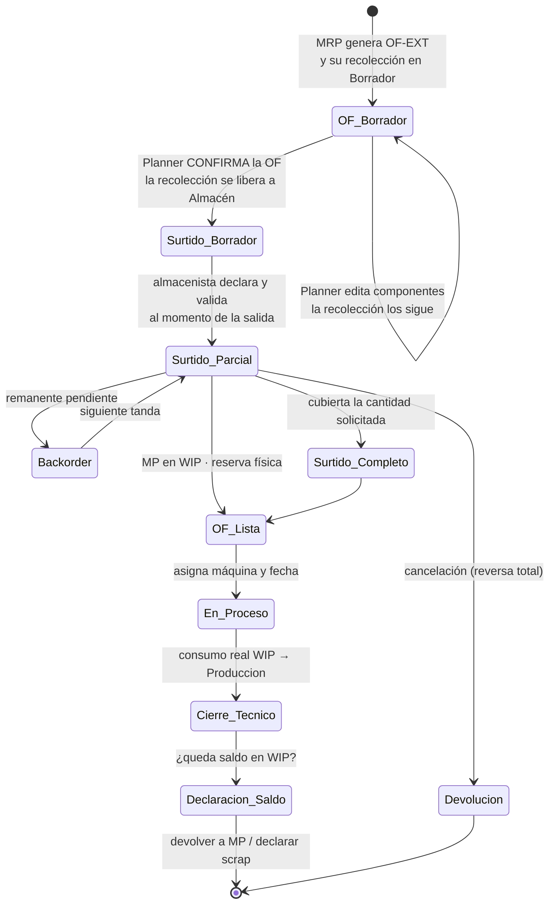

# Feature Specification: SPEC-008: Recolección de Componentes a WIP — Operación de Traslado con Reserva Física, Parcialidades y Devolución

**Feature Branch**: `008-wip-component-picking`

**Created**: 2026-09-21 · **Revisada**: 2026-09-22

**Status**: Draft

**Input**: "Si ya se dispararon las órdenes de fabricación en borrador, la separación del inventario tiene que venir por una orden de traslado que me genere una reserva al validarse. El planner de extrusión, al recibir la orden, sabe que tiene que configurar componentes y reservar 300, 200 y 50 kg de cada componente. Esta solicitud la tiene que hacer a almacén por medio de una orden de traslado que saque de stock esas cantidades y las entregue a un almacén de WIP. De esta forma controlamos lo que sacamos de almacén a través de un traslado a un almacén que reserva el stock para producir. Hay que tener en cuenta que los traslados pueden generar reversa o devolución de esa materia prima al almacén original."

---

## Executive Summary

Hoy la OF declara sus componentes (`BomLine`: 300 / 200 / 50 kg) pero **nada media entre esa declaración y el almacén**. La materia prima se considera consumida al cierre técnico (regla 7.2 de `ARQUITECTURA_ALMACENES_RUTAS_Y_ABASTECIMIENTO.md`), de modo que entre "la OF pide" y "la OF consumió" no existe ningún documento, ningún responsable y ninguna cifra de cuánto salió realmente del almacén.

Esta especificación inserta ese eslabón: un **almacén WIP** y una **orden de recolección** que lo alimenta. El Planner *solicita*; el **almacenista declara y valida** qué sale; el material se mueve a WIP y queda **físicamente reservado** contra una OF concreta. La recolección admite **parcialidades con backorder** — para fabricaciones grandes, almacén entrega en tandas — y admite **devolución** del sobrante al almacén origen.

El efecto colateral más valioso es que cierra el balance de masa por el lado de la entrada, con una invariante que hoy no se puede calcular:

$$\text{Recolectado a WIP} \;=\; \text{Consumido} \;+\; \text{Devuelto} \;+\; \text{Scrap}$$

---

## Decisiones validadas con el usuario (2026-09-21)

| # | Pregunta | Decisión |
| :--- | :--- | :--- |
| ⑥ | ¿WIP es almacén en CONTPAQi? | **Sí. WIP es un almacén más en CONTPAQi.** La recolección genera por tanto un movimiento contable de traspaso. |
| ⑦ | ¿Quién valida la recolección? | **El almacenista declara qué es lo que va a salir del stock.** El Planner solicita; no surte. |
| ⑧ | ¿Recolección parcial? | **Se valida parcial.** Para fabricaciones enormes almacén entrega en parcialidades, no de golpe. |
| ⑨ | ¿Arrastre de saldo a otra OF? | **No.** El sobrante se devuelve a `Stock/MP` y vuelve a pasar por el proceso de picking. |
| ⑩ | ¿Re-pesaje en la devolución? | **Sí, cantidad capturada manualmente.** El sistema no asume el saldo teórico. |
| ⑪ | ¿WIP subdividido por OF? | **No.** WIP indica que el material está reservado y a qué OF responde; la **división lógica es suficiente**, no queda forzosamente amarrado a la OF. |
| ⑬ | ¿Cuándo nace la recolección? | **Siempre de la mano de la Orden de Fabricación, en Borrador.** Cuando el Planner confirma la OF se libera a Almacén, que valida **al momento en que el material sale** físicamente. |
| ⑫ | ¿Es un documento propio o una operación más? | **Una operación de traslado más, de tipo MP → WIP, llamada Recolección.** No un tipo de documento aparte: comparte modelo, nomenclatura de folio y mecánica de validación con el resto de las operaciones de inventario. |

### Revisión del 22-sep-2026 — la Recolección no es un documento especial

La primera versión modelaba el movimiento MP → WIP como un "surtido", un tipo de documento propio. El usuario lo corrigió: **es una operación de traslado más**, definida por su tipo de operación igual que el traspaso interplanta o la entrega a cliente. Se llama **Recolección** y es la formalidad con la que Producción le pide materia prima a Almacén, y con la que Almacén le da salida del stock a lo que Producción vaya a requerir.

La consecuencia de modelo es que no hay una jerarquía de documentos paralela: hay **un tipo de operación** (`PIM-REC-OUT`) con su origen, su destino, su evento en CONTPAQi y su reversa (`PIM-REC-RET`), exactamente como los tipos de la sección 5 de la arquitectura.

### ⚠️ Impacto sobre un documento ya aprobado

La decisión ⑥ **modifica la regla 7.2 de `ARQUITECTURA_ALMACENES_RUTAS_Y_ABASTECIMIENTO.md`** (estatus "Aprobado para Implementación"), que hoy dice que las operaciones de manufactura afectan materias primas en CONTPAQi *únicamente* en el cierre técnico. Con WIP como almacén contable:

- El **surtido** `MP → WIP` genera un **traspaso de almacén en CONTPAQi** al validarse.
- El **consumo** al cierre técnico se descuenta **desde el almacén WIP**, no desde `Stock/MP`.
- La **devolución** `WIP → MP` genera el traspaso inverso.

Ese documento requiere una actualización coordinada (sección 5 y regla 7.2). No se ha modificado aún.

---

## Modelo de ubicaciones: tres estados, no dos

La distinción central de esta spec, hoy ausente del modelo:

| Ubicación | Naturaleza | Significado | Cuenta como inventario |
| :--- | :--- | :--- | :--- |
| `PIM/Stock/MP` | Física | Disponible para cualquier demanda | Sí, disponible |
| **`PIM/WIP`** ← nueva | **Física / contable** | Apartado para producir; el material **sigue existiendo** | Sí, **no disponible** |
| `PIM/Produccion` | Virtual | Entrar aquí = **consumo**; deja de existir como MP | No |

`PIM/Produccion` ya figura en la sección 3 del documento de arquitectura como ubicación virtual de transformación. `PIM/WIP` es el eslabón intermedio faltante: donde vive el material entre *salió del almacén* y *se consumió en la máquina*.

**WIP es una sola ubicación por planta, no una por OF.** Su función es decir *que el material está reservado* y a qué OF responde; la liga a la OF es un **atributo lógico de la reserva**, no una subdivisión física del almacén. El material no queda forzosamente amarrado a esa OF, lo que permite reasignarlo sin mover nada físicamente.

## Dos niveles de reserva — nombres distintos, obligatoriamente

Punto de contacto con SPEC-007 y fuente habitual de doble compromiso:

| | Reserva **lógica** (soft) | Reserva **física** (hard) |
| :--- | :--- | :--- |
| La genera | Autorizar el pedido (SPEC-007) | Validar la recolección a WIP (esta spec) |
| Ubicación del material | Sigue en `Stock/MP` | Movido a `PIM/WIP` |
| Efecto | Resta del disponible | Ya no está en el almacén origen |
| Se revierte con | Cancelar el pedido | `REC-RET` (devolución) |
| Afecta CONTPAQi | No | **Sí** (traspaso de almacén) |

---

## Nuevos Tipos de Operación (extienden la sección 5 de la arquitectura)

| Código | Nombre | Origen | Destino | Evento en CONTPAQi |
| :--- | :--- | :--- | :--- | :--- |
| **`PIM-REC-OUT`** | Recolección de materia prima | `PIM/Stock/MP` | `PIM/WIP` | **Traspaso de almacén** al validar |
| **`PIM-REC-RET`** | Devolución de componentes a almacén | `PIM/WIP` | `PIM/Stock/MP` | **Traspaso de almacén** (inverso) |
| **`STC-WIP-OUT`** | Surtido de rollos a conversión | `SC/Stock/MP` | `SC/WIP` | Traspaso de almacén al validar |
| **`STC-WIP-RET`** | Devolución de rollos a almacén | `SC/WIP` | `SC/Stock/MP` | Traspaso de almacén (inverso) |

El patrón se define **universal y parametrizado por almacén**, no como reglas separadas por planta o proceso.

---

## Ciclo de vida

El Planner **no toca inventario**: emite una solicitud. Almacén es quien declara, valida y mueve.

---

## User Story 1 — Solicitud de surtido generada por la OF (Priority: P1)

Como **Planner de Extrusión**, al recibir una OF en borrador necesito configurar sus componentes y que el sistema emita automáticamente una orden de recolección dirigida a Almacén por esas cantidades, para no tener que pedir material por fuera del sistema.

**Independent Test**: Configurar los componentes de una OF-EXT y verificar que aparece una orden de recolección en Borrador con las tres líneas y sus cantidades.

**Acceptance Scenarios**:

1. **Given** una OF-EXT en Borrador con componentes 300 / 200 / 50 kg, **When** el Planner confirma los componentes, **Then** se genera una orden de recolección `PIM-REC-OUT` en estado Borrador con esas tres líneas, ligada a la OF.
2. **Given** una orden de recolección emitida, **When** el Planner intenta modificar cantidades de componentes, **Then** el sistema **re-sincroniza** la solicitud pendiente o exige cancelarla primero — nunca quedan descuadradas.
3. **Given** una OF sin componentes, **When** se intenta emitir la recolección, **Then** la operación se rechaza.
4. **Given** una OF con surtido emitido, **When** se consulta la OF, **Then** un smart button muestra la recolección y su estado de avance.

---

## User Story 2 — El almacenista declara y valida lo que sale (Priority: P1)

Como **Almacenista**, necesito declarar qué lotes y qué cantidades salen realmente de mi almacén y validarlo yo, para que el inventario refleje lo que entregué y no lo que alguien más supuso.

**Why this priority**: Es el control que motiva toda la spec. Sin validación del almacenista, WIP es un registro decorativo.

**Independent Test**: Tomar una orden de recolección en Borrador, seleccionar lotes, validar y verificar que el material aparece en WIP y salió de `Stock/MP`.

**Acceptance Scenarios**:

1. **Given** una orden de recolección en Borrador, **When** el almacenista selecciona los lotes concretos y cantidades y presiona Validar, **Then** el material se mueve a `PIM/WIP`, queda reservado físicamente contra esa OF y **se dispara el traspaso de almacén en CONTPAQi**.
2. **Given** material en WIP, **When** se consulta la disponibilidad del SKU (SPEC-007), **Then** ese material **no cuenta como disponible** aunque siga siendo inventario de la empresa.
3. **Given** una orden de recolección, **When** el Planner intenta validarla, **Then** la acción está restringida al rol de Almacén.
4. **Given** una recolección validado, **When** se consulta la trazabilidad, **Then** constan los lotes exactos entregados, quién los entregó y cuándo.

---

## User Story 3 — Recolección parcial con backorder (Priority: P1)

Como **Almacenista**, necesito entregar en parcialidades cuando la fabricación es grande o no tengo todo el material, y que el sistema me deje un pendiente rastreable con el remanente.

**Why this priority**: Decisión ⑧ del usuario; es el modo de operación normal, no una excepción.

**Independent Test**: Validar 250 de 300 kg solicitados y verificar que se crea un documento de remanente por 50 kg y que la OF puede arrancar.

**Acceptance Scenarios**:

1. **Given** una solicitud de 300 kg y solo 250 disponibles o declarados, **When** el almacenista valida por 250, **Then** el sistema crea un **backorder** por los 50 kg restantes, ligado a la misma OF y al recolección padre.
2. **Given** una recolección parcial validado, **When** se consulta la OF, **Then** puede pasar a `Lista para producir` con el material ya surtido — el parcial **no bloquea** el arranque.
3. **Given** un backorder pendiente, **When** almacén entrega la siguiente tanda, **Then** se valida sobre el backorder y se genera otro si aún queda remanente.
4. **Given** un backorder que ya no se va a surtir, **When** el almacenista lo cancela, **Then** la OF refleja que fue recolectada por menos de lo solicitado y ese delta queda visible en el cierre técnico.
5. **Given** varias parcialidades, **When** se consulta la recolección, **Then** el acumulado entregado es la suma de todas las validaciones.

---

## User Story 4 — Devolución y reversa (Priority: P1)

Como **Almacenista**, necesito poder devolver a mi almacén el material que salió y no se consumió, tanto si la OF se cancela antes de producir como si sobró al cerrar.

**Independent Test**: Cerrar una OF con saldo en WIP y verificar que el sistema exige declarar ese saldo antes de permitir el cierre.

**Acceptance Scenarios**:

1. **Given** una recolección validado y una OF que se cancela **antes de producir**, **When** se ejecuta la reversa, **Then** se genera un `PIM-REC-RET` por la totalidad y el traspaso inverso en CONTPAQi.
2. **Given** una OF en cierre técnico con saldo en `PIM/WIP`, **When** se intenta cerrar, **Then** el sistema **no permite el cierre** hasta que el saldo se declare como **devolución a `Stock/MP`** o como **scrap con motivo**. No existe arrastre directo de saldo entre OFs: el material regresa al almacén y vuelve a pasar por el proceso de picking si otra OF lo necesita.
3. **Given** un saldo declarado como devolución, **When** el operador **captura manualmente la cantidad real devuelta** y valida, **Then** el material vuelve a `Stock/MP`, recupera disponibilidad y se registra el traspaso inverso por esa cantidad capturada.
4. **Given** el cierre técnico completado, **When** se verifica el balance, **Then** se cumple `Surtido = Consumido + Devuelto + Scrap`; cualquier descuadre bloquea el cierre.

---

## Functional Requirements

- **FR-001**: El sistema MUST modelar `WIP` como **almacén contable** con existencia propia, **uno por planta**. La relación con la orden de fabricación MUST ser un atributo lógico de la reserva, no una subdivisión física de la ubicación.
- **FR-002**: Toda OF con componentes MUST nacer con **una** orden de recolección en **Borrador**, ligada a ella.
- **FR-002b**: Mientras la recolección esté en Borrador, sus líneas MUST sincronizarse con los componentes de la OF; una vez liberada, MUST quedar fija.
- **FR-002c**: Confirmar la OF MUST liberar su recolección a Almacén (**En espera**); el almacenista la valida **al momento en que el material sale**.
- **FR-002d**: El backorder de una recolección liberada MUST nacer también liberado.
- **FR-003**: La validación dla recolección MUST estar restringida al rol de Almacén; el Planner MUST NOT poder validarla.
- **FR-004**: El almacenista MUST declarar **lote y cantidad** concretos por línea; el sistema MUST NOT auto-asignar lotes sin confirmación.
- **FR-005**: Validar la recolección MUST mover el material a `PIM/WIP`, marcarlo como **reserva física** contra esa OF y **disparar el traspaso de almacén en CONTPAQi**.
- **FR-006**: El material en WIP MUST NOT contar como disponible para otras demandas, y MUST seguir contando como inventario de la empresa.
- **FR-007**: El sistema MUST admitir validación parcial, generando un **backorder** por el remanente ligado al recolección padre y a la OF.
- **FR-008**: Un recolección parcial MUST NOT impedir que la OF pase a `Lista para producir`.
- **FR-009**: El sistema MUST soportar devolución total (reversa por cancelación) y parcial (sobrante al cierre) mediante `REC-RET`, con el traspaso inverso en CONTPAQi.
- **FR-009b**: La cantidad devuelta MUST capturarse **manualmente** por quien ejecuta la devolución. El sistema MUST NOT tomar por defecto el saldo teórico de WIP: un rollo parcialmente consumido o resina remanente en tolva no pesan lo que el sistema supone.
- **FR-009c**: El sistema MUST NOT permitir transferir saldo de WIP directamente de una OF a otra. Todo sobrante MUST devolverse a `Stock/MP` y volver a solicitarse por una orden de recolección nueva.
- **FR-010**: El cierre técnico de la OF MUST bloquearse mientras exista saldo no declarado en `PIM/WIP`.
- **FR-011**: El consumo de materia prima en CONTPAQi al cierre técnico MUST descontarse **desde el almacén WIP**, no desde `Stock/MP`.
- **FR-012**: El sistema MUST validar la invariante `Surtido = Consumido + Devuelto + Scrap` como precondición del cierre técnico.
- **FR-013**: El patrón MUST aplicarse de forma uniforme a extrusión, impresión y bolseo, parametrizado por almacén.

## Key Entities

| Entidad | Propósito |
| :--- | :--- |
| `StockOperation` | Orden de surtido `REC-OUT` / devolución `REC-RET`: origen, destino, OF, estado, líneas |
| `StockOperationLine` | Línea con cantidad solicitada, entregada acumulada, lote(s) declarado(s) |
| `Backorder` (relación) | Enlace recolección padre → remanente; permite rastrear la cadena de parcialidades |
| `WipBalance` | Saldo vivo por OF y SKU en WIP; alimenta el bloqueo de cierre |
| `StockLocation` (modif.) | Gana el tipo `WIP` como categoría distinta de física-stock y virtual-producción |

## Success Criteria

- **SC-001**: Ningún kilo sale del almacén sin un documento validado por un almacenista.
- **SC-002**: En cualquier momento es posible responder "¿cuánto material hay apartado para la OF X y dónde está?".
- **SC-003**: El material en WIP no puede comprometerse para otro pedido ni otra OF.
- **SC-004**: Una OF grande puede surtirse en N tandas sin perder la trazabilidad del pendiente.
- **SC-005**: Ninguna OF cierra con saldo de material sin declarar.
- **SC-006**: La existencia de CONTPAQi por almacén (MP y WIP) coincide con la de PolyConecta tras cada validación.

## Dependencias y coordinación

- **`ARQUITECTURA_ALMACENES_RUTAS_Y_ABASTECIMIENTO.md`** — requiere actualización de la sección 3 (ubicaciones WIP), la sección 5 (cuatro tipos de operación nuevos) y la regla 7.2 (momento de afectación contable). **Pendiente.**
- **SPEC-004 (balance de masa)** — esta spec le aporta el lado de la entrada de la ecuación; hoy solo cuadra masa extruida = rollos + scrap.
- **SPEC-007** — comparte el concepto de reserva; ver ahí la distinción lógica vs física.
- **CONTPAQi Bridge** — requiere verificar contra el SDK real que el traspaso entre almacenes admite lote y cantidad fraccionada (Principio VII de la Constitución).

## Preguntas abiertas

_Ninguna pendiente de la operación. Queda por verificar contra el SDK real (Principio VII) que el traspaso entre almacenes de CONTPAQi admita lote y cantidad fraccionada._
