# INFORME DE VALIDACIÓN DEL DIAGRAMA OPERATIVO — POLYCONECTA

**Proyecto:** Sistema Integrado PolyConecta / CONTPAQi® Premium  
**Fecha:** Septiembre 2026  
**Versión:** 1.0 (Definición Operativa Validada End-to-End)  
**Estatus:** Aprobado y Consensuado con Operación  

---

## 1. Resumen Ejecutivo

El presente documento consolida la validación integral del **Diagrama Operativo To-Be** para el sistema **PolyConecta**, habiendo contrastado las necesidades operativas reales de la planta con la arquitectura del software de manufactura y la integración con el ERP **CONTPAQi® Premium**.

Tras las sesiones de revisión en las que la operación describió paso a paso el flujo con sus propias palabras, se ha alcanzado una **alineación del 100% en la visión funcional**, incorporando las reglas de negocio precisas para la gestión de productos, especificaciones multinivel, aprobaciones, jerarquía de órdenes, lotificación, control de calidad, balance de masa, traspasos logísticos y conversión.

---

## 2. Flujo Operativo Validado Paso a Paso (End-to-End)

```mermaid
flowchart TD
    subgraph F1["Fase 1: Captura ERP & Especificación"]
        A[Alta Previa de SKU en CONTPAQi] --> B[Captura Pedido de Venta en CONTPAQi]
        B --> C[Llenado de Campos de Usuario: Extrusión + Conversión]
    end

    subgraph F2["Fase 2: Sincronización & Aprobaciones"]
        C -->|SDK/SQL Sync| D[PolyConecta: Estado 'Borrador']
        D -->|AC: Clic 'Confirmar'| E[Estado 'Confirmado']
        E -->|Validación Ventas & Crédito| F[Estado 'Autorizado']
    end

    subgraph F3["Fase 3: Jerarquía & Programación MRP"]
        F --> G[Disparo de OM Maestra + OFs en 'Borrador']
        G -->|Planner: Ingesta BoM Excel| H[Confirmar OF-EXT]
        H --> I[Generación de WO 'Por Programar']
        I -->|Asignación Máquina & Fecha| J[Estado 'En Progreso']
    end

    subgraph F4["Fase 4: Ejecución, Pesaje & Calidad"]
        J --> K[Diarios Físicos en Máquina]
        K -->|Vaciado por Planner| L[Pesaje Iterativo & Slots Precargados]
        L --> M{Inspección Quality Check}
        M -->|Aprobado| N[Lote Consecutivo: IV214-26-R00X]
        M -->|Rechazado| O[Lote Cuarentena: IV214-26-R00X.S + Reciclaje Slot]
    end

    subgraph F5["Fase 5: Cierre & Balance de Masa"]
        N & O --> P[Cierre Técnico de OF-EXT]
        P --> Q[Balance de Masa: Rollos + Scrap]
        Q -->|Descuento Consolidado| R[Afectación Insumos CONTPAQi]
    end

    subgraph F6["Fase 6: Logística & Traspaso 2 Pasos"]
        R --> S{Tipo de Entrega}
        S -->|Cliente Directo| T[Validación Tráfico -> Remisión CONTPAQi]
        S -->|Segundo Proceso| U[Salida PIM -> Ubicación TRANSIT/PIM-STC]
        U --> V[Recepción Santa Cruz 'Validar' -> Traspaso CONTPAQi]
    end

    subgraph F7["Fase 7: Conversión STC"]
        V --> W[Auto-Confirmar OF-BOL / OF-IMP]
        W --> X[Picking Rollos + WO Programada]
        X --> Y[Vaciado Millares + Kg + Suaje]
        Y --> Z[Cierre OF-BOL & Pedido 'Hecho']
    end
```

---

## 3. Descripción Detallada por Fases Operativas

### Fase 1: Captura de Pedido y Alta de Productos en CONTPAQi Premium
1. **Alta Previa de SKU:** Si el cliente requiere un producto nuevo o una especificación técnica diferente, Atención a Clientes (AC) o Facturación debe **dar de alta previamente el código de Producto Terminado específico en CONTPAQi Premium**. El Pedido comercial siempre debe contener el producto exacto a entregar.
2. **Captura de Especificaciones en Campos de Usuario:** AC captura el Pedido en CONTPAQi llenando las variables técnicas directamente en los **Campos de Usuario / Datos Complementarios** del documento:
   * *Nivel Extrusión (Rollo):* Tipo de material, Medida/Tipo de rollo, Calibre, Kg/Rollo, Tratamiento corona, Pigmento, Aditivo, Perforación, Impresión preliminar.
   * *Nivel Conversión (Bolsa/Lámina):* Medidas finales, Tintas, Pantones, Suaje, Empaque, Millares/Kg solicitados, Kg por millar, Tipo de sello.
3. **Eliminación de Archivos Adjuntos:** **Se elimina al 100% el uso y adjuntado manual de archivos Excel/PDF de Orden de Trabajo (OT)**. La ficha nace estructurada en la base de datos del ERP.

### Fase 2: Sincronización y Ciclo de Vida del Pedido en PolyConecta
1. **Ingesta Automática:** PolyConecta lee vía SDK/SQL el Pedido de CONTPAQi con sus Campos de Usuario y lo crea en el listado en estado **`Borrador`**.
2. **Máquina de Estados (Estilo Odoo 19):**
   $$\text{Borrador} \xrightarrow{\text{Confirmar (AC)}} \text{Confirmado} \xrightarrow{\text{Validar (Ventas/Crédito)}} \text{Autorizado} \xrightarrow{\text{Programar WO}} \text{En progreso} \xrightarrow{\text{Cierre OFs}} \text{Hecho}$$
3. **Aprobaciones:** Los responsables de Ventas y Crédito/Cobranza cuentan con botones individuales de **"Validar"** en PolyConecta. Al completarse ambas aprobaciones, el pedido pasa a `Autorizado`.

### Fase 3: Jerarquía MRP y Programación de Órdenes
1. **Jerarquía Tripartita:**
   * **`OM` (Orden de Manufactura Maestra):** Nivel superior ligado 1:1 al Pedido de Venta.
   * **`OF` (Orden de Fabricación por Proceso):** Generada en `Borrador` (`OF-EXT`, `OF-IMP`, `OF-BOL`).
   * **`WO` (Orden de Trabajo / Operación):** Generada al confirmar la `OF`, asignada inicialmente al centro de trabajo predeterminado **`'Por programar'`** / **`'Por asignar'`**.
2. **Ingesta de BoM Dinámica en Extrusión:** Al confirmar la `OF-EXT`, el Planner (Roosvelt) adjunta el archivo Excel de formulación de la coextrusora. PolyConecta parsea la receta (Capas A, B, C), calcula las cantidades de resinas/aditivos y reserva las materias primas en `PIM/Stock/MP`.
3. **Conmutación a `En progreso`:** Ocurre únicamente cuando la `WO` es asignada a una máquina extrusora física y fecha programada concreta.

### Fase 4: Ejecución, Pesaje Iterativo, Lotificación y Calidad
1. **Diarios de Piso:** Los operadores en planta registran a mano en libros físicos a pie de máquina. El Planner realiza el vaciado digital en PolyConecta.
2. **Precarga de Slots e Inspecciones de Calidad (`Quality Checks`):** PolyConecta precarga los slots visuales (`Rollo 1`, `Rollo 2`, ..., `Rollo N`) y sus correspondientes **Fichas de Inspección de Calidad (`quality.check`)**.
3. **Nomenclatura y Reciclaje de Lotes:**
   * Estándar: `[Folio_Pedido]-R[Secuencial_3_Dígitos]` (ej. `IV214-26-R001`).
   * **Regla de Cuarentena `.S`:** Si un rollo es rechazado por Calidad, se renombra a **`IV214-26-R001.S`** y se transfiere a `PIM/Stock/Cuarentena`. Esto **libera el slot `R001`** para que un rollo de reposición producido tome la secuencia limpia `IV214-26-R001`.

### Fase 5: Balance de Masa y Afectación ERP Consolidada
1. **Masa Total Extruida:**
   $$\text{Masa Total Extruida (kg)} = \sum \text{Rollos Producidos (Buenos + Cuarentena)} + \sum \text{Scrap de Proceso}$$
2. **Consumo Consolidado al Cierre:** La materia prima en CONTPAQi **NO** se descuenta rollo por rollo. Se ejecuta un **único descuento consolidado en CONTPAQi Premium al Confirmar las cifras y realizar el Cierre Técnico de la `OF-EXT`**.
3. **Clasificación de Scrap:** El scrap se registra en kg, catalogado por tipo de resina/color (para peletizado/reciclado) y con código de motivo de desecho (*Reason Code*).

### Fase 6: Logística, Remisiones y Traspasos Interplanta en 2 Pasos
1. **Smart Buttons UI:** 
   * Pedido de Venta $\rightarrow$ Smart Button **"Entregas / Envíos"** (para Cliente Directo).
   * Orden de Manufactura Maestra (`OM`) $\rightarrow$ Pestaña de **Operaciones de Traslado** (para Interplanta).
2. **Despacho Directo a Cliente (`PIM-OUT-DIR`):** Al presionar **"Validar"** en Logística, PolyConecta crea la **Remisión de Venta** en CONTPAQi Premium y descuenta el inventario.
3. **Traspaso Interplanta en 2 Pasos (`PIM-TR-OUT` $\rightarrow$ `STC-TR-IN`):**
   * **Paso 1 (Salida PIM):** Logística valida empaque y da salida. El material entra a la ubicación virtual **`TRANSIT/PIM-STC`** (sin afectar inventario contable en CONTPAQi).
   * **Paso 2 (Recepción Santa Cruz):** Almacén de SC recibe y presiona **"Validar"**. PolyConecta dispara automáticamente el documento de **Traspaso de Almacén en CONTPAQi Premium**.

### Fase 7: Conversión en Santa Cruz (Bolseo / Impresión) & 4 Reglas Universales
1. **Las 4 Reglas Universales de Manufactura:** Aplican idéntico en `OF-EXT`, `OF-IMP` y `OF-BOL`:
   * *Regla 1:* Estado `Borrador`; al confirmar exige especificar insumos.
   * *Regla 2:* WO nace en `'Por programar'`; pasa a `En progreso` al asignar fecha y máquina.
   * *Regla 3:* Captura desde diarios + Coexistencia de Órdenes de Calidad por ítem.
   * *Regla 4:* Cierre técnico de OF calcula balance de masa y descuenta insumos en bloque en CONTPAQi.
2. **Registro Dual en Bolseo (`OF-BOL`):**
   * **Millares Producidos:** Métrica comercial primaria.
   * **Peso Neto Total (kg):** Pesaje real en báscula de bultos/cajas.
   * **Factor de Conversión Real:** $\text{Kg/Millar real} = \frac{\text{Kg pesados}}{\text{Millares}}$, contrastado contra la ficha técnica.
   * **Merma de Bolseo:** Kg de suaje/troquel de asas y refile.

---

## 4. Matriz de Discrepancias y Ajustes Arquitectónicos Documentados

A continuación se detallan los 17 puntos en los cuales la definición operativa acordada refinó, corrigió o amplió la propuesta del documento TO-BE inicial:

| No. | Punto del Proceso | Propuesta Inicial (TO-BE Preliminar) | Especificación Operativa Validada (Decisión Final) | Justificación Operativa / Impacto en Arquitectura |
| :---: | :--- | :--- | :--- | :--- |
| **1** | **Captura Técnica** | Adjuntar archivo de especificaciones (Excel/PDF) al pedido. | Campos de Usuario / Datos Complementarios en CONTPAQi. | Elimina la gestión de archivos sueltos. La ficha técnica nace como dato estructurado en el ERP. |
| **2** | **Catálogo de Productos** | Reutilizar códigos genéricos para evitar proliferación en ERP. | Código único de Producto Terminado por especificación de cliente. | Garantiza que la remisión/factura coincida 1:1 con la pieza producida y vendida. |
| **3** | **Máquina de Estados Pedido** | Momentos cualitativos ("Capturado", "Aprobado", "Ejecución"). | 5 estados explícitos: `Borrador` $\rightarrow$ `Confirmado` $\rightarrow$ `Autorizado` $\rightarrow$ `En progreso` $\rightarrow$ `Hecho`. | Define formalmente la máquina de estados y las transiciones UI en PolyConecta. |
| **4** | **Estructura de Ficha Técnica** | Único bloque de especificaciones en la OT. | Ficha técnica multinivel desacoplada (Extrusión vs. Conversión). | Alimenta directamente los insumos y parámetros de `OF-EXT` y `OF-BOL` de forma independiente. |
| **5** | **Captura de Ficha Técnica** | Formulario web secundario en PolyConecta. | Campos de Usuario directamente en el Pedido de CONTPAQi Premium. | Centraliza la entrada de datos en Atención a Clientes desde el ERP comercial. |
| **6** | **Eliminación de OT Excel** | Atención a Clientes mantiene archivo OT en Excel. | **Cero archivos OT en Excel**. Ingesta directa vía SDK de CONTPAQi. | Automatiza la creación de la Orden Maestra sin recaptura manual. |
| **7** | **Controles UI/UX** | Firmas electrónicas genéricas. | Botones de encabezado estilo Odoo: "Confirmar" (AC) y "Validar" (Ventas/Crédito). | Experiencia de usuario nativa Odoo 19 con control de permisos por rol. |
| **8** | **Jerarquía de Órdenes** | Desglose plano de Órdenes de Fabricación. | Jerarquía formal `OM` Maestra $\rightarrow$ `OFs` por proceso (`OF-EXT`, `OF-IMP`, `OF-BOL`). | Permite trazabilidad independiente por planta (PIM vs. Santa Cruz). |
| **9** | **Modelo Operativo MRP** | La OF se programa directamente en máquina. | Jerarquía tripartita: `OM` $\rightarrow$ `OF` $\rightarrow$ `WO` (Orden de Trabajo). | Permite que la `WO` nazca en estado `'Por programar'` antes de fijar máquina y fecha. |
| **10** | **Ingesta de BoM Extrusión** | Carga de receta en el Pedido Maestro. | Carga obligatoria del Excel de BoM al confirmar la `OF-EXT Borrador`. | Habilita la reserva de materias primas antes de autorizar la programación de la `WO`. |
| **11** | **slots y Calidad Precargados** | Creación reactiva de inspecciones al pesar. | Precarga anticipada de slots (`Rollo 1`... `Rollo N`) y `Quality Checks`. | El Planner y Calidad visualizan el plan completo de inspección desde el arranque de la orden. |
| **12** | **Gestión de Scrap** | Registro de cifra global de kg al cierre. | Scrap catalogado por SKU en CONTPAQi + Reason Codes + Desecho directo de Calidad. | Permite separar scrap por densidad/color para peletizado y registrar motivos de desecho. |
| **13** | **Fórmula Balance de Masa** | $\text{Consumo} = \text{Rollos Buenos} + \text{Scrap}$. Descuento dinámico. | $\text{Masa Total} = \sum \text{Rollos (Buenos+Cuarentena)} + \text{Scrap}$. Descuento al Cierre. | Refleja que toda resina procesada consumió insumo y ejecuta un **único descuento masivo al cerrar la OF**. |
| **14** | **Nomenclatura de Lotes** | Identificador secuencial continuo. | `[Folio]-R00X`. Si cae a cuarentena se renombra `.S` y se recicla el slot `R00X`. | Garantiza entregables consecutivos al cliente (`R001`, `R002`) aislando el historial defectuoso. |
| **15** | **Traspaso Interplanta ERP** | Movimiento directo de almacén en ERP al salir. | **Traspaso en 2 Pasos**. CONTPAQi registra el Traspaso solo tras la Recepción Validada en SC. | Elimina discrepancias de inventario en tránsito entre Apodaca y Guadalupe. |
| **16** | **Registro de Bolseo (PT)** | Reporte único en millares. | Registro dual: **Millares** (comercial) + **Kg** (físico/costos) + Factor $\text{Kg/Millar real}$. | Cuadra el balance de masa en Santa Cruz y audita desviaciones de calibre/peso por bolsa. |
| **17** | **Estándar de Manufactura** | Reglas diferenciadas por tipo de planta. | **4 Reglas Universales de Manufactura** aplicables a todas las OFs. | Unifica la arquitectura de software de PolyConecta para Extrusión, Impresión y Bolseo. |

---

## 5. Conclusiones y Próximos Pasos

1. **Alineación Completa:** La definición operativa se encuentra 100% cerrada y validada con los equipos de Atención a Clientes, Planeación, Producción, Calidad y Logística.
2. **Archivos de Especificaciones Actualizados:** Este informe queda integrado permanentemente en la carpeta `/docs/assesment/` del proyecto para regir la construcción de los módulos de software en PolyConecta.
3. **Pase a Desarrollo:** La arquitectura de Clean Architecture y los contratos API del sistema se ajustarán para reflejar estrictamente las 17 reglas y decisiones documentadas en este informe.
