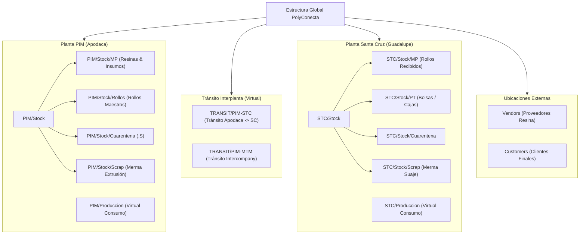
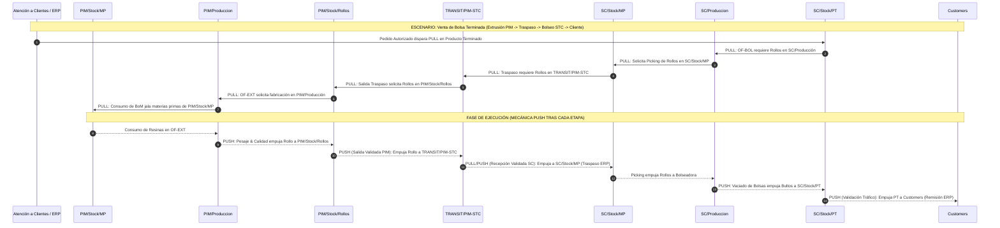

# ARQUITECTURA DE ALMACENES, UBICACIONES, RUTAS Y REGLAS DE ABASTECIMIENTO (PUSH / PULL) — POLYCONECTA

**Proyecto:** Engine Logístico y de Manufactura PolyConecta / CONTPAQi® Premium  
**Fecha:** Septiembre 2026  
**Versión:** 1.0 (Especificación Técnica de Routing & Abastecimiento)  
**Estatus:** Aprobado para Implementación  

---

## 1. Resumen Ejecutivo

Este documento especifica la **arquitectura del motor de inventarios, almacenes, ubicaciones físicas/virtuales, reglas de abastecimiento (Push / Pull), tipos de operación y centros de trabajo** de PolyConecta. 

Inspirado en la arquitectura logística avanzada de **Odoo 19**, PolyConecta desacopla la contabilidad comercial de CONTPAQi® Premium de la física operativa multialmacén y multiproceso de las plantas de **Polyempaques** (Planta PIM en Apodaca, Planta Santa Cruz en Guadalupe y Planta Montemorelos), permitiendo una trazabilidad exacta por lote, balance de masa estricto y transferencias en dos pasos.

---

## 2. Matriz de Almacenes (Warehouses / Entidades Lógicas y Jurídicas)

PolyConecta gestiona 4 almacenes principales, cada uno representando una instalación física o una entidad lógica de custodia:

| Código Almacén | Nombre Corto | Razón Social / Entidad | Función Principal |
| :--- | :--- | :--- | :--- |
| **`WH-PIM`** | Planta Parque Industrial Monterrey (Apodaca) | Razón Social Principal (Polyempaques) | Centro maestro de extrusión de rollos y abasto de resinas. |
| **`WH-STC`** | Planta Santa Cruz (Guadalupe) | Razón Social Principal (Polyempaques) | Centro de conversión secundaria (Impresión, Bolseo, Corte, Suaje, Empaque). |
| **`WH-MTM`** | Planta Montemorelos | Razón Social Filial (Empresa Hermana) | Planta multiproceso operada bajo esquema Intercompany. |
| **`WH-TR`** | Almacén Virtual de Tránsito Logístico | Entidad Lógica de Custodia | Custodia temporal de material en tránsito interplanta e intercompany. |

---

## 3. Jerarquía de Ubicaciones (Locations: Físicas, Virtuales e Intermedias)

Las ubicaciones se estructuran de forma jerárquica siguiendo el árbol de nodos `Almacén / Estructura / Sub-ubicación`:

### Detalle de Ubicaciones Clave

1. **Ubicaciones de Planta PIM:**
   * `PIM/Stock/MP`: Almacén de materia prima (resina virgen, pellets reciclados, pigmentos, aditivos).
   * `PIM/Produccion`: Ubicación virtual de transformación para extrusión.
   * `PIM/Stock/Rollos`: Piso de producto terminado pesado, validado y lotificado (`IV214-26-R001`).
   * `PIM/Stock/Cuarentena`: Rollos fuera de tolerancia marcados con sufijo `.S` (`IV214-26-R001.S`).
   * `PIM/Stock/Scrap`: Ubicación física para almacenamiento de merma por tipo de resina/color.

2. **Ubicaciones de Tránsito Interplanta:**
   * `TRANSIT/PIM-STC`: Ubicación virtual de custodia para fletes de rollos entre Apodaca y Guadalupe.
   * `TRANSIT/PIM-MTM`: Ubicación virtual para cruces de mercancía Intercompany.

3. **Ubicaciones de Planta Santa Cruz:**
   * `SC/Stock/MP`: Rollos maestros recibidos desde PIM en espera de conversión.
   * `SC/Produccion`: Ubicación virtual de transformación para impresión y bolseo.
   * `SC/Stock/PT`: Bultos y cajas de bolsas terminadas listas para despacho (`IV214-26-C01`).
   * `SC/Stock/Cuarentena`: Bultos/cajas retenidas por calidad.
   * `SC/Stock/Scrap`: Merma de suaje/troquelado y refile.

4. **Ubicaciones Externas:**
   * `Vendors`: Ubicación de origen para recepciones de compras de materia prima.
   * `Customers`: Ubicación de destino para remisiones y despachos a cliente.

---

## 4. Reglas de Abastecimiento (Procurement Rules: Mecánica Push y Pull)

PolyConecta utiliza un motor de rutas basado en la combinación de **Reglas PULL (Demanda por necesidad de producción/venta)** y **Reglas PUSH (Empuje automático tras completar una etapa)**.

### 4.1 Conceptos Fundamentales

* **Regla PULL (Jalar / Demanda):** Se gatilla cuando un requerimiento en una ubicación de destino (ej. una Orden de Fabricación o un Pedido de Venta) detecta falta de inventario y "jala" el material desde una ubicación de origen anterior.
* **Regla PUSH (Empujar / Flujo Automático):** Se gatilla cuando una acción se completa en una ubicación de origen (ej. finaliza el pesaje de un rollo o se valida una salida de almacén) y "empuja" automáticamente el material hacia la siguiente ubicación del flujo.

---

### 4.2 Diagrama de Flujo Completo Push / Pull por Operación

---

### 4.3 Matriz Detallada de Reglas Push / Pull por Tipo de Operación

#### 1. Flujo de Extrusión PIM (`PIM-MO`)
* **PULL — Consumo de Materia Prima:** La `OF-EXT` en `PIM/Produccion` jala resinas, pigmentos y aditivos desde `PIM/Stock/MP` basándose en la BoM en Excel cargada por el Planner.
* **PUSH — Entrada de Rollo Maestro:** Al registrar el pesaje e inspección aprobada de un rollo, el sistema lo empuja de `PIM/Produccion` $\rightarrow$ `PIM/Stock/Rollos` bajo el lote `IV214-26-R00X`.
* **PUSH — Rechazo a Cuarentena:** Si el rollo es rechazado por Calidad, la regla Push lo mueve de `PIM/Produccion` $\rightarrow$ `PIM/Stock/Cuarentena` bajo el lote `IV214-26-R00X.S`.
* **PUSH — Cierre de Merma:** Al realizar el Cierre Técnico de la `OF-EXT`, el scrap total se empuja de `PIM/Produccion` $\rightarrow$ `PIM/Stock/Scrap`.

#### 2. Flujo de Traspaso Interplanta PIM $\rightarrow$ Santa Cruz (`PIM-TR-OUT` / `STC-TR-IN`)
* **PULL — Necesidad en Santa Cruz:** La existencia de una `OF-BOL` en Santa Cruz jala los rollos maestros requeridos desde PIM.
* **PUSH — Paso 1 (Salida PIM):** Al validar la carga en camión en PIM, la operación `PIM-TR-OUT` empuja los rollos de `PIM/Stock/Rollos` $\rightarrow$ `TRANSIT/PIM-STC`. *(En este paso el material está físicamente viajando; no hay afectación contable en CONTPAQi)*.
* **PULL/PUSH — Paso 2 (Recepción Santa Cruz):** Al arribar el flete a Santa Cruz, la operación `STC-TR-IN` jala los rollos de `TRANSIT/PIM-STC` $\rightarrow$ `SC/Stock/MP`. **Al presionar "Validar" en SC, PolyConecta dispara automáticamente el documento de Traspaso entre Almacenes en CONTPAQi Premium.**

#### 3. Flujo de Conversión en Santa Cruz: Impresión y Bolseo (`STC-IMP-MO` / `STC-BOL-MO`)
* **PULL — Insumo de Rollo:** La `OF-BOL` en `SC/Produccion` jala rollos maestros desde `SC/Stock/MP`.
* **PUSH — Entrada de Producto Terminado:** Al realizar el vaciado diario de bultos/cajas de bolsas producidas, el sistema las empuja de `SC/Produccion` $\rightarrow$ `SC/Stock/PT` asignando lotes finales (`IV214-26-C01`).
* **PUSH — Merma de Suaje/Corte:** El desperdicio generado por suaje de asas y refile se empuja de `SC/Produccion` $\rightarrow$ `SC/Stock/Scrap`.

#### 4. Flujo de Despacho Directo a Cliente (`PIM-OUT-DIR` / `STC-OUT-DIR`)
* **PULL — Demanda Comercial:** El Pedido de Venta Autorizado en `Customers` jala el inventario disponible desde `PIM/Stock/Rollos` (para venta de rollo) o desde `SC/Stock/PT` (para venta de bolsa).
* **PUSH — Salida y Facturación:** Cuando Tráfico audita el embalaje y presiona **"Validar"**, el sistema empuja el inventario a `Customers`. **Esta acción dispara automáticamente la creación del documento de Remisión de Venta en CONTPAQi Premium.**

---

## 5. Catálogo de Tipos de Operación (Stock Operation Types)

Los Tipos de Operación definen la naturaleza transaccional de cada movimiento en PolyConecta y determinan qué evento contable/inventariable se dispara en CONTPAQi Premium:

| Código Operación | Nombre de Operación | Ubicación Origen | Ubicación Destino | Evento Disparado en CONTPAQi Premium |
| :--- | :--- | :--- | :--- | :--- |
| **`PIM-MO`** | Fabricación Extrusión PIM | `PIM/Stock/MP` | `PIM/Stock/Rollos` | **Consumo de MP + Entrada PT** al Cierre Técnico de la OF. |
| **`PIM-TR-OUT`** | Salida Traspaso Interplanta | `PIM/Stock/Rollos` | `TRANSIT/PIM-STC` | *Ninguno (El material queda en tránsito lógicamente).* |
| **`STC-TR-IN`** | Recepción Traspaso Interplanta | `TRANSIT/PIM-STC` | `SC/Stock/MP` | **Documento de Traspaso de Almacén** en CONTPAQi al "Validar". |
| **`STC-IMP-MO`** | Fabricación Impresión SC | `SC/Stock/MP` | `SC/Stock/Rollos-IMP` | Consumo de Rollo Liso + Tintas y Entrada Rollo Impreso. |
| **`STC-BOL-MO`** | Fabricación Bolseo SC | `SC/Stock/MP` | `SC/Stock/PT` | **Consumo de Rollo Impreso + Entrada de Bolsas PT** al Cierre de OF. |
| **`PIM-OUT-DIR`** | Despacho Directo Rollo | `PIM/Stock/Rollos` | `Customers` | **Remisión de Venta** en CONTPAQi al "Validar" salida. |
| **`STC-OUT-DIR`** | Despacho Directo Bolsa | `SC/Stock/PT` | `Customers` | **Remisión de Venta** en CONTPAQi al "Validar" salida. |
| **`ICO-TR-OUT`** | Salida Intercompany MTM | `PIM/Stock/Rollos` | `TRANSIT/PIM-MTM` | Genera Factura Intercompany y Pedido Espejo en Empresa Filial. |

---

## 6. Centros de Trabajo (Work Centers: Maquinaria y Capacidades)

Los Centros de Trabajo representan los recursos físicos (máquinas y estaciones de trabajo) donde se ejecutan las Órdenes de Trabajo (`WO`).

### 6.1 Planta PIM (Apodaca — Extrusión)

| Código Centro | Nombre del Centro | Proceso | Capacidad Nominal | Tiempos de Setup (Cambio) |
| :--- | :--- | :--- | :--- | :--- |
| `WC-EXT-01` | Extrusora Coex 3 Capas #1 | Extrusión Alta/Baja | $180 \text{ kg/h}$ | 45 min (Cambio de resina / calibre) |
| `WC-EXT-02` | Extrusora Coex 3 Capas #2 | Extrusión Alta/Baja | $220 \text{ kg/h}$ | 60 min (Cambio de color/pigmento) |
| `WC-EXT-03` | Extrusora Monocapa #3 | Extrusión Baja Densidad | $120 \text{ kg/h}$ | 30 min (Cambio de bobina) |
| `WC-EXT-04` | Extrusora Monocapa #4 | Extrusión Alta Densidad | $140 \text{ kg/h}$ | 30 min (Cambio de bobina) |
| `WC-SCALE-PIM`| Báscula y Registro PIM | Pesaje e Inspección | N/A | Captura manual por Planner (Roosvelt) |

### 6.2 Planta Santa Cruz (Guadalupe — Conversión)

| Código Centro | Nombre del Centro | Proceso | Capacidad Nominal | Tiempos de Setup (Cambio) |
| :--- | :--- | :--- | :--- | :--- |
| `WC-IMP-01..05`| Impresoras Flexográficas (5 Mqs) | Impresión Flexo 1-6 Tintas| $350 \text{ m/min}$ | 90 min (Lavado de tinteros y montaje de grabados) |
| `WC-BOL-01..10`| Bolseadoras Camiseta (10 Mqs) | Bolseo + Suaje Camiseta | $12 \text{ millares/h}$ | 20 min (Ajuste de suaje y temperatura de sello) |
| `WC-BOL-11..18`| Bolseadoras Fondo/Lateral (8 Mqs)| Bolseo Sello Fondo/Lateral | $8 \text{ millares/h}$ | 25 min (Ajuste de guillotina y fotocelda) |
| `WC-BOL-19..24`| Bolseadoras Especiales (6 Mqs) | Bolseo Troquel / Sello Estrella| $6 \text{ millares/h}$ | 35 min (Montaje de suaje especial) |
| `WC-SCALE-STC`| Báscula y Empaque SC | Bultado e Inspección | N/A | Captura manual por Planner (Diana) |

---

## 7. Reglas de Negocio Integradas

1. **Invariante de Tránsito:** Todo material que sale de una planta con destino a otra DEBE permanecer en la ubicación virtual `TRANSIT/*` hasta que el destinatario valide físicamente la entrada.
2. **Sincronización Transaccional en CONTPAQi:**
   * Las operaciones de manufactura (`PIM-MO`, `STC-BOL-MO`) afectan materias primas en CONTPAQi **únicamente en la confirmación final de cierre técnico de la OF**.
   * Las operaciones de traspaso interplanta (`STC-TR-IN`) afectan CONTPAQi **únicamente al validar la recepción en la planta destino**.
   * Las operaciones de venta (`PIM-OUT-DIR`, `STC-OUT-DIR`) afectan CONTPAQi **únicamente al validar el despacho de tráfico**.
3. **Control de Capacidad en Centros de Trabajo:** Ninguna `WO` puede ser asignada a un Centro de Trabajo sin especificar:
   * Identificador de máquina concreta.
   * Fecha y Hora programada de inicio y fin estimado.
   * Estado inicial de la WO: `'Por programar'` $\rightarrow$ `'Programado'` $\rightarrow$ `'En proceso'`.
