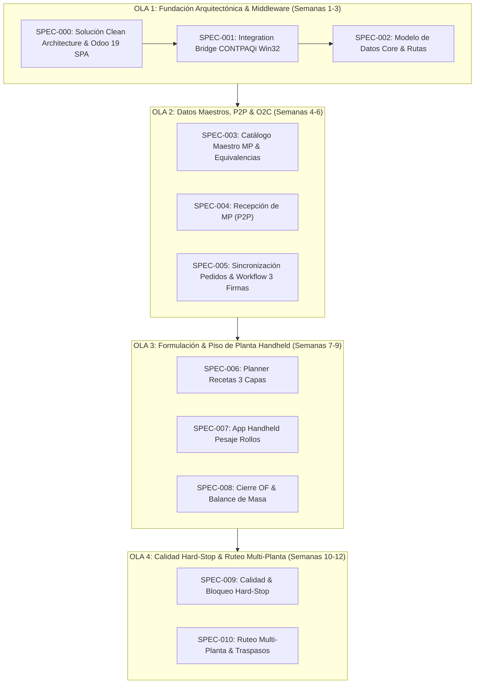

# ROADMAP DE ESPECIFICACIONES DE SOFTWARE (SDD) - POLYCONECTA
## De la Fundación Técnica al MVP Funcional (Fase 1)

**Proyecto:** PolyConecta (Motor Operativo de Ruteo y Gestión de Existencias)  
**Empresa:** Polyempaques  
**Alineación:** Constitución del Proyecto v1.4.0 (`.specify/memory/constitution.md`)  
**Fecha:** Septiembre 2026  

---

## 🗺️ Resumen Ejecutivo del Roadmap

El presente documento define la hoja de ruta técnica y funcional (SDD - Software Design Document Roadmap) para construir el MVP de **PolyConecta**. El desarrollo se divide en **4 Olas Incrementales (Release Waves)** compuestas por 11 Especificaciones (`specs` `000` a `010`).

Todas las especificaciones están estrictamente fundamentadas en los principios rectores de la **Constitución v1.4.0**:
* **Principio VII (Respaldo en Manuales y Búsqueda Web):** Obligatoriedad de fundamentar decisiones técnicas en [Referencia_BD_CONTPAQi.md](file:///Users/emilio/Development/Sandbox/Polyconecta/docs/contpaq/Referencia_BD_CONTPAQi.md) y [Referencia_SDK_CONTPAQi.md](file:///Users/emilio/Development/Sandbox/Polyconecta/docs/contpaq/Referencia_SDK_CONTPAQi.md).
* **Principio VIII (Fundamentación en la BD Operativa de Polyempaques):** Derivación directa de catálogos y transacciones contra la BD real de CONTPAQi Comercial Premium (`adm*`).
* **Principio IX (UI/UX y Filosofía Operativa Odoo 19 Enterprise):** Obligatoriedad de diseñar todas las interfaces de usuario (UI/UX), navegación (vistas Kanban/Formulario/Lista, Smart Buttons, barras de estado de pipeline) y el modelo operativo tomando como benchmark explícito **Odoo 19 Enterprise Edition**.



---

## 📋 Matriz de Especificaciones (Specs) y Prompts para Spec Kit

---

### 🧱 OLA 1: Fundación Arquitectónica e Infraestructura Integrativa

#### SPEC-000: `000-solution-clean-architecture`
* **Tipo:** Fundación Arquitectónica (Solución Raíz Clean Architecture & Odoo 19 Web SPA Suite)
* **Estado:** ✅ Especificación Validada, Planificada & Implementada
* **Objetivo:** Estructuración plana de la solución C# en la raíz con 5 capas independientes con directivas unidireccionales de dependencia: [PolyConecta.Presentation](file:///Users/emilio/Development/Sandbox/Polyconecta/PolyConecta.Presentation/README.md), [PolyConecta.Api](file:///Users/emilio/Development/Sandbox/Polyconecta/PolyConecta.Api/README.md), [PolyConecta.Domain](file:///Users/emilio/Development/Sandbox/Polyconecta/PolyConecta.Domain/README.md), [PolyConecta.Infrastructure](file:///Users/emilio/Development/Sandbox/Polyconecta/PolyConecta.Infrastructure/README.md) y [PolyConecta.Contpaq](file:///Users/emilio/Development/Sandbox/Polyconecta/PolyConecta.Contpaq/README.md). Incluye la suite UI/UX completa de Odoo 19 Enterprise (App Launcher Grid, Vistas Kanban/Lista/Formulario, Smart Buttons y Terminal Mobile Handheld).
* **Fundamentación Técnica:** Principios I, II e IX de la Constitución v1.4.0.
* **Ubicación Spec:** [.specify/features/000-solution-clean-architecture/spec.md](file:///Users/emilio/Development/Sandbox/Polyconecta/.specify/features/000-solution-clean-architecture/spec.md)

---

#### SPEC-001: `001-integration-bridge-contpaqi`
* **Tipo:** Fundación Técnica (Middleware Integration Bridge Win32)
* **Estado:** ✅ Especificación Validada & Implementada
* **Objetivo:** Servicio Windows (.NET 8 x86) ejecutable en Sesión 2 interactiva con cola FIFO durable en SQLite Outbox (`bridge_outbox.db`) e invocaciones nativas P/Invoke a `MGW_SDK.dll` y consultas SQL directas en modo `NOLOCK` a `adm*`.
* **Fundamentación Técnica:** Principios I, II, VII y VIII de la Constitución v1.4.0; [Referencia_SDK_CONTPAQi.md](file:///Users/emilio/Development/Sandbox/Polyconecta/docs/contpaq/Referencia_SDK_CONTPAQi.md) y [Referencia_BD_CONTPAQi.md](file:///Users/emilio/Development/Sandbox/Polyconecta/docs/contpaq/Referencia_BD_CONTPAQi.md).
* **Ubicación Spec:** [.specify/features/001-integration-bridge-contpaqi/spec.md](file:///Users/emilio/Development/Sandbox/Polyconecta/.specify/features/001-integration-bridge-contpaqi/spec.md)

---

#### SPEC-002: `002-core-domain-data-model`
* **Tipo:** Fundación Arquitectónica (Domain Data Model & Order Hierarchy)
* **Estado:** ✅ Especificación Validada & Implementada
* **Objetivo:** Definición del modelo de datos canónico de dominio (`RolloMaestro`, `PolyLocation`, `MasterOrder`, `SubOrder`, `LotGenealogy`, `MassBalanceAudit`).
* **Fundamentación Técnica:** Principio VIII de la Constitución v1.4.0 (`admAlmacenes`, `admProductos`, `admCapasProducto`, `admDocumentos`).
* **Ubicación Spec:** [.specify/features/002-core-domain-data-model/spec.md](file:///Users/emilio/Development/Sandbox/Polyconecta/.specify/features/002-core-domain-data-model/spec.md)

---

### 📦 OLA 2: Datos Maestros, Recepciones (P2P) y Aprobaciones (O2C)

#### SPEC-003: `003-solution-layer-interfaces`
* **Tipo:** Especificación Intermedia (Interfaces Reales & Contratos de Solución)
* **Estado:** 📝 Especificación Creada (Lista para `/speckit-plan`)
* **Objetivo:** Definición formal de todas las interfaces fuertemente tipadas y contratos de integración entre capas: Repositorios de Dominio (`IRepository`, `IOrderRepository`), Unidades de Trabajo (`IUnitOfWork`), Publicador de Eventos de Dominio (`IDomainEventPublisher`), Envolvente API REST (`ApiResponse<T>`), SDK JavaScript Frontend (`PolyAPI.client`) y Gateway CONTPAQi (`IContpaqSdkGateway`).
* **Fundamentación Técnica:** Principios I, II, VII, VIII e IX de la Constitución v1.4.0.
* **Ubicación Spec:** [.specify/features/003-solution-layer-interfaces/spec.md](file:///Users/emilio/Development/Sandbox/Polyconecta/.specify/features/003-solution-layer-interfaces/spec.md)

---

#### SPEC-004: `004-p2p-goods-receipt`
* **Tipo:** Flujo Operativo (Recepción de Compras & Calidad 1)
* **Objetivo:** Registro de Recepción Física de MP en Planta PIM (`PIM/Stock/MP`), inspección de recibo, asignación de Lote de Recepción (`MP-PROV-YYYYMMDD-LOT`) y llamada SDK para generar la "Entrada de Compra" en CONTPAQi afectando `admCapasProducto`.
* **Fundamentación Técnica:** Principios VII y VIII de la Constitución v1.4.0.

---

#### SPEC-005: `005-o2c-order-sync-approvals`
* **Tipo:** Flujo Comercial (Order-to-Cash & Workflow)
* **Objetivo:** Sincronización de Pedidos de Venta desde CONTPAQi $\rightarrow$ Creación de Orden Maestra (OM) $\rightarrow$ Workflow de Aprobaciones Secuenciales Digitales con los 3 roles autorizadores obligatorios y UI/UX estilo Odoo 19.
* **Fundamentación Técnica:** Principios III, V, VIII e IX de la Constitución v1.4.0.

---

### 🏭 OLA 3: Formulación y Piso de Planta Handheld (Corazón MES)

#### SPEC-006: `006-bom-extrusion-planner`
* **Tipo:** Planeación de Producción (MES Extrusión)
* **Objetivo:** Consola para el Planner de Extrusión: importación de Recetas Dinámicas de Co-Extrusión de 3 capas (Tolvas A/B/C: % resina virgen, aditivos, pigmentos), programación de extrusoras y generación de folios inmutables (`EX-01-260910-042747`).
* **Fundamentación Técnica:** Principios I, VI, VIII e IX de la Constitución v1.4.0.

---

#### SPEC-007: `007-handheld-roll-weighing`
* **Tipo:** Ejecución en Piso de Planta (UX Handheld Mobile)
* **Objetivo:** Aplicación Móvil Handheld para Planners/Supervisores en planta PIM: pesaje iterativo de rollos extruidos a pie de máquina, captura de peso neto, tara de cono, metraje, calibre e impresión/lectura de etiquetas QR GS1-128.
* **Fundamentación Técnica:** Principios VI e IX de la Constitución v1.4.0 (UX Odoo Barcode).

---

#### SPEC-008: `008-mass-balance-closure`
* **Tipo:** Algoritmo MES e Integración ERP (Cierre de OF)
* **Objetivo:** Cierre Técnico de OF de Extrusión: cálculo de Balance de Masa ($\text{Consumo MP} = \sum \text{Rollos Netos} + \text{Scrap Declara}$), evaluación contra la tolerancia configurable (2.0%) y posteo SDK de Salidas por Consumo de MP y Entradas de PT en CONTPAQi.
* **Fundamentación Técnica:** Principios IV, VII, VIII e IX de la Constitución v1.4.0.

---

### 🔒 OLA 4: Calidad Hard-Stop & Ruteo Multi-Planta (MVP Complete)

#### SPEC-009: `009-quality-inspection-hardstop`
* **Tipo:** Control de Calidad & Aislamiento (Quality Gate)
* **Objetivo:** Fichas de inspección de calidad en proceso y auditoría obligatoria. Módulo de Cuarentena (Etiquetado Rojo) y **Hard-Stop sistémico** que bloquea automáticamente traspasos o remisiones de lotes no liberados.
* **Fundamentación Técnica:** Principios IV e IX de la Constitución v1.4.0.

---

#### SPEC-010: `010-multi-plant-routing-handheld`
* **Tipo:** Logística y Ruteo Multi-Planta (Routing Engine)
* **Objetivo:** Motor de ruteo para traspasos entre Planta PIM (Apodaca) y Planta Santa Cruz (Guadalupe) en 2 pasos (`PIM-TR-OUT` $\rightarrow$ `TRANS/PIM-SC` $\rightarrow$ `STC-TR-IN`) mediante escaneo Handheld. Incluye la regla para la ruta Montemorelos (Razón Social 2).
* **Fundamentación Técnica:** Principios V, VII, VIII e IX de la Constitución v1.4.0.

---

## 🚀 Guía de Ejecución Unificada con Script `run.sh`

Para compilar toda la solución, ejecutar las suites de pruebas e iniciar la aplicación:

```bash
# 1. Compilar, probar e iniciar Presentación SPA Odoo 19 (Puerto 9000) y API Gateway (Puerto 9020)
./run.sh

# 2. Compilar, probar e iniciar la Solución Completa con CONTPAQi Bridge Worker (Puerto 5005)
./run.sh --with-bridge
```
