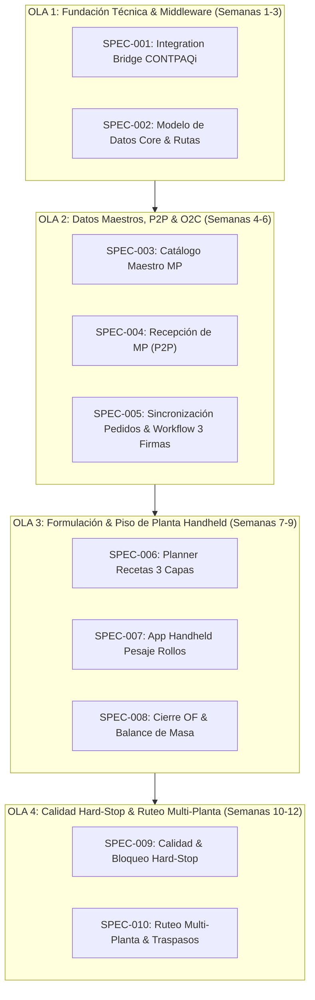

# ROADMAP DE ESPECIFICACIONES DE SOFTWARE (SDD) - POLYCONECTA
## De la Fundación Técnica al MVP Funcional (Fase 1)

**Proyecto:** PolyConecta (Motor Operativo de Ruteo y Gestión de Existencias)  
**Empresa:** Polyempaques  
**Alineación:** Constitución del Proyecto v1.4.0 (`.specify/memory/constitution.md`)  
**Fecha:** Septiembre 2026  

---

## 🗺️ Resumen Ejecutivo del Roadmap

El presente documento define la hoja de ruta técnica y funcional (SDD - Software Design Document Roadmap) para construir el MVP de **PolyConecta**. El desarrollo se divide en **4 Olas Incrementales (Release Waves)** compuestas por 10 Especificaciones (`specs`).

Todas las especificaciones están estrictamente fundamentadas en los principios rectores de la **Constitución v1.4.0**:
* **Principio VII (Respaldo en Manuales y Búsqueda Web):** Obligatoriedad de fundamentar decisiones técnicas en [Referencia_BD_CONTPAQi.md](file:///Users/emilio/Development/Sandbox/Polyconecta/docs/contpaq/Referencia_BD_CONTPAQi.md) y [Referencia_SDK_CONTPAQi.md](file:///Users/emilio/Development/Sandbox/Polyconecta/docs/contpaq/Referencia_SDK_CONTPAQi.md), y consultar en la web ante cualquier ambigüedad técnica.
* **Principio VIII (Fundamentación en la BD Operativa de Polyempaques):** Toda estructura de datos (productos, clientes, conceptos de documentos, remisiones, facturas, almacenes) debe derivarse directamente de cómo opera actualmente la base de datos de CONTPAQi Comercial Premium en Polyempaques (`adm*`).
* **Principio IX (UI/UX y Filosofía Operativa Odoo 19 Enterprise):** Obligatoriedad de diseñar todas las interfaces de usuario (UI/UX), la navegación (vistas Kanban/Formulario/Lista, Smart Buttons de trazabilidad, barras de avance de estado) y el modelo operativo de MRP/Almacén tomando como benchmark explicito la experiencia y estándares de **Odoo 19 Enterprise**.



---

## 📋 Matriz de Especificaciones (Specs) y Prompts para Spec Kit

Para cada especificación se proporciona un **Prompt de Co-Creación** diseñado para ejecutar con la herramienta **Spec Kit** (comando `/speckit-specify` o prompt interactivo). Cada prompt incluye explícitamente las directivas de verificación técnica contra los manuales de referencia, la base de datos de CONTPAQi y la búsqueda web.

---

### 🧱 OLA 1: Fundación Técnica e Infraestructura Integrativa

#### SPEC-001: `001-integration-bridge-contpaqi`
* **Tipo:** Fundación Técnica (Middleware Integration Bridge)
* **Objetivo:** Construir el servicio Windows (.NET x86) que expone una API REST/JSON interna con cola FIFO síncrona hilo a hilo (`SemaphoreSlim`) para encapsular todas las llamadas Win32 al `SDK_CONTPAQ.dll` y realizar lecturas directas a SQL Server (`adm*`).
* **Fundamentación Técnica:** Principios I, II, VII y VIII de la Constitución v1.3.0; `Referencia_SDK_CONTPAQi.md` y `Referencia_BD_CONTPAQi.md`.
* **Decisiones Clave a Resolver:** Tiempos de timeout del SDK, funciones Win32 (`fInicializarSDK`, `fAbreEmpresa`, `fAltaDocumento`, `fAltaMovimiento`), persistencia Outbox FIFO y manejo de errores con DLQ.

> [!TIP]
> **Prompt Interactivo para Spec Kit:**
> ```text
> Actúa como Arquitecto de Software Sr. e inicia el proceso /speckit-specify para la especificación '001-integration-bridge-contpaqi'.
> 
> Revisa la Constitución v1.3.0 (.specify/memory/constitution.md), especialmente los Principios VII y VIII. Fundamenta todas las decisiones técnicas en docs/contpaq/Referencia_SDK_CONTPAQi.md y docs/contpaq/Referencia_BD_CONTPAQi.md. Si alguna función del SDK o tabla de SQL Server resulta ambigua o incompleta, realiza búsquedas web antes de proponer soluciones.
> 
> Guíame en una sesión interactiva donde me hagas de 3 a 5 preguntas concretas sobre:
> 1. Mapeo exacto de funciones SDK (fInicializarSDK, fAbreEmpresa, fAltaDocumento, fAltaMovimiento) y lecturas directas SQL a tablas adm*.
> 2. Control de concurrencia single-threaded (SemaphoreSlim/Mutex) y tiempos de timeout por transacción.
> 3. Persistencia de la cola Outbox (Redis/SQLite) y estrategia de reintentos asíncronos ante caídas de CONTPAQi.
> 4. Estructura de logs de auditoría y alertas de transacciones fallidas.
> 
> Con mis respuestas, redacta el archivo spec.md en .specify/features/001-integration-bridge-contpaqi/spec.md.
> ```

---

#### SPEC-002: `002-core-domain-data-model`
* **Tipo:** Fundación Arquitectónica (Domain Data Model)
* **Objetivo:** Definir el modelo de datos canónico y las entidades de dominio en PolyConecta (Almacenes Físicos y Ubicaciones Virtuales `PIM/Stock/MP`, `PIM/Produccion`, `PIM/Stock/PT`, `TRANS/PIM-SC`, `SC/Stock/MP`, Rutas Logísticas, Rollo Maestro, Lotes de MP y Jerarquía de Órdenes).
* **Fundamentación Técnica:** Principio VIII de la Constitución v1.3.0 (Alineación con la estructura real de `admAlmacenes`, `admProductos`, `admCapasProducto` y `admDocumentos`).
* **Decisiones Clave a Resolver:** Esquema de base de datos de PolyConecta (PostgreSQL/SQL Server), estructuras de tablas alineadas con CONTPAQi y tipos de estado.

> [!TIP]
> **Prompt Interactivo para Spec Kit:**
> ```text
> Actúa como Arquitecto de Software Sr. e inicia /speckit-specify para la especificación '002-core-domain-data-model'.
> 
> Revisa la Constitución v1.3.0 (.specify/memory/constitution.md) y verifica la estructura actual de admAlmacenes y admCapasProducto en docs/contpaq/Referencia_BD_CONTPAQi.md. En caso de ambigüedad, realiza búsquedas web sobre el modelo de datos de CONTPAQi.
> 
> Hazme preguntas clave para definir el modelo de datos canónico de PolyConecta:
> 1. Alineación de Almacenes Físicos y Ubicaciones Virtuales en PolyConecta contra la tabla admAlmacenes de CONTPAQi.
> 2. Modelo de la entidad Rollo Maestro (peso neto, metraje, calibre, máquina, turno, folio).
> 3. Jerarquía de Órdenes: Orden Maestra (OM) vs Sub-Órdenes de Fabricación (OF-EXT, OF-IMP, OF-BOL).
> 4. Estructura de Lotes y Capas de Inventario para coincidir con admCapasProducto en CONTPAQi.
> 
> Al finalizar, genera la especificación spec.md correspondiente.
> ```

---

### 📦 OLA 2: Datos Maestros, Recepciones (P2P) y Aprobaciones (O2C)

#### SPEC-003: `003-master-catalogs-mp`
* **Tipo:** Datos Maestros (Procure-to-Pay)
* **Objetivo:** Módulo de Catálogo Maestro Estandarizado de Materias Primas (resinas vírgenes, aditivos, pigmentos). Estandariza la codificación interna y mantiene la tabla de equivalencias contra los códigos de proveedor.
* **Fundamentación Técnica:** Principio III y Principio VIII de la Constitución v1.3.0 (Grounding en la estructura de `admProductos` de Polyempaques).
* **Decisiones Clave a Resolver:** Convención de SKUs internos de MP, mapeo directo a campos de `admProductos` (cCodigoProducto, cNombreProducto, cUnidadMedida), unidades de medida (kg) y tabla de equivalencias de proveedor.

> [!TIP]
> **Prompt Interactivo para Spec Kit:**
> ```text
> Actúa como Business Analyst y Especialista en Compras e inicia /speckit-specify para '003-master-catalogs-mp'.
> 
> Revisa la Constitución v1.3.0 (.specify/memory/constitution.md), especialmente los Principios III y VIII. Consulta la estructura de admProductos en docs/contpaq/Referencia_BD_CONTPAQi.md para fundamentar los campos.
> 
> Ayúdame a responder:
> 1. Convención de codificación de SKUs internos para resinas (MP-RES-HD-001) y su mapeo a admProductos en CONTPAQi.
> 2. Estructura de la tabla de equivalencias para códigos heterogéneos de proveedores (Dow Chemical, Braskem, etc.).
> 3. Campos obligatorios de la ficha técnica de resinas (MFI, densidad, tipo de tolva destino).
> 4. Reglas para consultar la BD operativa de CONTPAQi y evitar duplicados al registrar nuevas materias primas.
> 
> Genera el spec.md resultante.
> ```

---

#### SPEC-004: `004-p2p-goods-receipt`
* **Tipo:** Flujo Operativo (Recepción de Compras & Calidad 1)
* **Objetivo:** Registro de Recepción Física de MP en Planta PIM (`PIM/Stock/MP`), inspección de recibo (Filtro Calidad 1), asignación de Lote de Recepción (`MP-PROV-YYYYMMDD-LOT`) y llamada SDK para generar el documento "Entrada de Compra" en CONTPAQi afectando `admCapasProducto`.
* **Fundamentación Técnica:** Principio VII y VIII de la Constitución v1.3.0; `Referencia_SDK_CONTPAQi.md` (Concepto Entrada de Compra, `fAltaDocumento`, `fAltaMovimientoSeriesCapas`) y `Referencia_BD_CONTPAQi.md` (`admDocumentos`, `admMovimientos`).
* **Decisiones Clave a Resolver:** Validación contra la Orden de Compra de CONTPAQi, adjunto de CoA del proveedor y manejo de capas de costo/lote en CONTPAQi.

> [!TIP]
> **Prompt Interactivo para Spec Kit:**
> ```text
> Actúa como Business Analyst y Especialista CONTPAQi e inicia /speckit-specify para '004-p2p-goods-receipt'.
> 
> Consulta docs/contpaq/Referencia_SDK_CONTPAQi.md (funciones de capas de inventario y Entrada de Compra) y docs/contpaq/Referencia_BD_CONTPAQi.md, fundamentando el diseño en la Constitución v1.3.0.
> 
> Hazme preguntas sobre:
> 1. Captura para el almacenista (Ismael/Francisco) al recibir resinas y validación contra la OC en CONTPAQi.
> 2. Registro del Certificado de Calidad (CoA) del proveedor e Inspección de Recibo (Filtro Calidad 1).
> 3. Asignación de Lote y Pedimento afectando admCapasProducto en CONTPAQi vía SDK (fAltaMovimientoSeriesCapas).
> 4. Verificación en la web de cualquier comportamiento ambiguo sobre la afectación de capas de costo en CONTPAQi v10+.
> 
> Documenta las especificaciones funcionales y de integración en spec.md.
> ```

---

#### SPEC-005: `005-o2c-order-sync-approvals`
* **Tipo:** Flujo Comercial (Order-to-Cash & Workflow)
* **Objetivo:** Sincronización de Pedidos de Venta desde CONTPAQi $\rightarrow$ Adjunto de especificaciones técnicas (Excel) $\rightarrow$ Creación de Orden Maestra (OM) en PolyConecta $\rightarrow$ Workflow de Aprobaciones Secuenciales Digitales con los 3 roles autorizadores obligatorios.
* **Fundamentación Técnica:** Principios III, V, VIII y IX de la Constitución v1.4.0; UI/UX estilo Odoo 19 Enterprise (vistas Kanban/Formulario, Smart Buttons y barra de estado de pipeline); mapeo a `admDocumentos` (Concepto Pedido de Venta), `admClientes` y `admProductos`.
* **Decisiones Clave a Resolver:** Evento de sincronización desde CONTPAQi, parseo de Excel de especificaciones, firmas digitales (Solicitante/Ventas, Crédito y Cobranza, Autorizador) y diseño de UI estilo Odoo 19 Enterprise.

> [!TIP]
> **Prompt Interactivo para Spec Kit:**
> ```text
> Actúa como Business Analyst y UX Designer e inicia /speckit-specify para '005-o2c-order-sync-approvals'.
> 
> Fundamenta el diseño en los Principios III, V, VIII y IX de la Constitución v1.4.0 (tomando Odoo 19 Enterprise como benchmark de UI/UX) y en docs/contpaq/Referencia_BD_CONTPAQi.md (tablas admDocumentos para Pedidos, admClientes y admProductos).
> 
> Pregúntame sobre:
> 1. Evento de sincronización de Pedidos de Venta desde CONTPAQi (admDocumentos cIdConceptoDocumento = Pedido).
> 2. Carga y parseo del Excel de especificaciones técnicas anexado por Atención a Clientes.
> 3. Workflow de firmas digitales secuenciales con interfaz gráfica estilo Odoo 19 (barra de avance de estado de pipeline y Smart Buttons).
> 4. Preservación del código de Producto Terminado por cliente/especificación según opera CONTPAQi actualmente.
> 
> Redacta el spec.md detallado con casos de uso, diagramas de estado y wireframes/patrones de interacción UI/UX de Odoo 19 Enterprise.
> ```

---

### 🏭 OLA 3: Formulación y Piso de Planta Handheld (Corazón MES)

#### SPEC-006: `006-bom-extrusion-planner`
* **Tipo:** Planeación de Producción (MES Extrusión)
* **Objetivo:** Consola para el Planner de Extrusión (Roosvelt Lara): importación de Recetas Dinámicas de Co-Extrusión de 3 capas (Tolvas A/B/C: % resina virgen, aditivos, pigmentos) desde Excel, programación de extrusoras y generación de folios inmutables (`EX-01-260910-042747`).
* **Fundamentación Técnica:** Principios I, VI, VIII y IX de la Constitución v1.4.0 (Filosofía Odoo 19 MRP: Work Centers, BOMs dinámicas y vistas Kanban/Gantt de piso).
* **Decisiones Clave a Resolver:** Formato del archivo Excel de formulación, validación de suma de capas (A=25%, B=50%, C=25%), apartado de stock de MP en `PIM/Stock/MP` y algoritmo de secuencia por color/densidad.

> [!TIP]
> **Prompt Interactivo para Spec Kit:**
> ```text
> Actúa como Especialista MES, UX Designer y Planner de Extrusión e inicia /speckit-specify para '006-bom-extrusion-planner'.
> 
> Revisa la Constitución v1.4.0 (.specify/memory/constitution.md), especialmente el Principio IX (Filosofía MRP y UI/UX Odoo 19 Enterprise) y fundamenta la estructura de insumos en docs/contpaq/Referencia_BD_CONTPAQi.md (admProductos).
> 
> Pregúntame sobre:
> 1. Estructura de la plantilla Excel que carga Roosvelt Lara con la receta de 3 capas (Tolvas A, B, C) y su despliegue visual tipo BOM Odoo 19.
> 2. Algoritmo de validación de masa de formulación (% dosificación por cañón resina virgen vs aditivo).
> 3. Generador del folio consecutivo de extrusión y gestión de Centros de Trabajo (Work Centers) al estilo Odoo 19 MRP.
> 4. Asignación de fecha programada, máquina extrusora y reserva de insumos en PIM/Stock/MP con Smart Buttons de disponibilidad.
> 
> Genera el documento spec.md con los requerimientos de la consola del planner y patrones de UI/UX Odoo 19.
> ```

---

#### SPEC-007: `007-handheld-roll-weighing`
* **Tipo:** Ejecución en Piso de Planta (UX Handheld Mobile)
* **Objetivo:** Aplicación Móvil Handheld para Planners/Supervisores en planta PIM: pesaje iterativo de rollos extruidos a pie de máquina, captura de peso neto, tara de cono/tubo, metraje, calibre e impresión/lectura de etiquetas QR GS1-128.
* **Fundamentación Técnica:** Principio VI e IX de la Constitución v1.4.0 (Fase 1 es 100% Handheld con UX de captura fluida y escaneo rápido inspirada en Odoo Barcode/MRP Mobile).
* **Decisiones Clave a Resolver:** Ergonomía de pantalla en terminal Handheld Android/iOS, almacenamiento local offline en el dispositivo para pesaje sin latencia de red, validación de rangos de peso y formato de etiqueta QR.

> [!TIP]
> **Prompt Interactivo para Spec Kit:**
> ```text
> Actúa como Especialista UX/UI Industrial e Ingeniero MES e inicia /speckit-specify para '007-handheld-roll-weighing'.
> 
> Revisa la decisión ratificada D-06 y los Principios VI e IX de la Constitución v1.4.0 (UX Handheld inspirada en Odoo Barcode 19 Enterprise).
> 
> Guíame para especificar la App Handheld de pesaje de rollos:
> 1. Flujo de pantallas táctiles simplificadas (modo oscuro/alto contraste) para el Planner/Supervisor frente a la báscula.
> 2. Campos de captura ultra-rápida: selección de OF, número de rollo, peso bruto, peso tara, calibre medido.
> 3. Almacenamiento local offline en el dispositivo Handheld para garantizar pesaje sin latencia de red.
> 4. Formato de la etiqueta QR GS1-128 generada para el rollo maestro y retroalimentación hápida/sonora al escanear.
> 
> Redacta la especificación spec.md orientada a la experiencia de usuario (Odoo Barcode UX) y resiliencia offline.
> ```

---

#### SPEC-008: `008-mass-balance-closure`
* **Tipo:** Algoritmo MES e Integración ERP (Cierre de OF)
* **Objetivo:** Cierre Técnico de OF de Extrusión: cálculo de Balance de Masa ($\text{Consumo MP} = \sum \text{Rollos Netos} + \text{Scrap Declara}$), evaluación contra la tolerancia configurable en sistema y disparo de eventos asíncronos para postear Salidas por Consumo de MP y Entradas de Producción de PT en CONTPAQi.
* **Fundamentación Técnica:** Principios IV, VII, VIII y IX de la Constitución v1.4.0; UI/UX estilo Odoo 19 Enterprise; `Referencia_SDK_CONTPAQi.md` (Conceptos "Salida de Almacén" y "Entrada de Producción", `fAltaDocumento`, `fAltaMovimiento`) y `Referencia_BD_CONTPAQi.md`.
* **Decisiones Clave a Resolver:** Ecuación exacta de balance de masa, pantalla de declaración de scrap por tipo/color, manejo de parámetro de tolerancia configurable en sistema y llamadas SDK.

> [!TIP]
> **Prompt Interactivo para Spec Kit:**
> ```text
> Actúa como Arquitecto de Software, UX Designer y Especialista MES e inicia /speckit-specify para '008-mass-balance-closure'.
> 
> Revisa los Principios IV, VIII y IX de la Constitución v1.4.0 (tomando Odoo 19 Enterprise como benchmark UI/UX). Fundamenta el posteo en CONTPAQi consultando docs/contpaq/Referencia_SDK_CONTPAQi.md (Salidas de Almacén y Entradas de PT) y docs/contpaq/Referencia_BD_CONTPAQi.md.
> 
> Pregúntame sobre:
> 1. Fórmula exacta de balance de masa para prorratear los kilos de resina/aditivos consumidos por rollo + scrap.
> 2. Configuración del parámetro de tolerancia máxima de varianza en el panel de administración.
> 3. Pantalla de cierre de orden y declaración final de merma/scrap en kg con UX limpia tipo Odoo 19.
> 4. Payload asíncrono al Outbox Worker para postear Salida de MP y Entrada de PT en CONTPAQi vía SDK.
> 
> Construye el archivo spec.md técnico y de reglas de negocio.
> ```

---

### 🔒 OLA 4: Calidad Hard-Stop & Ruteo Multi-Planta (MVP Complete)

#### SPEC-009: `009-quality-inspection-hardstop`
* **Tipo:** Control de Calidad & Aislamiento (Quality Gate)
* **Objetivo:** Fichas de inspección de calidad en proceso (Filtro 2: calibre, dyneado corona, sellos) y auditoría obligatoria de embarque (Filtro 3). Módulo de Cuarentena (Etiquetado Rojo) y **Hard-Stop sistémico** que bloquea automáticamente traspasos o remisiones de lotes no liberados.
* **Fundamentación Técnica:** Principios IV e IX de la Constitución v1.4.0 (Auditorías de producción obligatorias para todo lo producido + Hard-Stop + UI/UX de inspección Odoo 19 Quality).
* **Decisiones Clave a Resolver:** Disparador dinámico de fichas de inspección por rollo pesado, firma digital del inspector de calidad, traslado automático a `PIM/Stock/Cuarentena` y plantilla PDF de Certificado de Calidad (CoA).

> [!TIP]
> **Prompt Interactivo para Spec Kit:**
> ```text
> Actúa como Especialista en Aseguramiento de Calidad, UX Designer e Ingeniería de Software e inicia /speckit-specify para '009-quality-inspection-hardstop'.
> 
> Revisa los Principios IV y IX de la Constitución v1.4.0 (Auditorías obligatorias + Hard-Stop de Calidad + UX Odoo 19 Quality Checks).
> 
> Hazme preguntas clave sobre:
> 1. Puntos de inspección dinámica por rollo (10-20 lecturas de calibre, tratamiento corona >= 38 dynas, etc.) desplegados en formularios limpios tipo Odoo 19.
> 2. Reglas de rechazo y transferencia automática del lote a la ubicación de Cuarentena (Red Tag).
> 3. Lógica del bloqueo Hard-Stop en el motor de almacenamiento para impedir traslados o embarques sin firma de Calidad.
> 4. Generación del PDF del Certificado de Calidad (CoA) para el cliente final accesible vía Smart Button.
> 
> Genera la especificación spec.md detallada.
> ```

---

#### SPEC-010: `010-multi-plant-routing-handheld`
* **Tipo:** Logística y Ruteo Multi-Planta (Routing Engine)
* **Objetivo:** Motor de ruteo para traspasos entre Planta PIM (Apodaca) y Planta Santa Cruz (Guadalupe) en 2 pasos (`PIM-TR-OUT` $\rightarrow$ `TRANS/PIM-SC` $\rightarrow$ `STC-TR-IN`) mediante escaneo Handheld. Incluye la regla para la ruta Montemorelos que genera automáticamente la Solicitud de Cotización al cliente bajo Razón Social 2.
* **Fundamentación Técnica:** Principios V, VII, VIII y IX de la Constitución v1.4.0 (Ruteo en 2 pasos estilo Odoo 19 Inventory); `Referencia_SDK_CONTPAQi.md` (Concepto Traspaso de Almacén) y `Referencia_BD_CONTPAQi.md` (`admAlmacenes`, `admDocumentos`).
* **Decisiones Clave a Resolver:** Tolerancia de varianza de peso entre báscula PIM y báscula Santa Cruz ($\pm 0.5\%$), hoja de salida digital en Handheld, confirmación de recepción por Brian Palomino y disparo de Solicitud de Cotización Razón Social 2 (Montemorelos).

> [!TIP]
> **Prompt Interactivo para Spec Kit:**
> ```text
> Actúa como Business Analyst, UX Designer y Especialista en Logística e inicia /speckit-specify para '010-multi-plant-routing-handheld'.
> 
> Revisa los Principios V, VIII y IX de la Constitución v1.4.0 (Ruteo multi-paso por ubicaciones estilo Odoo 19 Inventory) y docs/contpaq/Referencia_BD_CONTPAQi.md (admAlmacenes y admDocumentos para traspasos).
> 
> Hazme preguntas sobre:
> 1. Flujo de Salida de Traspaso en Handheld (PIM-TR-OUT) afectando la ubicación virtual de tránsito TRANS/PIM-SC con interfaz de escaneo rápido.
> 2. Flujo de Recepción en báscula de Santa Cruz (STC-TR-IN) por Brian Palomino y manejo de varianza de pesaje (+-0.5%).
> 3. Regla de disparo al seleccionar la Ruta Montemorelos: generación automática de Solicitud de Cotización (Razón Social 2).
> 4. Emisión de documento de Traspaso en CONTPAQi vía SDK.
> 
> Documenta las reglas de ruteo y casos de uso en spec.md.
> ```

---

## 🚀 Guía de Ejecución Interactiva con Spec Kit

Para comenzar a construir cualquier especificación del roadmap:

1. **Copia el Prompt Interactivo** de la especificación correspondiente.
2. **Inicia el comando Spec Kit** en la consola o chat:
   ```bash
   /speckit-specify
   ```
3. **Pasta el prompt** y responde a las preguntas interactivas que el asistente te irá formulando.
4. El asistente consultará los manuales de referencia (`Referencia_BD_CONTPAQi.md` y `Referencia_SDK_CONTPAQi.md`), verificará la estructura operativa de la BD de Polyempaques y realizará búsquedas web si existe alguna ambigüedad antes de congelar el `spec.md` oficial dentro de `.specify/features/<feature-name>/spec.md`.
5. Una vez aprobado el `spec.md`, puedes continuar con `/speckit-plan` y `/speckit-tasks`.
