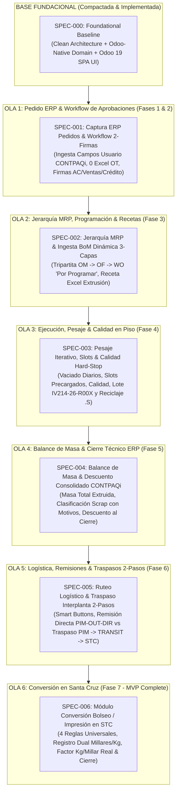

# ROADMAP DE ESPECIFICACIONES DE SOFTWARE (SDD) - POLYCONECTA
## Basado en el Informe de Validación del Diagrama Operativo To-Be

**Proyecto:** PolyConecta (Motor Operativo de Ruteo y Gestión de Existencias / MES)  
**Empresa:** Polyempaques  
**Alineación:** Constitución del Proyecto v1.4.0 + [INFORME_VALIDACION_DIAGRAMA_OPERATIVO.md](file:///Users/emilio/Development/Sandbox/Polyconecta/docs/assesment/INFORME_VALIDACION_DIAGRAMA_OPERATIVO.md)  
**Fecha:** Septiembre 2026 · **Realineado:** 23 de septiembre de 2026

---

## ⚠️ Realineación de numeración (23-sep-2026)

La numeración original de este roadmap (`001`–`006`) **no corresponde a los directorios reales** de `.specify/features/`. La ejecución tomó otro camino: la base se compactó en tres specs implementadas y las specs operativas se numeraron a partir de `007`. Los directorios son la fuente de verdad; este roadmap queda realineado a ellos.

| Directorio real | Spec | Estado |
| :--- | :--- | :--- |
| `000-foundational` | Fundación técnica (Clean Architecture + dominio Odoo-native + SPA) | ✅ Implementada |
| `001-poc-end-to-end-operational-flow` | Prueba de concepto del flujo operativo completo | ✅ Implementada |
| `002-domain-model-redefinition` | Redefinición del modelo de dominio | 🔄 Parcial — ver nota abajo |
| `003-presentation-shell-consolidation` | Consolidación del shell de presentación | ✅ Implementada |
| `007-procurement-rules-and-authorization` | Disponibilidad, reserva y autorización de dos firmas | 📝 Draft |
| `008-wip-component-recollection` | Recolección de componentes a WIP | 📝 Draft |
| `009-users-roles-permissions` | Usuarios, roles y permisos | 📝 Draft |
| `010-search-view-dynamic-filters` | Vista de búsqueda y filtros dinámicos | 📝 Draft — parcialmente implementada |

**Qué fue de las specs `004`–`006` del plan original:** nunca se crearon como directorios. Su contenido sigue vigente como trabajo pendiente y se reubica así:

- **SPEC-004 (Balance de masa y cierre técnico)** — pendiente. `008` le aporta el lado de la entrada de la ecuación (`Recolectado = Consumido + Devuelto + Scrap`).
- **SPEC-005 (Logística y traspasos de 2 pasos)** — implementada en el prototipo (traslado, recepción, entrega, recolección) sin spec formal propia; los tipos de operación viven en `ARQUITECTURA_ALMACENES_RUTAS_Y_ABASTECIMIENTO.md` y en `008`.
- **SPEC-006 (Conversión bolseo/impresión en STC)** — pendiente, sin spec escrita.

**Nota sobre `002`:** la fusión de `MasterOrder`/`SubOrder` en `ManufacturingOrder` autoreferenciado y el reemplazo de `RolloMaestro` por `StockLot` **ya se ejecutaron** (23-sep-2026). El resto de la spec —`WorkOrder`, ficha técnica multinivel, `QualityControl` como documento propio, numeración centralizada— sigue pendiente.

Las secciones siguientes se conservan como **registro del plan original**, no como índice vigente.

---

## 🗺️ Resumen Ejecutivo del Nuevo Roadmap

El presente documento reestructura la hoja de ruta técnica y funcional (SDD - Software Design Document Roadmap) para construir el MVP de **PolyConecta**, tomando como fundamento exclusivo el **Informe de Validación del Diagrama Operativo To-Be** consensuado con la planta.

El desarrollo se organiza en **1 Spec Fundacional Baseline (`000-foundational`) + 6 Especificaciones Operativas (`001` a `006`)** estructuradas en olas según las 7 Fases Operativas validadas:



---

## 📋 Matriz de Especificaciones (Specs) del Nuevo Roadmap

---

### 🧱 BASE FUNDACIONAL (Compactada)

#### SPEC-000: `000-foundational`
* **Tipo:** Fundación Técnica Baseline (Clean Architecture + Odoo-Native Domain + Odoo 19 SPA)
* **Estado:** ✅ Especificación Validada & Base Implementada
* **Objetivo:** Solución C# Clean Architecture de 5 capas (`PolyConecta.Domain`, `PolyConecta.Infrastructure`, `PolyConecta.Api`, `PolyConecta.Presentation`, `PolyConecta.Contpaq`), modelo de datos de dominio con 10 entidades nativas de Odoo 19 (`Product`, `StockLot`, `ManufacturingOrder`, `Bom`, `BomLine`, `StockLocation`, `StockPicking`, `StockMove`, `QualityCheck`, `StockScrap`), y suite frontend SPA Odoo 19 Enterprise (Grid App Launcher, Vistas Kanban/Lista/Formulario, Smart Buttons y Terminal Mobile Handheld).
* **Fundamentación:** Principios I, II, VIII e IX de la Constitución v1.4.0.
* **Ubicación Spec:** [.specify/features/000-foundational/spec.md](file:///Users/emilio/Development/Sandbox/Polyconecta/.specify/features/000-foundational/spec.md)

---

### 📦 OLA 1: Pedido ERP, Sincronización & Aprobaciones (Fases 1 & 2)

#### SPEC-001: `001-erp-order-sync-approvals`
* **Tipo:** Flujo Comercial & Pedidos (Fases 1 y 2 del Diagrama Operativo)
* **Estado:** 📝 Lista para `/speckit-specify`
* **Objetivo:** Ingesta automática vía SDK/SQL del Pedido de Venta desde CONTPAQi leyendo los **Campos de Usuario / Datos Complementarios** (eliminando al 100% los archivos Excel OT). Implementación de la máquina de estados Odoo 19:
  $$\text{Borrador} \xrightarrow{\text{Confirmar (AC)}} \text{Confirmado} \xrightarrow{\text{Validar (Ventas/Crédito)}} \text{Autorizado}$$
  Botones individuales de **"Validar"** para Ventas y Crédito/Cobranza.
* **Fundamentación Operativa:** Puntos 1, 3, 5, 6 y 7 de la Matriz de Discrepancias Validada.

---

### 🏭 OLA 2: Jerarquía MRP, Programación & Recetas (Fase 3)

#### SPEC-002: `002-mrp-hierarchy-bom-planner`
* **Tipo:** Planeación MRP & Formulación (Fase 3 del Diagrama Operativo)
* **Estado:** 📝 Pendiente
* **Objetivo:** Jerarquía tripartita: `OM` (Maestra) $\rightarrow$ `OF` (Proceso: `OF-EXT`, `OF-IMP`, `OF-BOL`) $\rightarrow$ `WO` (Orden de Trabajo en centro predeterminado `'Por programar'`). Ingesta obligatoria del Excel de BoM de extrusión al confirmar `OF-EXT`, cálculo de resinas/aditivos por capa (Tolvas A, B, C) y reserva de MP en `PIM/Stock/MP`. Conmutación a `En progreso` al asignar máquina física y fecha programada.
* **Fundamentación Operativa:** Puntos 4, 8, 9 y 10 de la Matriz de Discrepancias Validada.

---

### ⚖️ OLA 3: Piso de Planta, Pesaje Iterativo, Slots & Calidad (Fase 4)

#### SPEC-003: `003-shopfloor-weighing-quality-slots`
* **Tipo:** Piso de Planta, Pesaje & Calidad (Fase 4 del Diagrama Operativo)
* **Estado:** 📝 Pendiente
* **Objetivo:** Vaciado digital de diarios de piso leídos a pie de máquina. Precarga anticipada de slots (`Rollo 1`... `Rollo N`) y Fichas de Inspección (`quality.check`). Nomenclatura de lotes `[Folio_Pedido]-R[Secuencial_3_Dígitos]` (ej. `IV214-26-R001`). **Regla de Cuarentena `.S`**: si un rollo es rechazado, se renombra a `IV214-26-R001.S` y pasa a `PIM/Stock/Cuarentena`, **liberando el slot `R001`** para el rollo de reposición.
* **Fundamentación Operativa:** Puntos 11 y 14 de la Matriz de Discrepancias Validada.

---

### 📊 OLA 4: Balance de Masa & Cierre Técnico ERP (Fase 5)

#### SPEC-004: `004-mass-balance-erp-closure`
* **Tipo:** Balance de Masa & Cierre ERP (Fase 5 del Diagrama Operativo)
* **Estado:** 📝 Pendiente
* **Objetivo:** Cálculo de Masa Total Extruida ($\sum \text{Rollos Buenos+Cuarentena} + \sum \text{Scrap}$). Registro de scrap por SKU resina/color con Reason Codes. **Ejecución de un único descuento masivo consolidado de materias primas en CONTPAQi Premium al Confirmar y realizar el Cierre Técnico de la `OF-EXT`**.
* **Fundamentación Operativa:** Puntos 12 y 13 de la Matriz de Discrepancias Validada.

---

### 🚚 OLA 5: Logística, Remisiones & Traspasos Interplanta 2-Pasos (Fase 6)

#### SPEC-005: `005-logistics-routing-2step-transfers`
* **Tipo:** Motor Logístico & Ruteo (Fase 6 del Diagrama Operativo)
* **Estado:** 📝 Pendiente
* **Objetivo:** Smart Buttons UI ("Entregas / Envíos" para Cliente Directo vs "Operaciones de Traslado" para Interplanta). Despacho Directo (`PIM-OUT-DIR`) genera Remisión de Venta en CONTPAQi. Traspaso Interplanta 2 Pasos: Paso 1 `PIM-TR-OUT` a ubicación virtual `TRANSIT/PIM-STC` (sin afectación contable); Paso 2 `STC-TR-IN` recepción validada en Santa Cruz dispara el documento de Traspaso de Almacén en CONTPAQi Premium.
* **Fundamentación Operativa:** Punto 15 de la Matriz de Discrepancias Validada.

---

### ✂️ OLA 6: Conversión en Santa Cruz (Bolseo / Impresión) (Fase 7 - MVP Complete)

#### SPEC-006: `006-conversion-bagging-printing-stc`
* **Tipo:** Conversión & Proceso Secundario (Fase 7 del Diagrama Operativo)
* **Estado:** 📝 Pendiente
* **Objetivo:** Aplicación de las 4 Reglas Universales de Manufactura a `OF-BOL` y `OF-IMP`. Registro Dual en Bolseo: **Millares Producidos** (comercial) + **Peso Neto Total (kg)** (báscula) + **Factor de Conversión Real** ($\text{Kg/Millar real} = \frac{\text{Kg pesados}}{\text{Millares}}$), contrastado contra ficha técnica. Cierre técnico de `OF-BOL` y marcación del Pedido como `Hecho`.
* **Fundamentación Operativa:** Puntos 16 y 17 de la Matriz de Discrepancias Validada.

---

## 🚀 Guía de Ejecución Unificada con Script `run.sh`

Para compilar toda la solución, ejecutar las suites de pruebas e iniciar la aplicación:

```bash
# 1. Compilar, probar e iniciar Presentación SPA Odoo 19 (Puerto 9000) y API Gateway (Puerto 9020)
./run.sh

# 2. Compilar, probar e iniciar la Solución Completa con CONTPAQi Bridge Worker (Puerto 5005)
./run.sh --with-bridge
```
